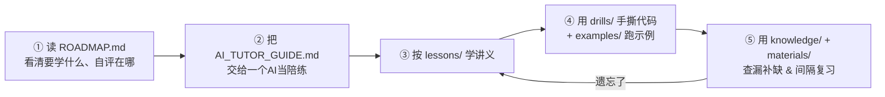

# agent_lesson —— Agent 研发工程师学习仓库

一套面向 **Agent 研发工程师**（围绕大模型做应用/基础设施开发，非算法训练岗）的体系化学习材料：讲义、知识卡片、资料精读、手撕题、可跑示例，外加一份**让 AI 当你陪练**的指引。

> 适合谁：有一定编程基础、想系统补齐 Agent 方向（推理框架 / 记忆系统 / RAG / 工具与协议 / 安全与评估）的工程师，尤其是从后端/分布式转 Agent 的同学。

---

## 怎么用这个仓库（推荐路径）



1. **先看 [`ROADMAP.md`](./ROADMAP.md)** —— 5 个能力维度 + 学习顺序 + 一张可勾选的就绪度自评表。
2. **把 [`AI_TUTOR_GUIDE.md`](./AI_TUTOR_GUIDE.md) 整段贴给 AI**（Claude / GPT / Kimi / 本地模型皆可），让它按"讲义 → 默写 → 抽题 → 追问"的节奏带你学，而不是直接甩答案。
3. **跟着 `lessons/` 学**，每学一块就到 `drills/` 手写、到 `examples/` 跑通。
4. **`knowledge/` 和 `materials/`** 作为速查与精读，配合"主动回忆"做间隔复习。

---

## 目录结构

```
agent_lesson/
├── README.md              ← 你在这
├── AI_TUTOR_GUIDE.md      ← 给 AI 的陪练指引（核心）
├── ROADMAP.md             ← 学习路径 + 能力自评模板
│
├── lessons/               讲义与课程（从零讲起）
│   ├── 00_llm_basics/         LLM 运行机制（token/窗口/采样/幻觉）
│   ├── 01_react/              ReAct 推理框架（讲义 + 可跑 agent + 自测）
│   ├── 02_rag/                RAG 两阶段全链路
│   ├── 03_memory/             mem0 复习讲义
│   ├── curriculum/            stage-1~7 完整路线 + 大型手册 + 源码逐行批注
│   └── mem0-deep-reading/     mem0 源码精读课
│
├── knowledge/             知识卡片（面试速查）
│   ├── know_*.md              CQRS / Reranker / Graph / Rolling Summary / Compaction ...
│   └── frameworks/            各 Agent 框架学习笔记（LangChain/LangGraph/AutoGen/AgentScope/Manus/Cursor...）
│
├── materials/             资料精读（论文 / 源码 / 实践指南）
├── drills/                手撕题（练习题 + 逐行注释的参考实现）
└── examples/              可跑示例代码 + 合成样例数据
```

---

## 五个核心维度（详见 ROADMAP）

| 维度 | 关键内容 | 仓库位置 |
|---|---|---|
| 推理框架 | CoT → ReAct → ToT，**ReAct 要能手写** | `lessons/01_react/`、`drills/01` |
| Agent 架构 | 记忆（短期/长期/向量/图/反思）、规划、行动 | `lessons/03_memory/`、`knowledge/know_*` |
| 工具与协议 | Function Calling、MCP 三原语 | `knowledge/frameworks/`、`drills/02` |
| 系统设计 | RAG 系统、多 Agent、可观测性 | `lessons/02_rag/`、`drills/03` |
| 安全与评估 | Prompt Injection 防御、HITL、评估体系 | `lessons/curriculum/` |
| LLM 基础 | Token、上下文窗口、采样参数、幻觉 | `lessons/00_llm_basics/` |

---

## 配套 AI 技能（可选）

学习过程中可以安装几个与学习相关的 AI 技能（Skill），让 AI 陪练更顺手。`AI_TUTOR_GUIDE.md` 里会引导 AI 从 **<https://github.com/ZhouNQQQ/skills_repo>** 选取并安装这些与课程学习相关的 skill（如深度阅读、学习教练、课程资料整理等）。

---

## 学习方法论（贯穿全仓）

- **先学后答**：先看讲义建立概念，再闭卷默写/口述，**不要先看答案**。
- **主动回忆 + 间隔复习**：盖住答案自己讲一遍 → 对照 → 标记卡壳 → 隔几天重测。
- **手撕代码**：能讲不等于能写，关键算法（ReAct 循环、RAG pipeline、混合召回）要能空白手写。
- **诚实批改**：答错就定位错在哪、为什么；不确定的标"未验证"。

---

## 许可与免责

- 仓库内容整理自公开学习材料、论文与开源源码阅读笔记，**已做改写与压缩并尽量标注来源**，仅供学习交流。
- 引用的论文、框架、源码版权归原作者所有；如有来源标注遗漏，欢迎提 issue 指正。
