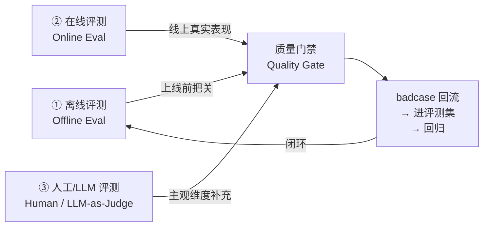
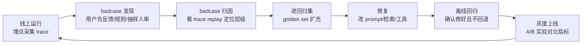

# 模块 5 · Agent 评测与可观测性（Evaluation & Observability）

> 缺口来源：真实 JD（JD3 全栈 AI-Native、JD4 开发工程师 55-80K、JD6/JD7 平台架构师）**反复硬性要求**"评测体系 / trace / eval / badcase 平台 / 回归 / 可观测性 / 反馈闭环"。这是课程原先最大的空白。
> 学完目标：能讲清"为什么 Agent 必须评测"、三支柱评测体系、RAG 与 Agent 的核心指标、LLM-as-Judge 怎么做、trace/span 怎么埋点、badcase 平台怎么闭环；并能手写一个 LLM-as-Judge 评分器（见 `drills/05`）。

---

## 0. 先建立直觉：为什么 Agent 比普通后端更需要评测

普通后端：输入确定 → 输出确定，单元测试断言相等即可。
Agent：**同样输入，输出不确定**（采样随机、模型升级、prompt 微调都会变），而且"对不对"往往没有唯一标准答案。

这带来三个后果，正是 JD 反复考的点：

1. **不能用 assert == 测**：要用"语义是否正确""是否忠实于证据"这类**软指标**。
2. **改一处可能崩另一处**：换 prompt 修好了 A 类 badcase，可能让 B 类回归——所以要有**回归测试集**。
3. **线上才暴露的问题最多**：用户真实 query 千奇百怪，必须有**线上可观测性 + badcase 回流**，否则永远在追昨天的 bug。

> 一句话面试版：**"Agent 的质量不是测出来的，是治理出来的"**——评测（offline）+ 可观测（online）+ badcase 闭环，三者缺一不可。

---

## 1. 评测三支柱（必背框架）



| 支柱 | 什么时候用 | 数据来源 | 典型指标 | 优点 / 局限 |
|---|---|---|---|---|
| **离线评测** | 上线前、每次改 prompt/模型/检索 | 固定评测集（黄金集 golden set） | 准确率、Recall@K、Faithfulness | 快、可复现、能做 CI 门禁；但覆盖不了线上长尾 |
| **在线评测** | 线上运行时持续 | 真实流量 + 埋点 | 成功率、延迟 P95、成本/次、用户反馈率、人工接管率 | 真实；但有滞后、需要埋点和采样 |
| **人工 / LLM-as-Judge** | 离线和在线都可叠加 | 抽样 + 评分 prompt | 相关性、有用性、安全性打分 | 能评主观维度；人工贵、LLM 评有偏差需校准 |

**面试高频追问："离线指标好，上线却差，为什么？"**
答：①评测集分布 ≠ 线上真实分布（过拟合黄金集）；②离线没测到的失败模式（多轮、并发、工具超时）；③数据泄漏（评测集里有训练见过的样本）。解法：用线上 badcase 持续扩充评测集，让两者分布逼近。

---

## 2. 分层指标：检索侧 / 生成侧 / Agent 侧

评测一定要**分层定位**，否则"系统不好"无法归因。

### 2.1 检索侧（RAG 召回质量）

| 指标 | 定义 | 直觉 | 易错点 |
|---|---|---|---|
| **Recall@K** | 前 K 个结果覆盖了多少真实相关项 | "该捞的捞回来了吗" | 完全依赖数据集，不是固定值 |
| **Precision@K** | 前 K 个里有多少是真相关 | "捞回来的有多少是对的" | 和 Recall 是 trade-off |
| **MRR** | 第一个相关项排名的倒数平均 | "对的排得够前吗" | 只看第一个相关项 |
| **NDCG** | 带位置折扣的相关性增益 | "排序整体质量" | 需要分级相关性标注 |

> 串联已学：`lessons/02_rag/` 和 `knowledge/know_reranker.md` 讲的 over-fetch、两段式重排，最终都要用 Recall@K（阶段1）和 MRR/NDCG（阶段2）来验证有没有改进。

### 2.2 生成侧（答案质量）

| 指标 | 定义 | 反什么问题 |
|---|---|---|
| **Faithfulness 忠实度** | 答案是否被检索证据支撑 | 反幻觉（最重要） |
| **Answer Relevance** | 答案是否切题 | 答非所问 |
| **Context Precision/Recall** | 用到的上下文是否精准/完整 | 检索与生成的衔接 |

> **核心原则**："检索准但生成乱"和"生成好但检索漏"是两类问题，**必须分开测**。一个混在一起的"端到端准确率"无法指导优化。

### 2.3 Agent 侧（多步任务质量）

Agent 比单轮 RAG 多了"过程"，要额外评：

| 指标 | 定义 | 为什么重要 |
|---|---|---|
| **任务成功率 (Task Success Rate)** | 端到端任务是否达成目标 | 最终北极星指标 |
| **工具调用准确率** | 选对工具 + 参数对 | Function Calling 质量 |
| **步数 / 收敛性** | 完成任务用了几步、是否死循环 | 效率 + 成本 |
| **轨迹合理性 (Trajectory Eval)** | 中间推理路径是否合理 | 即使结果对，过程也可能侥幸 |

**面试追问："结果对了，过程还需要评吗？"**
答：需要。结果对可能是侥幸（蒙对/绕远路）。生产里要评**轨迹**——是否走了最短合理路径、有没有多余的工具调用（烧钱）、有没有越权操作。这就是为什么 AgentBench 类基准会同时看 outcome 和 trajectory。

---

## 3. LLM-as-Judge：用模型评模型

主观维度（相关性、有用性、语气）没法用规则断言，工业界用**更强的模型当裁判**。

### 3.1 三种范式

| 范式 | 做法 | 适用 |
|---|---|---|
| **Pointwise 打分** | 给单个答案打 1-5 分 | 绝对质量评估 |
| **Pairwise 对比** | A/B 两个答案选更好的 | 模型/prompt 对比（更稳） |
| **Reference-based** | 对照标准答案评 | 有 golden answer 时 |

> 经验：**Pairwise 比 Pointwise 更可靠**，因为模型"比较两者"比"给绝对分"一致性更高。A/B 测新 prompt 时优先用 pairwise。

### 3.2 LLM-as-Judge 的坑（必答）

1. **位置偏差 (Position Bias)**：pairwise 时模型倾向选第一个 → 对策：交换顺序各评一次取平均。
2. **冗长偏差 (Verbosity Bias)**：倾向选更长的答案 → 对策：评分维度里明确"简洁性"，或控制长度。
3. **自我偏好 (Self-enhancement Bias)**：模型偏爱自己生成的风格 → 对策：用不同厂商的模型当裁判。
4. **校准问题**：LLM 打分和人工打分要做**一致性校验**（如 Cohen's Kappa / 相关系数），偏差大就调评分 prompt。

### 3.3 评分 prompt 设计要点

- **给明确的评分维度和 rubric**（每个分数对应什么标准），不要只说"打个分"。
- **要求先给理由再给分**（CoT 提升一致性）。
- **输出结构化 JSON**（`{"reason": "...", "score": 4}`）便于解析聚合。

> 手写练习见 `drills/05_llm_as_judge.py`——一个带位置消偏的 pairwise 评分器骨架。

---

## 4. 可观测性（Observability）：Trace / Span / Metrics / Logs

JD 里的 "trace / 结果回放 / 全链路监控" 指的就是这套。

### 4.1 三大支柱（借用 OpenTelemetry 心智）

| 支柱 | 是什么 | Agent 语境下记什么 |
|---|---|---|
| **Traces（链路）** | 一次请求的完整调用树 | 一次 Agent 运行：每步 LLM 调用、每次工具调用、检索、记忆读写 |
| **Metrics（指标）** | 可聚合的数值 | 延迟 P50/P95/P99、token 消耗、成本/次、成功率、缓存命中率 |
| **Logs（日志）** | 离散事件记录 | prompt 全文、模型原始输出、工具入参出参、异常栈 |

### 4.2 Agent Trace 的关键结构：Span 树

一次 Agent 运行 = 一棵 span 树：

```
Trace: user_query="帮我查上海天气并写一句话播报"
├── Span: agent.run (root, 2.3s, $0.012)
│   ├── Span: llm.plan (0.8s, 320 tokens)        ← 决策调哪个工具
│   ├── Span: tool.weather_api (0.4s)            ← 工具调用，记入参/出参
│   ├── Span: llm.observe_and_decide (0.6s)      ← 看到结果后下一步
│   └── Span: llm.generate (0.5s, 180 tokens)    ← 生成最终播报
```

每个 span 至少记：`name / start / duration / status / 关键属性(tokens/cost/工具名/错误)`。
父子关系靠 `trace_id + parent_span_id` 串起来——**和分布式链路追踪（Dejaeger/Zipkin）完全一个套路**。

> Java/后端类比：这就是 **APM 的分布式追踪**搬到 Agent 上。trace_id 贯穿全链路，span 是每个 RPC，只不过这里的"RPC"是 LLM 调用、工具调用、检索。

### 4.3 为什么"结果回放（replay）"重要

线上出了个 badcase，你需要能**完整重放**：当时的 prompt、检索到的上下文、模型输出、工具返回——才能定位是检索漏了、prompt 没约束住、还是工具返回脏数据。
所以埋点要记**全量上下文快照**（脱敏后），不能只记一句"失败了"。

---

## 5. badcase 平台与闭环（线上实验体系）

这是 JD7 明确点名的"badcase 平台 / 线上实验体系"。



**关键设计点（面试可讲）：**
- **badcase 怎么发现**：①用户显式负反馈（点踩）；②规则探针（输出空/超长/含敏感词/工具连续失败）；③定期抽样人工/LLM 审核。
- **badcase 怎么不再犯**：每个修复的 badcase **必须固化进回归集**，否则下次改动又会复发——这是"回归测试"在 Agent 里的体现。
- **怎么确认新版本更好**：**A/B 实验**（线上分流）或 **shadow 模式**（新版本只跑不影响用户，对比指标），看核心指标（成功率/满意度/成本）是否显著提升，再全量。

---

## 6. 把评测接进 CI/CD（工程化落地）

JD 里 "评测与回归 / CI-CD" 指：**每次提交 prompt 或代码改动，自动跑离线评测集，指标低于阈值就卡住合并**。

最小可行方案：
1. 维护一个版本化的评测集（`eval_set.jsonl`：query + 期望/参考）。
2. CI 脚本跑：对每条 query 执行 Agent → 算指标（规则指标 + LLM-as-Judge）。
3. 设质量门禁：如 `任务成功率 ≥ 0.85 且 Faithfulness ≥ 0.9 且 成本/次 ≤ 阈值`，不达标 fail。
4. 输出对比报告：本次 vs 基线，高亮回退的 case。

> 这把"凭感觉调 prompt"变成"数据驱动迭代"，是 AI-Native 工程岗（JD3）的核心要求。

---

## 7. 面试速答卡

| 问题 | 30 秒答案要点 |
|---|---|
| Agent 怎么评测？ | 三支柱：离线（golden set + CI 门禁）、在线（真实流量埋点）、LLM-as-Judge（主观维度）；分层定位：检索 Recall@K / 生成 Faithfulness / Agent 任务成功率 |
| 离线好上线差？ | 评测集分布 ≠ 线上分布、长尾失败、数据泄漏；用 badcase 回流缩小分布差 |
| LLM-as-Judge 的坑？ | 位置/冗长/自我偏好偏差 + 需和人工校准；pairwise 比 pointwise 稳，顺序交换消偏 |
| 怎么做可观测？ | trace（span 树记每步 LLM/工具/检索）+ metrics（延迟/成本/成功率）+ logs（全量上下文快照供 replay） |
| badcase 怎么闭环？ | 发现（负反馈/规则/抽样）→ 归因（trace replay）→ 进回归集 → 修复 → 离线回归 → A/B 灰度 |
| 结果对了还评过程吗？ | 评。结果对可能侥幸，要评轨迹：步数/工具调用是否合理/有无越权 |

---

## 8. 关联与延伸

- 检索指标细节 → `lessons/02_rag/rag_lesson.md` 第 6 节、`knowledge/know_reranker.md`
- 可靠性（重试/降级/熔断）→ `lessons/07_engineering/engineering_lesson.md`、`knowledge/know_cost_reliability.md`
- 安全维度评测（注入/越狱）→ `lessons/08_security/security_lesson.md`
- 知识速查卡 → `knowledge/know_evaluation.md`、`knowledge/know_observability.md`
- 手撕题 → `drills/05_llm_as_judge.py`

> 来源：内容综合自公开的 LLM 评测实践（RAG 三元组指标、LLM-as-Judge 范式与偏差）、OpenTelemetry 可观测性心智模型，以及真实 JD 要求，已改写压缩，非逐字复制。
