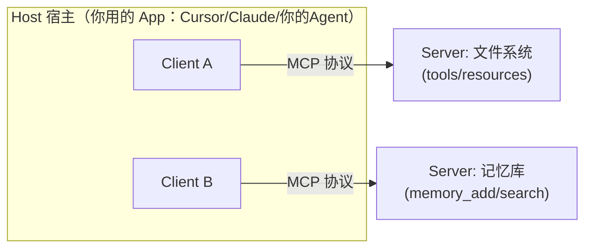
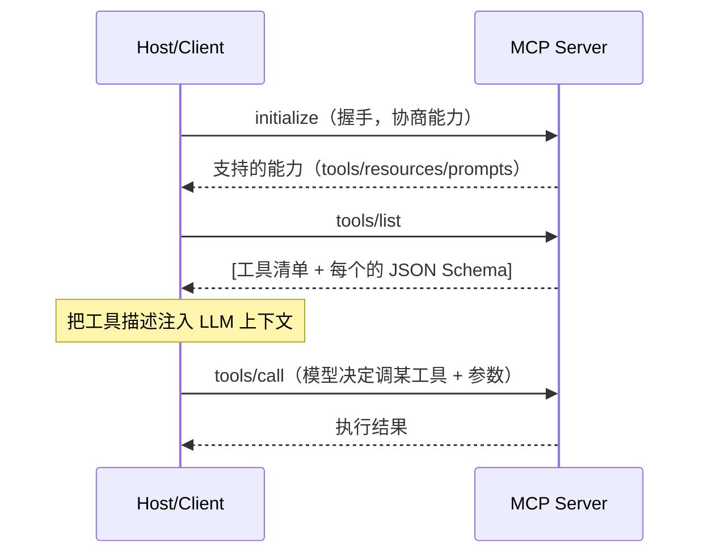

# 模块 6 · MCP 协议与工具编排（Tool Orchestration）

> 缺口来源：深圳 JD 明确要求"MCP 管理"，北京火山引擎 JD 列出"Skill / MCP / Memory / Agent Infra 组件原理与开发调优"，ROADMAP 也标 MCP 为热点。原课程只在 `react_lesson` 散讲，缺独立单元。
> 学完目标：讲清 MCP 是什么、解决什么问题、三原语、Host/Client/Server 三角色、传输层、与 Function Calling 的关系；并能说清"工具编排（Tool Orchestration）"的几种模式。

---

## 0. 一句话定位

**MCP（Model Context Protocol）= 给 LLM 应用接外部能力（工具/数据/提示）的标准协议。**
类比：MCP 之于 AI 应用，约等于 **USB-C 之于硬件**——一套标准接口，任何 server 实现了它，任何 host 都能即插即用，不用为每个工具写一遍对接代码。

**它解决的痛点**：没有 MCP 时，每个应用（Cursor / Claude Desktop / 你的 Agent）要对接每个外部系统（GitHub / 数据库 / 文件系统）都得写**定制胶水代码**，是 M×N 的对接成本。MCP 把它变成 **M+N**：工具方实现一次 server，应用方实现一次 client。

---

## 1. 三个角色（别混）

| 角色 | 是什么 | 例子 |
|---|---|---|
| **Host 宿主** | 用户直接用的 LLM 应用，内含一个或多个 client | Claude Desktop、Cursor、你写的 Agent |
| **Client 客户端** | host 内部的连接模块，1 个 client 连 1 个 server | host 里的连接管理器 |
| **Server 服务器** | 工具/数据的提供方，暴露能力 | 文件系统 server、GitHub server、你的记忆 server |

> 关键认知：**一个 host 可以连多个 server**（文件 + GitHub + 记忆），每个 server 用独立 client 连接，互相隔离。

---

## 2. 三原语（Primitives）—— MCP 暴露什么

MCP server 能向 host 暴露三类东西，**这是必背的**：

| 原语 | 是什么 | 谁控制调用 | 类比 |
|---|---|---|---|
| **Tools（工具）** | 可执行的函数（有副作用），如查天气、写文件、调 API | **模型决定调**（model-controlled） | POST 接口 / RPC |
| **Resources（资源）** | 只读数据，如文件内容、数据库记录 | **应用决定加载**（app-controlled） | GET 接口 / 文件 |
| **Prompts（提示模板）** | 预定义的提示/工作流模板 | **用户决定触发**（user-controlled） | 收藏的指令模板 |

**面试追问："Tools 和 Resources 区别？"**
答：Tools 有副作用、由**模型**在推理中决定调用（像 Function Calling）；Resources 是只读上下文、由**应用/用户**决定加载进上下文（不应有副作用）。一个"写文件"是 tool，一个"读文件内容"既可做成 tool 也可做成 resource，区别在语义和谁来触发。

---

## 3. 运行时发现（Runtime Discovery）—— MCP 的精髓

这是和"硬编码工具"最大的区别，也是 `react_lesson` 里强调过的点。

分两层（务必分清）：

| 层 | 发生什么 | 是否需重启 |
|---|---|---|
| **配置层** | 在 `mcp.json` 声明"要连哪些 server" | 改配置后 host 通常**重启**才重新读取建连 |
| **发现层** | client 连上后发 `tools/list`，**server 当场返回它有哪些工具 + 参数 schema** | 不需重启，运行时动态获取 |

所以宿主代码里**没有硬编码**工具名和 schema——它是连上 server 后**问出来的**。这让工具可以热更新（server 端加个工具，重连即可见）。

---

## 4. 传输层（Transport）

MCP 消息用 **JSON-RPC 2.0** 编码，传输方式主要两种：

| 传输 | 场景 | 说明 |
|---|---|---|
| **stdio** | 本地 server | host 把 server 当子进程拉起，走标准输入输出，最简单 |
| **Streamable HTTP / SSE** | 远程 server | 走 HTTP，支持服务端流式推送，适合远程/云端 server |

> 早期用 HTTP+SSE 组合，新版规范统一为 Streamable HTTP。本地工具用 stdio 足够。

---

## 5. MCP vs Function Calling（高频对比题）

**很多人混淆，这是区分度题。**

| 维度 | Function Calling | MCP |
|---|---|---|
| 是什么 | 模型**能力**：输出"要调哪个函数+参数"的结构化意图 | **协议**：规定工具如何被发现、描述、调用 |
| 层级 | 模型层 | 应用/协议层 |
| 谁执行 | 你的代码执行函数 | MCP client 经协议调 server 执行 |
| 关系 | MCP 工具最终**也是通过 FC 让模型选**的 | MCP 把"工具从哪来、怎么描述、怎么调"标准化 |

**一句话**：FC 是"模型怎么表达要调工具"，MCP 是"工具怎么被标准化地接进来"。两者**互补不冲突**——MCP server 暴露的工具，注入上下文后，模型仍是用 Function Calling 的方式选择调用。

---

## 6. 工具编排（Tool Orchestration）

JD（北京火山引擎）点名 "Tool Orchestration"。当工具变多、任务变复杂，光有"模型选一个工具"不够，需要编排：

| 模式 | 做法 | 何时用 |
|---|---|---|
| **工具检索（Tool Retrieval）** | 工具几百个时，先按 query 语义检索出最相关的几个再注入 prompt（本质是对工具描述做 RAG） | 工具数量大，全塞会烧 token + 选晕 |
| **顺序编排（Sequential）** | 工具 A 输出喂给工具 B | 有明确依赖的流水线 |
| **并行编排（Parallel）** | 无依赖的工具同时调 | 多源信息聚合，省时间 |
| **条件路由（Conditional）** | 按中间结果决定走哪个工具分支 | 决策树式任务 |
| **DAG / 工作流引擎** | 把工具调用建模成有向无环图，带重试/状态 | 复杂长任务（接 LangGraph 的图模型） |

**面试追问："工具特别多怎么办？"**
答：用工具检索（tool retrieval）——把工具描述向量化，按当前 query 检索 top-k 注入，而不是全量塞 prompt。这就是 `drills/02_tool_router.py` 干的事，本质是一次 RAG。再大可以分层：先选工具类别，再在类别内选具体工具。

> 编排的状态管理、长任务调度更深的内容见 `lessons/07_engineering/engineering_lesson.md`；LangGraph 的图编排见 `knowledge/frameworks/LangGraph学习笔记.md`。

---

## 7. 安全注意（与模块 8 衔接）

MCP 接外部能力 = 扩大攻击面，必须注意：

- **server 是不可信的**：第三方 MCP server 返回的内容要当**不可信数据**，防"工具返回里藏注入指令"（间接 prompt injection）。
- **工具权限最小化**：写文件/执行命令类高危工具要有**人工审批（HITL）**或沙箱隔离。
- **凭证管理**：server 配置里的 token/密钥不要硬编码、不要进版本库。

> 详见 `lessons/08_security/security_lesson.md`。

---

## 8. 面试速答卡

| 问题 | 30 秒答案要点 |
|---|---|
| MCP 是什么？ | 给 LLM 应用接工具/数据/提示的标准协议，类比 USB-C；把 M×N 对接降成 M+N |
| 三原语？ | Tools（模型调，有副作用）/ Resources（应用加载，只读）/ Prompts（用户触发的模板） |
| 三角色？ | Host 宿主（含 Client）↔ Server；一个 host 可连多个 server，client 与 server 一对一 |
| 运行时发现？ | 配置层声明连哪个 server（改了要重启）；发现层连上后 `tools/list` 当场拿工具+schema，代码不硬编码 |
| MCP vs FC？ | FC 是模型表达调用意图的能力；MCP 是工具接入的协议；MCP 工具最终仍靠 FC 让模型选；互补 |
| 工具太多？ | 工具检索（对工具描述做 RAG）选 top-k 注入，而非全塞 |
| 传输层？ | JSON-RPC 2.0；本地 stdio，远程 Streamable HTTP/SSE |

---

## 9. 关联与延伸

- ReAct 里的工具调用与 MCP 串联 → `lessons/01_react/react_lesson.md` 点2、README 第5节
- 工具路由手撕 → `drills/02_tool_router.py`
- 图编排框架 → `knowledge/frameworks/LangGraph学习笔记.md`
- 安全 → `lessons/08_security/security_lesson.md`
- 知识速查卡 → `knowledge/know_mcp.md`

> 来源：综合自 MCP 公开规范（原语、角色、JSON-RPC 传输、运行时发现）与真实 JD 要求，已改写压缩，非逐字复制。
