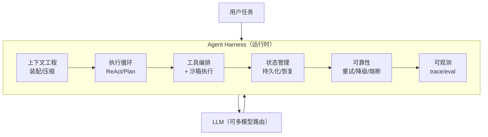
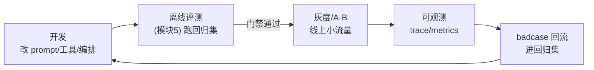

# 模块 7 · Agent 工程化（运行时编排 / 成本·性能·可靠性 / 多模型路由 / Harness）

> 缺口来源：JD4（55-80K）要求"上下文工程/Harness/长任务调度/长记忆管理/云端沙箱/成本·性能·可靠性"；JD6/JD7（平台架构师 90-150K）要求"运行时编排/研发流水线/多模型协同/状态持久化/故障恢复"；北京火山引擎 JD 点名"Harness 工程实践 / State Management"。这是决定能否接平台架构岗的关键。
> 学完目标：能讲清 Agent Harness 是什么、运行时编排与长任务状态管理、可靠性三件套（重试/降级/熔断）、成本与性能优化手段、多模型路由策略；并能手写重试降级骨架（见 `drills/07`）。

---

## 0. 什么是 Agent Harness（先建立总图）

**Harness（运行时框架/挽具）= 包裹 LLM 的那层工程系统**，负责把"一个会生成文本的模型"变成"一个能稳定完成任务的 Agent"。

模型本身只会：输入上下文 → 输出文本/调用意图。**其余全是 Harness 的事**：

> 一句话面试版：**"模型是引擎，Harness 是底盘+变速箱+安全系统"**。同一个模型，Harness 做得好不好，决定了 Agent 是 demo 还是生产可用。这正是 JD 反复说的"从 Demo 到稳定运行的工程化落地"。

---

## 1. 运行时编排与长任务状态管理

### 1.1 为什么长任务需要状态持久化

一个 Agent 任务可能跑几分钟到几小时（多步、调多个工具、等外部回调）。期间可能：进程重启、超时、被中断、节点故障。如果状态只在内存里，一崩就全丢、得从头来。

**解法：把 Agent 的执行状态外化、持久化**，支持：

| 能力 | 含义 | 实现要点 |
|---|---|---|
| **状态持久化** | 每步执行后落盘（DB/状态存储） | 记录：当前步、已完成的工具调用、中间结果、上下文 |
| **中断恢复 (Resume)** | 崩溃后从断点继续，不从头跑 | 用持久化的 checkpoint 恢复 |
| **异常补偿 (Compensation)** | 失败步骤回滚或补偿，保证幂等 | 类比 Saga 模式；同一步可安全重放 |

> 后端类比：这就是**工作流引擎 / 状态机 / Saga 事务**搬到 Agent。LangGraph 的 checkpointer、Temporal 这类工作流引擎都是干这个。每个节点执行后存 checkpoint，恢复时从 checkpoint 继续。

### 1.2 状态机 / DAG 建模

把 Agent 流程建模成**状态机或 DAG**（而非一根 if-else 到底），好处：
- 每个节点状态明确，便于持久化和恢复。
- 天然支持条件分支、并行、循环（带终止条件）。
- 可观测：每个节点就是一个 span。

**面试追问："长任务中途模型挂了/超时怎么办？"**
答：状态机每个节点执行后存 checkpoint（当前步+中间结果+上下文快照）；恢复时从最近 checkpoint 继续而非重头；对有副作用的步骤（已写库/已扣款）用幂等键 + 补偿，保证重放安全。这是分布式事务 Saga 思路在 Agent 的应用。

---

## 2. 可靠性三件套：重试 / 降级 / 熔断

LLM 调用和工具调用都会失败（限流、超时、5xx、输出格式错）。生产 Agent 必须有容错。

| 机制 | 解决什么 | 关键点 |
|---|---|---|
| **重试 (Retry)** | 瞬时故障（超时、限流、偶发 5xx） | **指数退避 + 抖动**；限制最大次数；只重试幂等/可重试错误 |
| **降级 (Fallback)** | 主路径不可用时保证有兜底结果 | 切备用模型 / 返回缓存 / 返回"无法处理"而非乱答；**不要用 Mock 顶生产** |
| **熔断 (Circuit Breaker)** | 下游持续故障时停止打它，防雪崩 | 失败率超阈值→打开熔断→快速失败→半开试探→恢复 |

### 2.1 重试的两类错误（呼应 ReAct 讲义）

- **格式解析失败**（模型没给合法 Action/JSON）→ 回注纠正提示让它重输出。
- **工具执行失败**（异常/超时）→ 捕获后把错误当 Observation 回喂，或退避重试，或换工具。

### 2.2 降级的正确姿势（错题点）

呼应 `week1-partb-technical-design.md` 的决策：**Mock/规则兜底不能当生产降级**——基于关键词的 Mock 无法处理真实自然语言。生产降级应该是：切更小/更稳的备用模型、返回缓存结果、或诚实返回错误并转人工，而不是用假数据硬顶。

### 2.3 fail-open vs fail-closed

- **记忆召回失败** → 通常 **fail-open**（召回不到就不注入记忆，照常回答，别让记忆挂了拖垮主流程）。
- **安全/权限校验失败** → 必须 **fail-closed**（校验系统挂了就拒绝，不能放行）。

**面试追问："什么时候 fail-open，什么时候 fail-closed？"**
答：看失败的后果。非关键增强（记忆、个性化）失败应 fail-open 保可用性；安全、扣费、权限这类失败必须 fail-closed 保正确性/安全性。

---

## 3. 成本与性能优化

JD4 明确要求"成本/性能/可靠性"。这是把 Agent 跑便宜、跑快的工程手段。

### 3.1 成本优化

| 手段 | 怎么省 |
|---|---|
| **分级路由 (Model Tiering)** | 简单请求用便宜小模型，难的才上贵的大模型（见第 4 节） |
| **Prompt 缓存 (KV-Cache / Prompt Caching)** | 复用不变的前缀（system prompt、few-shot），只算变化部分，省 token + 提速 |
| **语义缓存 (Semantic Cache)** | 相似 query 直接返回缓存答案，不走模型 |
| **上下文压缩** | 只喂相关片段、做 compaction/摘要（呼应记忆模块），减少输入 token |
| **批处理 (Batching)** | 离线任务合批调用，提高吞吐 |
| **控制步数** | 死循环检测 + max_steps，防止多步任务烧钱失控 |

### 3.2 性能 / 延迟优化

| 手段 | 怎么快 |
|---|---|
| **流式输出 (Streaming/SSE)** | 边生成边返回，降低首字延迟（TTFT），改善体感 |
| **并行工具调用** | 无依赖的工具/检索并发执行 |
| **预计算 / 缓存 Embedding** | Bi-Encoder 向量预计算（呼应 reranker 卡片） |
| **投机解码 / 小模型起草** | 进阶手段，小模型起草大模型验证 |

> 关键指标：**TTFT（首 token 延迟）、TPOT（每 token 延迟）、P95/P99 总延迟、成本/请求**。优化前先用可观测性（模块 5）测出瓶颈在哪一段。

---

## 4. 多模型协同与路由（Model Routing）

JD6 要求"多模型协同"。核心思想：**不是所有请求都用同一个模型，按需路由以平衡质量/成本/延迟**。

### 4.1 路由策略

| 策略 | 依据 | 例子 |
|---|---|---|
| **按难度分级** | 任务复杂度 | 闲聊/分类→小模型；复杂推理→大模型 |
| **按能力路由** | 模型特长 | 代码→Code 模型；长文→长上下文模型；多模态→VLM |
| **按成本/延迟约束** | SLA 预算 | 实时场景选快模型；离线选便宜模型 |
| **级联 (Cascade)** | 先小后大 | 小模型先答 + 置信度判断，不够好再升级到大模型 |
| **多模型投票/集成** | 高可靠场景 | 多个模型并行，投票/仲裁取共识 |

### 4.2 路由怎么实现

- **规则路由**：按请求类型/长度/标签硬规则分发（简单可控）。
- **分类器路由**：训练/用小模型判断"该走哪个模型"。
- **级联路由**：小模型先跑 + 置信度门控，低于阈值再升级。

**面试追问："级联路由怎么判断要不要升级到大模型？"**
答：用置信度信号——小模型输出的 logprob/自评分、是否触发"不确定"、答案是否通过校验（如 Faithfulness 检查）。低于阈值就把请求升级给大模型重做。本质是用一点额外延迟/成本换整体质量，同时让大部分简单请求停在便宜模型。

> 路由本身也要可观测：记录每个请求走了哪个模型、成本、质量，持续调阈值。

---

## 5. 研发流水线（AI-Native 工程链路）

JD3/JD7 要求"Agent 原生研发流水线 / 工程链路（日志/问题追踪/结果回放/评测回归）"。把前面串成一条线：

要点：把"调 prompt → 跑评测 → 灰度 → 观测 → badcase 回流"做成**自动化闭环**，而不是手工试错。这就是"AI-Native 工作方式"。

---

## 6. 面试速答卡

| 问题 | 30 秒答案要点 |
|---|---|
| Agent Harness 是什么？ | 包裹 LLM 的运行时：上下文装配、执行循环、工具编排、状态管理、可靠性、可观测。模型是引擎，Harness 是底盘 |
| 长任务中途崩了？ | 状态机每节点存 checkpoint；从断点恢复；有副作用的步骤幂等+补偿（Saga 思路） |
| 可靠性三件套？ | 重试（指数退避+抖动，只重试可重试错误）、降级（切备用模型/缓存，别用 Mock 顶生产）、熔断（失败率超阈值快速失败防雪崩） |
| fail-open vs closed？ | 非关键增强失败 fail-open 保可用；安全/权限/扣费失败 fail-closed 保正确 |
| 怎么省成本？ | 分级路由+prompt缓存+语义缓存+上下文压缩+批处理+控步数 |
| 怎么降延迟？ | 流式输出降 TTFT、并行工具、预计算 embedding；先用 trace 定位瓶颈 |
| 多模型路由？ | 按难度/能力/成本路由 + 级联（小模型先答+置信门控升级）；路由要可观测持续调阈值 |

---

## 7. 关联与延伸

- 执行循环与错误处理 → `lessons/01_react/react_lesson.md`
- 上下文压缩/记忆治理 → `lessons/03_memory/`、`knowledge/know_compaction_decay.md`
- 评测与可观测（定位瓶颈/质量门禁）→ `lessons/05_evaluation/`
- 多 Agent 协作中的容错 → `lessons/curriculum/stage-3-multi-agent-full.md`
- 知识速查卡 → `knowledge/know_cost_reliability.md`、`knowledge/know_model_routing.md`
- 手撕题 → `drills/06_model_router.py`、`drills/07_retry_fallback.py`

> 来源：综合自公开的 LLM 工程化实践（重试/熔断/降级模式、模型路由与级联、prompt 缓存、流式与延迟指标）、工作流引擎/Saga 心智模型，以及真实 JD 要求，已改写压缩，非逐字复制。
