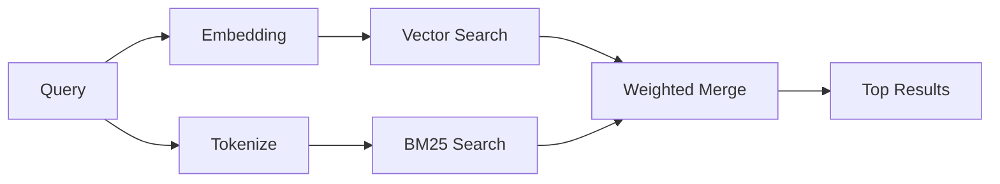

# Memory Search — 完整原文 + 中文注释

> **原始来源**：/usr/lib/node_modules/openclaw/docs/concepts/memory-search.md
> **原始标题**：Memory Search
> **整理时间**：2026-06-01
> **说明**：以下内容为 OpenClaw 官方文档的完整原文，我在关键段落旁添加了中文注释（以 `【注：】` 标记）。

---

---
title: "Memory Search"
summary: "How memory search finds relevant notes using embeddings and hybrid retrieval"
read_when:
  - You want to understand how memory_search works
  - You want to choose an embedding provider
  - You want to tune search quality
---

# Memory Search

`memory_search` finds relevant notes from your memory files, even when the
wording differs from the original text. It works by indexing memory into small
chunks and searching them using embeddings, keywords, or both.

【注：memory_search 的核心价值 —— 即使措辞不同也能找到相关内容。靠切分成小块 + 向量/关键词搜索实现。】

## Quick start

If you have an OpenAI, Gemini, Voyage, or Mistral API key configured, memory
search works automatically. To set a provider explicitly:

```json5
{
  agents: {
    defaults: {
      memorySearch: {
        provider: "openai", // or "gemini", "local", "ollama", etc.
      },
    },
  },
}
```

For local embeddings with no API key, use `provider: "local"` (requires
node-llama-cpp).

【注：两种模式总结 —— 有 API key → 用云端 provider（自动检测）；无 API key → 用 local provider（需安装 node-llama-cpp）。】

## Supported providers

| Provider | ID        | Needs API key | Notes                                                |
| -------- | --------- | ------------- | ---------------------------------------------------- |
| OpenAI   | `openai`  | Yes           | Auto-detected, fast                                  |
| Gemini   | `gemini`  | Yes           | Supports image/audio indexing                        |
| Voyage   | `voyage`  | Yes           | Auto-detected                                        |
| Mistral  | `mistral` | Yes           | Auto-detected                                        |
| Bedrock  | `bedrock` | No            | Auto-detected when the AWS credential chain resolves |
| Ollama   | `ollama`  | No            | Local, must set explicitly                           |
| Local    | `local`   | No            | GGUF model, ~0.6 GB download                         |

【注：provider 完整列表。需要 API key 的：OpenAI/Gemini/Voyage/Mistral。不需要的：Bedrock（用 AWS 凭证链）、Ollama、Local。注意 Ollama 和 Local 虽然不需要 API key，但需要本地部署或下载模型。】

## How search works

OpenClaw runs two retrieval paths in parallel and merges the results:



【注：搜索流程图。用户的查询同时走两条路：Embedding（向量搜索）和 Tokenize（BM25 关键词搜索），然后加权合并。这是 Hybrid Search 的核心架构。】

- **Vector search** finds notes with similar meaning ("gateway host" matches
  "the machine running OpenClaw").

【注：向量搜索找"意思相近"的。例子：搜"gateway host"能找到"运行 OpenClaw 的机器"，因为语义相近，即使没有共享关键词。】

- **BM25 keyword search** finds exact matches (IDs, error strings, config
  keys).

【注：BM25 找"精确匹配"。例子：搜特定的错误代码、配置键名、ID，精确命中。】

If only one path is available (no embeddings or no FTS), the other runs alone.

【注：降级策略。如果只有一条路径可用（没配 embedding → 只有 BM25；FTS 损坏 → 只有向量），另一条单独运行。不会报错，只是效果打折。】

When embeddings are unavailable, OpenClaw still uses lexical ranking over FTS results instead of falling back to raw exact-match ordering only. That degraded mode boosts chunks with stronger query-term coverage and relevant file paths, which keeps recall useful even without `sqlite-vec` or an embedding provider.

【注：无 embedding 时的降级细节。不是简单的精确匹配，而是用词频覆盖度和文件路径相关性做 lexical ranking，尽量让结果有用。这是设计上的保底策略。】

## Improving search quality

Two optional features help when you have a large note history:

### Temporal decay

Old notes gradually lose ranking weight so recent information surfaces first.
With the default half-life of 30 days, a note from last month scores at 50% of
its original weight. Evergreen files like `MEMORY.md` are never decayed.

【注：时间衰减 —— 旧笔记自动降权，默认半衰期 30 天（上个月的内容权重只剩 50%）。但 MEMORY.md 等" evergreen"（常青）文件不衰减，因为它们是长期事实。】

### MMR (diversity)

Reduces redundant results. If five notes all mention the same router config, MMR
ensures the top results cover different topics instead of repeating.

【注：多样性重排序 —— 防止搜索结果重复。如果 5 条笔记都在说同一个路由器配置，MMR 会让 Top-K 结果覆盖不同主题，而不是重复同一内容。】

### Enable both

```json5
{
  agents: {
    defaults: {
      memorySearch: {
        query: {
          hybrid: {
            mmr: { enabled: true },
            temporalDecay: { enabled: true },
          },
        },
      },
    },
  },
}
```

## Multimodal memory

With Gemini Embedding 2, you can index images and audio files alongside
Markdown. Search queries remain text, but they match against visual and audio
content. See the [Memory configuration reference](/reference/memory-config) for
setup.

【注：多模态 —— Gemini 的 embedding 支持图片和音频。你可以索引图片，然后用文字搜索找到相关内容。这很先进，但目前只有 Gemini 支持。】

## Session memory search

You can optionally index session transcripts so `memory_search` can recall
earlier conversations. This is opt-in via
`memorySearch.experimental.sessionMemory`. See the
[configuration reference](/reference/memory-config) for details.

【注：会话记忆索引 —— 实验性功能。默认只索引 memory 文件（MEMORY.md 和 daily notes），不索引完整对话历史。开启后可以把整个对话也纳入搜索范围。】

## Troubleshooting

**No results?** Run `openclaw memory status` to check the index. If empty, run
`openclaw memory index --force`.

**Only keyword matches?** Your embedding provider may not be configured. Check
`openclaw memory status --deep`.

【注：只有关键词匹配、没有语义匹配？说明 embedding provider 没配置好。用 `--deep` 参数查看深层诊断信息。】

---

> **中文注释完成。** 如需进一步解释某个段落，请告诉我。
