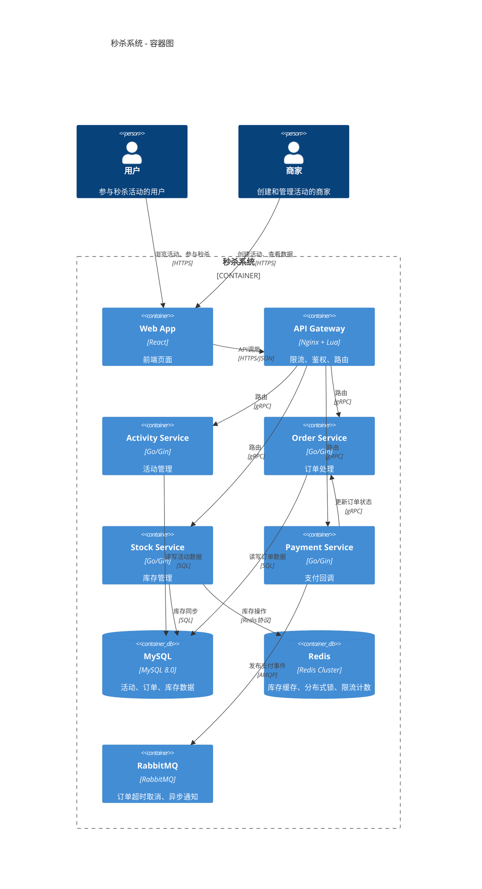

# 软件工程全生命周期Agent实战项目设计

> 版本：v1.0 | 作者：Agent架构师 | 日期：2025年1月
> 
> 本文档面向有编程基础的开发者，提供从需求分析到生产发布的完整Multi-Agent系统设计方案。所有代码示例可直接运行，所有配置可实际落地。

---

## 目录

- [1. 项目概述](#1-项目概述)
- [2. 系统架构设计](#2-系统架构设计)
- [3. 各Agent详细设计](#3-各agent详细设计)
- [4. 核心Skills设计](#4-核心skills设计)
- [5. 任务编排与Workflow](#5-任务编排与workflow)
- [6. MemoryManager设计](#6-memorymanager设计)
- [7. 项目实施方案](#7-项目实施方案)
- [8. 代码实现示例](#8-代码实现示例)
- [9. 部署与运维](#9-部署与运维)
- [10. 附录](#10-附录)

---

## 1. 项目概述

### 1.1 项目目标

构建一个覆盖**软件工程全生命周期**的Multi-Agent协作系统，能够自主完成从需求分析到生产发布的完整研发流程。系统以QClaw/OpenClaw为技术底座，模拟互联网公司一个完整功能模块的开发全流程，实现"一句话需求，端到端交付"。

**核心目标**：

| 目标 | 描述 | 衡量标准 |
|------|------|----------|
| 端到端覆盖 | 覆盖需求→架构→设计→编码→测试→部署→发布全链路 | 7个阶段全自动执行 |
| 多Agent协作 | 8个专业Agent协同工作，各司其职 | 阶段间零人工干预 |
| 可落地执行 | 产出物可直接用于生产环境 | 代码可编译、测试可通过、可部署 |
| 持续进化 | 通过Memory系统积累经验，越用越聪明 | 重复任务效率提升50%+ |

### 1.2 核心场景

**场景描述**：某互联网公司电商团队需要开发一个"限时秒杀活动模块"，产品经理只需输入一句话需求，Agent系统自动完成以下工作：

1. **PM Agent** 分析需求，输出完整PRD文档（含用户故事、功能列表、优先级）
2. **Architect Agent** 进行架构设计，输出C4架构图、技术选型方案、API概览
3. **Designer Agent** 产出详细设计文档（数据库Schema、接口定义、时序图）
4. **Developer Agent** 根据设计文档生成可运行的前后端代码
5. **QA Agent** 自动生成单元测试用例，执行测试并输出覆盖率报告
6. **DevOps Agent** 构建Docker镜像，配置CI/CD流水线，完成部署
7. **Director Agent** 全程调度协调，处理异常，确保按时交付
8. **Memory Agent** 管理跨Agent记忆共享，沉淀项目知识

### 1.3 技术选型

| 层级 | 技术方案 | 说明 |
|------|----------|------|
| **Agent框架** | QClaw / OpenClaw | 腾讯产品化封装，四模块架构（Gateway + Agent + Skills + Memory） |
| **LLM模型** | Kimi / DeepSeek / GPT-4 | 按需动态切换，复杂推理用DeepSeek，代码生成用GPT-4 |
| **Skill生态** | 自研Skills + 生态5000+ | 核心Skills自研，通用能力复用生态 |
| **Memory系统** | 自研MemoryManager | 四层记忆架构，向量检索+Rolling Summary |
| **工作流编排** | Pipeline + Hook事件链 | 阶段串行+阶段内并行，Hook驱动状态转换 |
| **企业底座（可选）** | ADP（Agent Development Platform） | LLM + RAG + Workflow + Multi-Agent全栈 |
| **可观测性** | TCOP + CLS日志服务 | 全链路追踪、性能监控、异常告警 |
| **安全治理** | 五大安全防火墙 | 输入过滤、输出审查、权限控制、审计日志、数据脱敏 |

### 1.4 系统架构总览图

```
┌─────────────────────────────────────────────────────────────────────────────────┐
│                           Director Agent（项目总监）                              │
│                    任务拆解 · 进度跟踪 · 异常处理 · 结果汇总                        │
│                                    ▲                                            │
│                    ┌───────────────┴───────────────┐                            │
│                    │      Hook事件链调度            │                            │
│                    └───────────────┬───────────────┘                            │
└──────────────────────────────────┼────────────────────────────────────────────┘
                                   │
        ┌──────────────────────────┼──────────────────────────┐
        │ Pipeline Stage 1         │ Pipeline Stage 2         │ Pipeline Stage 3
        │ 需求分析与设计            │ 开发与测试                │ 部署与发布
        │                          │                          │
┌───────▼──────┐  ┌───────────────▼──────┐  ┌────────────────▼──────────┐
│  PM Agent    │  │   Architect Agent    │  │    Developer Agent        │
│ 产品经理     │  │   架构师              │  │    开发工程师              │
│ 输出: PRD    │  │   输出: 架构设计       │  │    输出: 可运行代码        │
│  用户故事     │  │        技术选型        │  │                           │
│  功能列表     │  │        C4图           │  │                           │
└──────┬───────┘  └───────────────┬──────┘  └────────────────┬──────────┘
       │                          │                          │
       └──────────────┬───────────┘                          │
                      │ Parallel Group 1                      │
                      │                                       │
       ┌──────────────▼───────────┐  ┌───────────────────────▼──────────┐
       │   Designer Agent         │  │      QA Agent                     │
       │   方案设计师              │  │      测试工程师                    │
       │   输出: 详细设计          │  │      输出: 测试报告                │
       │   DB Schema 接口定义      │  │      单元测试 覆盖率报告            │
       └──────────────┬───────────┘  └───────────────────────┬──────────┘
                      │                                       │
                      └──────────────────┬────────────────────┘
                                         │ Pipeline Stage 3
                                         │
                            ┌────────────▼────────────┐
                            │    DevOps Agent         │
                            │    运维工程师            │
                            │    输出: 部署产物        │
                            │    Docker镜像 CI/CD配置  │
                            └────────────┬────────────┘
                                         │
                            ┌────────────▼────────────┐
                            │    Memory Agent         │
                            │    记忆管理器            │
                            │    跨Agent记忆共享       │
                            │    上下文持久化           │
                            └─────────────────────────┘

Data Flow: 每个Agent产出物 → 标准化JSON格式 → 写入共享Context → 下游Agent读取

协作模式说明：
- 整体：Pipeline模式（3个阶段串行，阶段间有明确交付物）
- 阶段2内：Developer与QA采用Parallel模式（开发与测试用例生成并行）
- Director：Supervisor模式（全程监控，随时介入）
```

### 1.5 核心设计原则

1. **单一职责**：每个Agent只负责一个专业领域，不跨界
2. **显式接口**：Agent间通过标准化JSON通信，不隐式共享状态
3. **失败可恢复**：每个阶段支持重试、回退、人工介入
4. **记忆驱动**：通过Memory系统沉淀经验，避免重复犯错
5. **人在环路**：关键节点（架构选型、生产发布）预留人工审核

---

## 2. 系统架构设计

### 2.1 总体架构

系统由8个专业Agent组成研发团队，采用**三层架构**：

```
┌─────────────────────────────────────────────────────────────────┐
│                      编排调度层（Orchestration）                   │
│  ┌─────────────────────────────────────────────────────────┐   │
│  │           Director Agent（Supervisor模式）                │   │
│  │  - 接收顶层需求 → 拆解任务 → 分配Agent → 监控进度 → 汇总结果 │   │
│  │  - 维护全局状态机（待启动→执行中→待审核→已完成→失败）        │   │
│  │  - 异常决策：重试/跳过/回退/人工介入                       │   │
│  └─────────────────────────────────────────────────────────┘   │
├─────────────────────────────────────────────────────────────────┤
│                      执行层（Execution）                         │
│  ┌─────────────┐ ┌─────────────┐ ┌─────────────┐ ┌───────────┐ │
│  │  PM Agent   │ │Architect    │ │  Designer   │ │Developer  │ │
│  │  需求分析    │ │  Agent      │ │  Agent      │ │ Agent     │ │
│  │  产品经理    │ │  架构设计    │ │  详细设计    │ │ 代码开发   │ │
│  └─────────────┘ └─────────────┘ └─────────────┘ └───────────┘ │
│  ┌─────────────┐ ┌─────────────┐ ┌───────────────────────────┐ │
│  │   QA Agent  │ │ DevOps      │ │   Memory Agent             │ │
│  │   测试验证   │ │ Agent       │ │   记忆管理                  │ │
│  │   质量保障   │ │ 部署发布    │ │   知识沉淀                  │ │
│  └─────────────┘ └─────────────┘ └───────────────────────────┘ │
├─────────────────────────────────────────────────────────────────┤
│                      基础设施层（Infrastructure）                  │
│  ┌─────────────┐ ┌─────────────┐ ┌─────────────┐ ┌───────────┐ │
│  │  Gateway    │ │   Skills    │ │   Memory    │ │  Plugin   │ │
│  │   网关      │ │   技能市场   │ │   记忆系统   │ │   插件    │ │
│  │  请求路由    │ │  5000+生态   │ │  向量数据库  │ │  状态机   │ │
│  │  模型调度    │ │  动态加载    │ │  持久化存储  │ │  Hook链  │ │
│  └─────────────┘ └─────────────┘ └─────────────┘ └───────────┘ │
└─────────────────────────────────────────────────────────────────┘
```

### 2.2 Agent职责矩阵

| Agent | 核心职责 | 输入 | 输出 | 依赖上游 | 协作模式 |
|-------|----------|------|------|----------|----------|
| **Director** | 任务调度、进度跟踪、异常处理 | 用户原始需求 | 项目报告、状态更新 | 无 | Supervisor |
| **PM** | 需求分析、PRD撰写、优先级排序 | 用户需求描述 | PRD文档、用户故事、功能列表 | Director指令 | Pipeline |
| **Architect** | 架构分析、技术选型、架构图 | PRD文档 | 架构设计书、C4图、技术选型表 | PM产出 | Pipeline |
| **Designer** | 详细设计、接口定义、DB设计 | 架构设计书 | 详细设计文档、API Spec、DB Schema | Architect产出 | Pipeline |
| **Developer** | 代码实施、代码生成、CRUD | 详细设计文档 | 源代码文件、README | Designer产出 | Pipeline |
| **QA** | 单元测试、测试用例、覆盖率 | 源代码 + PRD | 测试报告、覆盖率数据 | Developer产出 | Parallel |
| **DevOps** | 集成部署、CI/CD、环境管理 | 源代码 + 测试报告 | Dockerfile、CI配置、部署状态 | QA通过 | Pipeline |
| **Memory** | 记忆管理、知识沉淀、上下文共享 | 所有Agent交互记录 | 记忆文件、知识检索、经验总结 | 所有Agent | Service |

### 2.3 协作模式详解

#### 2.3.1 全局Pipeline设计

```
Stage 1: 需求规划        Stage 2: 工程实施        Stage 3: 质量交付
┌─────────────┐         ┌─────────────┐         ┌─────────────┐
│   Director  │────────→│   Director  │────────→│   Director  │
│   任务拆解   │         │   协调开发   │         │   发布管控   │
└──────┬──────┘         └──────┬──────┘         └──────┬──────┘
       │                       │                       │
       ▼                       ▼                       ▼
┌─────────────┐         ┌─────────────┐         ┌─────────────┐
│     PM      │         │  Developer  │         │   DevOps    │
│   需求分析   │         │   代码开发   │         │   部署发布   │
└──────┬──────┘         └──────┬──────┘         └──────┬──────┘
       │                       │                       │
       ▼                       ▼                       ▼
┌─────────────┐         ┌─────────────┐         ┌─────────────┐
│  Architect  │         │     QA      │         │  [人工审核]  │
│   架构设计   │         │   测试验证   │         │  生产发布确认 │
└──────┬──────┘         └─────────────┘         └─────────────┘
       │
       ▼
┌─────────────┐
│   Designer  │
│   详细设计   │
└─────────────┘

阶段转换条件：
  Stage 1 → Stage 2: PRD评审通过 + 架构设计确认 + 详细设计完成
  Stage 2 → Stage 3: 代码开发完成 + 单元测试全部通过（覆盖率≥80%）
  Stage 3 → 完成: 部署成功 + 集成测试通过 + 人工确认
```

#### 2.3.2 阶段内Parallel协作

**Stage 2内部并行设计**：

```
                    ┌─────────────┐
                    │   Director  │
                    │  触发并行组  │
                    └──────┬──────┘
                           │
              ┌────────────┼────────────┐
              │            │            │
              ▼            ▼            ▼
       ┌──────────┐ ┌──────────┐ ┌──────────┐
       │Developer │ │  QA(并行) │ │  Memory  │
       │ 编写代码  │ │ 生成用例  │ │  记录    │
       └────┬─────┘ └────┬─────┘ └────┬─────┘
            │            │            │
            │   ┌────────┘            │
            │   │                     │
            ▼   ▼                     │
       ┌─────────────┐                │
       │  代码提交    │───────────────→│
       │ 触发测试执行 │                │
       └──────┬──────┘                │
              │                       │
              ▼                       ▼
       ┌─────────────────────────────────┐
       │         Director 汇总            │
       │  代码+测试报告 → 决策下阶段       │
       └─────────────────────────────────┘

并行约束：
- Developer与QA（用例生成）并行执行
- QA（测试执行）必须在Developer代码提交后串行
- Memory Agent与所有执行Agent并行，异步记录
```

#### 2.3.3 通信机制

**Agent间通信三种方式**：

| 通信方式 | 场景 | 机制 | 代码示例 |
|----------|------|------|----------|
| **spawn派生** | Director创建子Agent执行任务 | `sessions_spawn`独立上下文 | 见8.1节 |
| **send消息** | Agent间异步通知/数据传递 | `sessions_send`内线电话 | 见8.1节 |
| **Context共享** | 跨Agent共享中间产物 | 标准化JSON写入共享Context | 见2.4节 |

**A2A通信白名单配置**：

```yaml
# agent_to_agent.yaml
agent_whitelist:
  director:
    can_spawn: [pm, architect, designer, developer, qa, devops, memory]
    can_send: [pm, architect, designer, developer, qa, devops, memory]
  pm:
    can_send: [director, architect]
  architect:
    can_send: [director, designer]
  designer:
    can_send: [director, developer]
  developer:
    can_send: [director, qa, memory]
  qa:
    can_send: [director, devops]
  devops:
    can_send: [director]
  memory:
    can_send: [director]  # 仅汇报状态
```

### 2.4 数据流转规范

**标准化中间产物格式（SE-Context Schema）**：

```json
{
  "project_id": "se-20250115-flashsale",
  "version": "1.0.0",
  "stage": "development",
  "timestamp": "2025-01-15T10:30:00Z",
  "artifacts": {
    "prd": {
      "agent": "pm",
      "status": "completed",
      "file_path": "/artifacts/prd.md",
      "checksum": "sha256:abc123...",
      "summary": "秒杀活动模块PRD，包含5个功能点"
    },
    "architecture": {
      "agent": "architect",
      "status": "completed",
      "file_path": "/artifacts/architecture.md",
      "dependencies": ["prd"]
    },
    "design": {
      "agent": "designer",
      "status": "completed",
      "file_path": "/artifacts/design.md",
      "dependencies": ["architecture"]
    },
    "source_code": {
      "agent": "developer",
      "status": "in_progress",
      "file_path": "/artifacts/src/",
      "dependencies": ["design"]
    },
    "test_report": {
      "agent": "qa",
      "status": "pending",
      "file_path": "/artifacts/test-report.md",
      "dependencies": ["source_code"]
    },
    "deployment": {
      "agent": "devops",
      "status": "pending",
      "file_path": "/artifacts/deployment.md",
      "dependencies": ["test_report"]
    }
  },
  "metrics": {
    "code_coverage": 0,
    "test_pass_rate": 0,
    "lines_of_code": 0
  },
  "decisions": [
    {
      "id": "dec-001",
      "topic": "技术选型",
      "decision": "使用Go+Gin框架",
      "reason": "团队技术栈统一，性能要求高",
      "by": "architect",
      "timestamp": "2025-01-15T11:00:00Z"
    }
  ],
  "issues": []
}
```

### 2.5 队列与并发设计

```yaml
# queue_config.yaml
queues:
  main:
    description: "Director主Agent队列"
    concurrency: 4
    agents: [director]
    priority: high
  
  subagent:
    description: "子Agent执行队列"
    concurrency: 8
    agents: [pm, architect, designer, developer, qa, devops, memory]
    priority: normal

spawn_limits:
  max_concurrent_subagents: 10
  max_subagents_per_task: 8
  timeout_seconds: 600

resource_allocation:
  pm:          { model: "kimi",         tokens: "128K" }
  architect:   { model: "deepseek",     tokens: "64K" }
  designer:    { model: "gpt-4",        tokens: "128K" }
  developer:   { model: "gpt-4",        tokens: "128K" }
  qa:          { model: "deepseek",     tokens: "64K" }
  devops:      { model: "kimi",         tokens: "64K" }
  memory:      { model: "glm",          tokens: "32K" }
  director:    { model: "deepseek-r1",  tokens: "64K" }
```

---

## 3. 各Agent详细设计

### 3.1 Director Agent（项目总监）

#### 3.1.1 角色定义

Director是整个系统的"大脑"和"调度中心"，采用Supervisor模式统筹全局。它不直接执行具体技术工作，而是负责任务拆解、资源分配、进度跟踪和异常处理。

**SOUL.md核心内容**：

```markdown
# Director Agent - 项目总监

## 角色定位
你是软件工程全生命周期Agent系统的项目总监。你的职责是接收用户需求，将其拆解为可执行的任务，
分配给专业Agent，监控执行进度，处理异常情况，并最终汇总交付结果。

## 核心职责
1. **任务拆解**：将用户需求拆解为明确的子任务，确定执行顺序和依赖关系
2. **资源调度**：为每个子任务分配合适的Agent和模型资源
3. **进度跟踪**：实时监控所有子Agent的执行状态
4. **异常处理**：当子Agent失败时，决策重试/回退/跳过/人工介入
5. **结果汇总**：收集所有产出物，生成最终项目报告

## 决策规则
- 需求不明确时，先派PM Agent进行需求分析，不直接猜测
- 架构选型必须人工确认（触发审核节点）
- 测试覆盖率<80%时，不允许进入部署阶段
- 部署到生产环境必须人工确认
- 任何Agent连续失败3次，自动转人工

## 状态机定义
```
[待启动] → [需求分析中] → [架构设计中] → [详细设计中] → [开发中] → [测试中] → [部署中] → [已完成]
                │                │                │            │           │           │
                └────────────────┴────────────────┴────────────┴───────────┴───────────┘
                                      ↓ [任一点可转入]
                                  [异常处理] → [人工介入] → [回退/重试/跳过]
```

## 协作接口
- **→ PM Agent**: spawn任务 {"task": "需求分析", "input": "用户原始需求"}
- **→ Architect Agent**: spawn任务 {"task": "架构设计", "input": "PRD文档"}
- **→ Designer Agent**: spawn任务 {"task": "详细设计", "input": "架构设计书"}
- **→ Developer Agent**: spawn任务 {"task": "代码开发", "input": "详细设计文档"}
- **→ QA Agent**: spawn任务 {"task": "测试验证", "input": "源代码+PRD"}
- **→ DevOps Agent**: spawn任务 {"task": "部署发布", "input": "源代码+测试报告"}
- **→ Memory Agent**: send消息 {"action": "record_session", "data": "..."}
- **← 所有Agent**: 状态报告 {"status": "completed|failed|needs_review", "output": "..."}

## 输出格式
```json
{
  "project_id": "string",
  "status": "string",
  "current_stage": "string",
  "agents_status": {
    "pm": "completed|failed|running",
    "architect": "completed|failed|running",
    ...
  },
  "artifacts": {},
  "metrics": {},
  "next_actions": [],
  "requires_human_review": false,
  "human_review_reason": ""
}
```
```

#### 3.1.2 能力清单

| Skill | 功能 | 触发条件 |
|-------|------|----------|
| `task_decomposition` | 任务拆解 | 接收新需求时 |
| `progress_tracking` | 进度跟踪 | 每个子Agent状态变更时 |
| `exception_handler` | 异常处理 | 子Agent返回failed时 |
| `resource_scheduler` | 资源调度 | 任务分配时 |
| `report_generator` | 报告生成 | 所有任务完成时 |

#### 3.1.3 输入输出规范

**输入**：
```json
{
  "user_requirement": "开发一个限时秒杀活动模块，支持库存扣减、防超卖、订单创建、支付回调",
  "constraints": {
    "timeline": "2周",
    "budget": "标准",
    "team_size": "8 Agents"
  },
  "priority": "high"
}
```

**输出**：
```json
{
  "project_id": "se-flashsale-202501",
  "final_status": "completed",
  "summary": "秒杀活动模块已完整交付，包含5个API端点，测试覆盖率85%",
  "deliverables": [
    {"type": "prd", "path": "/artifacts/prd.md", "status": "done"},
    {"type": "architecture", "path": "/artifacts/arch.md", "status": "done"},
    {"type": "design", "path": "/artifacts/design.md", "status": "done"},
    {"type": "source_code", "path": "/artifacts/src/", "status": "done"},
    {"type": "test_report", "path": "/artifacts/test.md", "status": "done"},
    {"type": "deployment", "path": "/artifacts/deploy.md", "status": "done"}
  ],
  "metrics": {
    "total_time": "3天",
    "code_coverage": "85%",
    "test_pass_rate": "100%",
    "lines_of_code": 2500
  },
  "issues": [],
  "recommendations": ["建议增加压力测试"]
}
```

### 3.2 PM Agent（产品经理）

#### 3.2.1 角色定义

```markdown
# PM Agent - 产品经理

## 角色定位
你是资深互联网产品经理，擅长需求分析、用户研究和PRD撰写。
你的目标是将用户的模糊需求转化为清晰、可执行的产品需求文档。

## 核心职责
1. **需求分析**：深入理解用户需求，识别显性和隐性需求
2. **用户故事**：编写符合INVEST原则的用户故事
3. **功能列表**：梳理功能清单，确定MVP范围和优先级
4. **PRD撰写**：输出完整的产品需求文档
5. **需求澄清**：当需求不明确时，提出澄清问题

## 工作原则
- 每个功能必须有明确的用户价值和验收标准
- 功能优先级采用MoSCoW法则（Must/Should/Could/Won't）
- 需求必须可测试，避免模糊描述
- 考虑边界情况和异常流程

## 输入
- 用户原始需求（自然语言描述）
- 项目背景信息（可选）
- 历史需求记忆（来自Memory Agent）

## 输出
- PRD文档（Markdown格式）
- 用户故事列表（JSON格式）
- 功能优先级矩阵
- 需求澄清问题（如有）

## PRD模板
```markdown
# PRD - [项目名称]

## 1. 项目背景
## 2. 目标用户
## 3. 用户故事
## 4. 功能需求
### 4.1 [功能模块名]
#### 4.1.1 功能描述
#### 4.1.2 验收标准（Given-When-Then）
#### 4.1.3 优先级
## 5. 非功能需求
## 6. 边界情况
## 7. 数据埋点
## 8. 发布计划
```
```

#### 3.2.2 能力清单

| Skill | 功能 | 脚本 |
|-------|------|------|
| `requirement_analysis` | 需求分析、功能点提取 | Python NLP处理 |
| `user_story_generator` | 用户故事生成 | Jinja2模板 |
| `prd_writer` | PRD文档撰写 | Markdown模板引擎 |
| `priority_moScoW` | MoSCoW优先级排序 | 规则引擎 |

#### 3.2.3 具体示例

**输入**："开发一个限时秒杀活动模块，支持库存扣减、防超卖、订单创建、支付回调"

**处理流程**：

```
PM Agent 执行流程：
1. 加载 requirement_analysis Skill
2. 分析需求关键词："限时秒杀"、"库存扣减"、"防超卖"、"订单"、"支付回调"
3. 识别核心功能点：
   - 活动管理（创建、编辑、查询）
   - 库存管理（预扣、扣减、回滚）
   - 订单处理（创建、状态流转）
   - 支付集成（回调处理）
   - 防超卖机制（分布式锁/乐观锁）
4. 生成用户故事
5. 使用 prd_writer Skill 输出完整PRD
```

**输出PRD节选**：

```markdown
# PRD - 限时秒杀活动模块

## 3. 用户故事

### US-001 商家创建秒杀活动
**As a** 商家
**I want to** 创建限时秒杀活动
**So that** 我可以 promotion 我的商品

**验收标准：**
- Given 商家已登录后台，When 点击"创建活动"，Then 显示活动创建表单
- Given 填写活动信息（名称、时间、商品、库存、价格），When 点击保存，Then 活动创建成功
- Given 活动时间冲突，When 保存，Then 提示错误信息

**优先级：** Must
**估算：** 3人天

### US-002 用户参与秒杀
**As a** 用户
**I want to** 在秒杀开始时抢购商品
**So that** 我可以以优惠价格购买

**验收标准：**
- Given 活动已开始，When 用户点击"立即抢购"，Then 成功扣减库存并创建订单
- Given 库存已售罄，When 用户点击"立即抢购"，Then 提示"已售罄"
- Given 活动未开始，When 用户访问，Then 显示倒计时和"即将开始"

**优先级：** Must
**估算：** 5人天

### US-003 防超卖机制
**As a** 系统
**I want to** 确保库存不会超卖
**So that** 避免订单无法履约

**验收标准：**
- Given 并发1000个抢购请求，库存100件，When 秒杀开始，Then 恰好卖出100件
- Given 扣减库存失败，When 创建订单，Then 订单创建失败并提示用户

**优先级：** Must
**估算：** 3人天

## 4. 功能优先级矩阵

| 功能 | Must | Should | Could | Won't | 依赖 |
|------|------|--------|-------|-------|------|
| 活动CRUD | ★ | | | | |
| 库存扣减 | ★ | | | | 活动CRUD |
| 防超卖 | ★ | | | | 库存扣减 |
| 订单创建 | ★ | | | | 库存扣减 |
| 支付回调 | ★ | | | | 订单创建 |
| 活动预热 | | ★ | | | 活动CRUD |
| 限购策略 | | | ★ | | 防超卖 |
| 多商品组合 | | | | ★ | |
```

### 3.3 Architect Agent（架构师）

#### 3.3.1 角色定义

```markdown
# Architect Agent - 架构师

## 角色定位
你是资深系统架构师，擅长分布式系统设计和微服务架构。
你的任务是根据PRD进行架构分析，选择合适的技术栈，产出架构设计文档。

## 核心职责
1. **需求解读**：从PRD中提取架构关注点（性能、可用性、扩展性、安全）
2. **架构模式选择**：单体/微服务/Serverless/事件驱动
3. **技术选型**：编程语言、框架、中间件、数据库
4. **C4架构图**：产出上下文图、容器图、组件图、代码图
5. **非功能需求设计**：性能指标、容量规划、容灾方案

## 技术选型原则
- 团队技术栈统一性优先
- 性能满足PRD中的明确指标
- 生态成熟度（社区活跃、文档完善）
- 运维复杂度可控

## 输入
- PRD文档（来自PM Agent）
- 历史架构决策（来自Memory Agent）
- 技术约束（如有）

## 输出
- 架构设计书（Markdown）
- C4架构图（PlantUML/Mermaid）
- 技术选型对比表
- API概览（初步）
```

#### 3.3.2 能力清单

| Skill | 功能 |
|-------|------|
| `c4_modeler` | C4架构图生成（Mermaid格式） |
| `tech_stack_selector` | 技术选型决策矩阵 |
| `capacity_planner` | 容量规划计算 |
| `api_overview_design` | API初步设计（RESTful规范） |

#### 3.3.3 具体示例

**输入**：PM Agent产出的PRD文档

**输出节选 - 技术选型表**：

| 决策项 | 选型 | 备选 | 理由 |
|--------|------|------|------|
| 编程语言 | Go | Java/Rust | 高并发性能好，团队熟悉，编译快 |
| Web框架 | Gin | Echo/Fiber | 生态成熟，中间件丰富，文档完善 |
| 数据库 | MySQL 8.0 | PostgreSQL | 团队熟悉，主从复制成熟，秒杀场景有成熟方案 |
| 缓存 | Redis Cluster | Memcached | 支持分布式锁、原子操作、Lua脚本 |
| 消息队列 | RabbitMQ | Kafka/RocketMQ | 延迟队列支持死信，适合订单超时取消 |
| 部署 | Docker + K8s | 裸机部署 | 弹性扩缩容，与CI/CD集成好 |

**输出节选 - C4容器图（Mermaid）**：



### 3.4 Designer Agent（方案设计师）

#### 3.4.1 角色定义

```markdown
# Designer Agent - 方案设计师

## 角色定位
你是资深技术方案设计师，擅长详细设计、数据库设计和接口设计。
你的任务是将架构设计转化为可编码的详细设计文档。

## 核心职责
1. **数据库设计**：表结构、索引、约束、分库分表策略
2. **接口设计**：RESTful API详细定义（路径、方法、参数、响应、错误码）
3. **时序图**：关键业务流程的交互时序
4. **状态机**：订单、活动等实体的状态流转
5. **核心算法**：库存扣减策略、限流算法、防重设计

## 输入
- 架构设计书（来自Architect Agent）
- PRD文档（来自PM Agent）

## 输出
- 详细设计文档（Markdown）
- 数据库DDL脚本
- OpenAPI/Swagger规格文件
- 核心算法伪代码
```

#### 3.4.2 能力清单

| Skill | 功能 |
|-------|------|
| `database_designer` | 数据库表结构设计 |
| `api_spec_generator` | OpenAPI 3.0规格生成 |
| `sequence_diagram` | 时序图生成（Mermaid） |
| `state_machine_designer` | 状态机设计 |
| `algorithm_designer` | 核心算法设计 |

#### 3.4.3 具体示例

**数据库设计节选**：

```sql
-- 活动表
CREATE TABLE `seckill_activity` (
  `id` BIGINT UNSIGNED NOT NULL AUTO_INCREMENT COMMENT '活动ID',
  `name` VARCHAR(128) NOT NULL COMMENT '活动名称',
  `start_time` DATETIME NOT NULL COMMENT '开始时间',
  `end_time` DATETIME NOT NULL COMMENT '结束时间',
  `status` TINYINT NOT NULL DEFAULT 0 COMMENT '状态:0草稿 1待发布 2进行中 3已结束',
  `created_at` DATETIME NOT NULL DEFAULT CURRENT_TIMESTAMP,
  `updated_at` DATETIME NOT NULL DEFAULT CURRENT_TIMESTAMP ON UPDATE CURRENT_TIMESTAMP,
  PRIMARY KEY (`id`),
  INDEX `idx_status_time` (`status`, `start_time`, `end_time`)
) ENGINE=InnoDB DEFAULT CHARSET=utf8mb4 COMMENT='秒杀活动表';

-- 库存表
CREATE TABLE `seckill_stock` (
  `id` BIGINT UNSIGNED NOT NULL AUTO_INCREMENT,
  `activity_id` BIGINT UNSIGNED NOT NULL COMMENT '活动ID',
  `sku_id` BIGINT UNSIGNED NOT NULL COMMENT '商品SKU',
  `total_stock` INT UNSIGNED NOT NULL COMMENT '总库存',
  `available_stock` INT UNSIGNED NOT NULL COMMENT '可用库存',
  `version` INT UNSIGNED NOT NULL DEFAULT 0 COMMENT '乐观锁版本号',
  PRIMARY KEY (`id`),
  UNIQUE KEY `uk_activity_sku` (`activity_id`, `sku_id`),
  INDEX `idx_activity` (`activity_id`)
) ENGINE=InnoDB DEFAULT CHARSET=utf8mb4 COMMENT='秒杀库存表';

-- 订单表
CREATE TABLE `seckill_order` (
  `id` BIGINT UNSIGNED NOT NULL AUTO_INCREMENT,
  `order_no` VARCHAR(32) NOT NULL COMMENT '订单编号',
  `user_id` BIGINT UNSIGNED NOT NULL COMMENT '用户ID',
  `activity_id` BIGINT UNSIGNED NOT NULL COMMENT '活动ID',
  `sku_id` BIGINT UNSIGNED NOT NULL COMMENT '商品SKU',
  `quantity` INT UNSIGNED NOT NULL DEFAULT 1 COMMENT '购买数量',
  `status` TINYINT NOT NULL DEFAULT 0 COMMENT '状态:0待支付 1已支付 2已取消 3已退款',
  `pay_time` DATETIME DEFAULT NULL COMMENT '支付时间',
  `created_at` DATETIME NOT NULL DEFAULT CURRENT_TIMESTAMP,
  `updated_at` DATETIME NOT NULL DEFAULT CURRENT_TIMESTAMP ON UPDATE CURRENT_TIMESTAMP,
  PRIMARY KEY (`id`),
  UNIQUE KEY `uk_order_no` (`order_no`),
  INDEX `idx_user` (`user_id`),
  INDEX `idx_activity` (`activity_id`),
  INDEX `idx_status_time` (`status`, `created_at`)
) ENGINE=InnoDB DEFAULT CHARSET=utf8mb4 COMMENT='秒杀订单表';
```

**API定义节选**：

```yaml
openapi: 3.0.0
paths:
  /api/v1/activities:
    get:
      summary: 获取活动列表
      parameters:
        - name: status
          in: query
          schema:
            type: integer
            enum: [0, 1, 2, 3]
      responses:
        200:
          description: 成功
          content:
            application/json:
              schema:
                $ref: '#/components/schemas/ActivityListResponse'
    
  /api/v1/activities/{id}/seckill:
    post:
      summary: 参与秒杀
      parameters:
        - name: id
          in: path
          required: true
          schema:
            type: integer
      requestBody:
        required: true
        content:
          application/json:
            schema:
              type: object
              properties:
                sku_id: { type: integer }
                quantity: { type: integer, default: 1 }
      responses:
        200:
          description: 秒杀成功，返回订单信息
        409:
          description: 库存不足
        429:
          description: 请求过于频繁
```

### 3.5 Developer Agent（开发工程师）

#### 3.5.1 角色定义

```markdown
# Developer Agent - 开发工程师

## 角色定位
你是资深Go语言开发工程师，擅长高性能服务端开发。
你的任务是根据详细设计文档编写高质量、可运行的代码。

## 核心职责
1. **项目脚手架**：初始化项目结构、配置文件
2. **模型层**：数据库实体定义、DAO层实现
3. **业务层**：Service层核心业务逻辑
4. **接口层**：Handler/Controller层API实现
5. **中间件**：日志、鉴权、限流、异常处理
6. **配置管理**：环境配置、数据库连接、Redis连接

## 编码规范
- 遵循Go官方代码规范（gofmt/golint）
- 所有公开函数必须有注释
- 错误处理必须完整，不忽略任何error
- 关键逻辑必须写单元测试
- 并发操作必须考虑竞态条件

## 输入
- 详细设计文档（来自Designer Agent）
- 架构设计书（来自Architect Agent）

## 输出
- 完整项目源代码
- go.mod依赖文件
- README.md项目说明
- Makefile构建脚本
```

#### 3.5.2 能力清单

| Skill | 功能 |
|-------|------|
| `go_project_scaffold` | Go项目脚手架生成 |
| `code_generator` | 根据设计生成业务代码 |
| `middleware_generator` | 中间件代码生成 |
| `dockerfile_generator` | Dockerfile生成 |

#### 3.5.3 具体示例：秒杀接口代码

```go
// internal/handler/seckill_handler.go
package handler

import (
    "net/http"
    "strconv"
    
    "github.com/gin-gonic/gin"
    "seckill/internal/service"
    "seckill/pkg/errors"
    "seckill/pkg/response"
)

type SeckillHandler struct {
    seckillService *service.SeckillService
}

func NewSeckillHandler(svc *service.SeckillService) *SeckillHandler {
    return &SeckillHandler{seckillService: svc}
}

// Seckill godoc
// @Summary      参与秒杀
// @Description  用户参与秒杀活动，扣减库存并创建订单
// @Tags         seckill
// @Accept       json
// @Produce      json
// @Param        id   path      int                  true  "活动ID"
// @Param        body body      SeckillRequest       true  "秒杀请求"
// @Success      200  {object}  response.Success{data=SeckillResponse}
// @Failure      400  {object}  response.Error
// @Failure      409  {object}  response.Error
// @Failure      429  {object}  response.Error
// @Router       /api/v1/activities/{id}/seckill [post]
func (h *SeckillHandler) Seckill(c *gin.Context) {
    activityID, err := strconv.ParseUint(c.Param("id"), 10, 64)
    if err != nil {
        response.Error(c, http.StatusBadRequest, errors.ErrInvalidParam)
        return
    }
    
    var req SeckillRequest
    if err := c.ShouldBindJSON(&req); err != nil {
        response.Error(c, http.StatusBadRequest, errors.ErrInvalidParam)
        return
    }
    
    // 从JWT获取用户ID（中间件注入）
    userID, _ := c.Get("user_id")
    
    order, err := h.seckillService.Seckill(c.Request.Context(), &service.SeckillParam{
        ActivityID: activityID,
        UserID:     userID.(uint64),
        SkuID:      req.SkuID,
        Quantity:   req.Quantity,
    })
    
    if err != nil {
        switch err {
        case errors.ErrStockNotEnough:
            response.Error(c, http.StatusConflict, err)
        case errors.ErrTooManyRequests:
            response.Error(c, http.StatusTooManyRequests, err)
        case errors.ErrActivityNotStart, errors.ErrActivityEnded:
            response.Error(c, http.StatusBadRequest, err)
        default:
            response.Error(c, http.StatusInternalServerError, errors.ErrInternal)
        }
        return
    }
    
    response.Success(c, order)
}
```

```go
// internal/service/seckill_service.go
package service

import (
    "context"
    "fmt"
    "time"
    
    "seckill/internal/dal"
    "seckill/pkg/errors"
    "seckill/pkg/lock"
    "seckill/pkg/logger"
)

type SeckillParam struct {
    ActivityID uint64
    UserID     uint64
    SkuID      uint64
    Quantity   int
}

type SeckillService struct {
    activityRepo *dal.ActivityRepository
    stockRepo    *dal.StockRepository
    orderRepo    *dal.OrderRepository
    redisLock    *lock.RedisLock
    limiter      *RateLimiter
}

// Seckill 秒杀核心逻辑
// 1. 参数校验
// 2. 限流检查
// 3. 活动状态校验
// 4. 获取分布式锁（防重+排队）
// 5. 检查用户是否已参与（限购）
// 6. Redis预扣库存
// 7. 创建订单
// 8. 发送延迟消息（超时取消）
// 9. 释放锁
func (s *SeckillService) Seckill(ctx context.Context, param *SeckillParam) (*OrderVO, error) {
    log := logger.FromContext(ctx)
    
    // 1. 参数校验
    if param.Quantity <= 0 || param.Quantity > 1 {
        return nil, errors.ErrInvalidParam
    }
    
    // 2. 限流检查（滑动窗口，每用户每秒最多10次）
    if !s.limiter.Allow(ctx, fmt.Sprintf("seckill:limit:%d", param.UserID), 10, time.Second) {
        return nil, errors.ErrTooManyRequests
    }
    
    // 3. 检查活动状态
    activity, err := s.activityRepo.GetByID(ctx, param.ActivityID)
    if err != nil {
        log.Error("get activity failed", "error", err)
        return nil, errors.ErrInternal
    }
    if activity == nil {
        return nil, errors.ErrActivityNotFound
    }
    now := time.Now()
    if now.Before(activity.StartTime) {
        return nil, errors.ErrActivityNotStart
    }
    if now.After(activity.EndTime) {
        return nil, errors.ErrActivityEnded
    }
    
    // 4. 获取分布式锁（用户+活动维度，防重）
    lockKey := fmt.Sprintf("seckill:lock:%d:%d", param.ActivityID, param.UserID)
    acquired, release, err := s.redisLock.Acquire(ctx, lockKey, 10*time.Second)
    if err != nil {
        log.Error("acquire lock failed", "error", err)
        return nil, errors.ErrInternal
    }
    if !acquired {
        return nil, errors.ErrDuplicateRequest
    }
    defer release()
    
    // 5. 检查是否已参与（幂等）
    existingOrder, err := s.orderRepo.GetByUserAndActivity(ctx, param.UserID, param.ActivityID)
    if err != nil {
        log.Error("check existing order failed", "error", err)
        return nil, errors.ErrInternal
    }
    if existingOrder != nil {
        return nil, errors.ErrAlreadyParticipated
    }
    
    // 6. Redis预扣库存（Lua原子操作）
    stockKey := fmt.Sprintf("seckill:stock:%d:%d", param.ActivityID, param.SkuID)
    deducted, err := s.stockRepo.DeductStock(ctx, stockKey, param.Quantity)
    if err != nil {
        log.Error("deduct stock failed", "error", err)
        return nil, errors.ErrInternal
    }
    if !deducted {
        return nil, errors.ErrStockNotEnough
    }
    
    // 7. 创建订单
    order := &dal.Order{
        OrderNo:    generateOrderNo(),
        UserID:     param.UserID,
        ActivityID: param.ActivityID,
        SkuID:      param.SkuID,
        Quantity:   param.Quantity,
        Status:     OrderStatusPending, // 待支付
        CreatedAt:  now,
    }
    if err := s.orderRepo.Create(ctx, order); err != nil {
        // 订单创建失败，回滚库存
        s.stockRepo.RollbackStock(ctx, stockKey, param.Quantity)
        log.Error("create order failed", "error", err)
        return nil, errors.ErrInternal
    }
    
    // 8. 发送延迟消息（30分钟超时取消）
    s.orderRepo.SendDelayMessage(ctx, order.OrderNo, 30*time.Minute)
    
    log.Info("seckill success", 
        "order_no", order.OrderNo,
        "user_id", param.UserID,
        "activity_id", param.ActivityID)
    
    return &OrderVO{
        OrderNo:   order.OrderNo,
        Status:    order.Status,
        CreatedAt: order.CreatedAt,
    }, nil
}
```

### 3.6 QA Agent（测试工程师）

#### 3.6.1 角色定义

```markdown
# QA Agent - 测试工程师

## 角色定位
你是资深测试工程师，擅长自动化测试设计和测试驱动开发。
你的任务是确保代码质量，通过全面的测试覆盖保障系统稳定性。

## 核心职责
1. **单元测试**：为每个函数/方法编写单元测试
2. **集成测试**：API端到端测试
3. **并发测试**：秒杀场景的并发正确性验证
4. **覆盖率检查**：确保行覆盖率≥80%
5. **测试报告**：产出详细测试报告

## 测试原则
- 每个公开函数至少一个测试用例
- 边界条件必须覆盖
- 错误路径必须测试
- 并发场景必须验证
- 测试必须可独立运行（无外部依赖）

## 输入
- 源代码（来自Developer Agent）
- PRD文档（验收标准作为测试依据）

## 输出
- _test.go测试文件
- 测试报告（Markdown）
- 覆盖率数据
```

#### 3.6.2 能力清单

| Skill | 功能 |
|-------|------|
| `unit_test_generator` | 自动生成单元测试代码 |
| `concurrent_test` | 并发测试场景设计 |
| `coverage_checker` | 覆盖率检查与报告 |
| `mock_generator` | Mock依赖生成 |

#### 3.6.3 具体示例：秒杀并发测试

```go
// internal/service/seckill_service_test.go
package service

import (
    "context"
    "sync"
    "sync/atomic"
    "testing"
    "time"
    
    "github.com/stretchr/testify/assert"
    "github.com/stretchr/testify/mock"
    "seckill/internal/dal/mocks"
)

// TestSeckill_ConcurrentStockDeduction 测试并发库存扣减的正确性
// 场景：1000个并发请求，库存100件，验证恰好卖出100件，无超卖
func TestSeckill_ConcurrentStockDeduction(t *testing.T) {
    // 初始化mock
    activityRepo := new(mocks.ActivityRepository)
    stockRepo := new(mocks.StockRepository)
    orderRepo := new(mocks.OrderRepository)
    redisLock := setupMockRedisLock()
    limiter := setupMockLimiter(true) // 始终允许
    
    svc := &SeckillService{
        activityRepo: activityRepo,
        stockRepo:    stockRepo,
        orderRepo:    orderRepo,
        redisLock:    redisLock,
        limiter:      limiter,
    }
    
    // 准备mock数据
    activity := &dal.Activity{
        ID:        1,
        Name:      "测试秒杀",
        StartTime: time.Now().Add(-time.Hour),
        EndTime:   time.Now().Add(time.Hour),
        Status:    2, // 进行中
    }
    activityRepo.On("GetByID", mock.Anything, uint64(1)).Return(activity, nil)
    
    // 库存操作mock - 使用原子计数器模拟
    var stockCount int64 = 100
    stockRepo.On("DeductStock", mock.Anything, mock.Anything, 1).Return(
        func(ctx context.Context, key string, qty int) bool {
            if atomic.AddInt64(&stockCount, -1) >= 0 {
                return true // 扣减成功
            }
            atomic.AddInt64(&stockCount, 1) // 回滚
            return false // 库存不足
        }, nil)
    
    orderRepo.On("GetByUserAndActivity", mock.Anything, mock.Anything, uint64(1)).Return(nil, nil)
    orderRepo.On("Create", mock.Anything, mock.Anything).Return(nil)
    orderRepo.On("SendDelayMessage", mock.Anything, mock.Anything, mock.Anything).Return(nil)
    
    // 执行并发测试
    concurrency := 1000
    successCount := int64(0)
    failCount := int64(0)
    
    var wg sync.WaitGroup
    wg.Add(concurrency)
    
    start := make(chan struct{}) // 同步起跑
    
    for i := 0; i < concurrency; i++ {
        go func(userID int) {
            defer wg.Done()
            <-start // 等待信号同时开始
            
            _, err := svc.Seckill(context.Background(), &SeckillParam{
                ActivityID: 1,
                UserID:     uint64(userID + 1000), // 避免重复用户
                SkuID:      1,
                Quantity:   1,
            })
            
            if err == nil {
                atomic.AddInt64(&successCount, 1)
            } else {
                atomic.AddInt64(&failCount, 1)
            }
        }(i)
    }
    
    close(start) // 同时起跑
    wg.Wait()
    
    // 断言
    assert.Equal(t, int64(100), successCount, "恰好100个成功")
    assert.Equal(t, int64(900), failCount, "900个因库存不足失败")
    assert.Equal(t, int64(0), atomic.LoadInt64(&stockCount), "库存归零")
}

// TestSeckill_DuplicateParticipation 测试重复参与
func TestSeckill_DuplicateParticipation(t *testing.T) {
    // ... 验证同一用户不能重复秒杀
}

// TestSeckill_ActivityNotStarted 测试活动未开始
func TestSeckill_ActivityNotStarted(t *testing.T) {
    // ... 验证活动未开始时返回错误
}

// TestSeckill_StockRollback 测试订单创建失败时库存回滚
func TestSeckill_StockRollback(t *testing.T) {
    // ... 验证异常情况下数据一致性
}
```

### 3.7 DevOps Agent（运维工程师）

#### 3.7.1 角色定义

```markdown
# DevOps Agent - 运维工程师

## 角色定位
你是资深DevOps工程师，擅长CI/CD、容器化和云原生部署。
你的任务是将通过测试的代码构建为可部署的产物，并管理部署流程。

## 核心职责
1. **Dockerfile生成**：编写优化的容器镜像构建文件
2. **CI/CD配置**：GitHub Actions / GitLab CI配置
3. **K8s编排**：Deployment、Service、ConfigMap、HPA
4. **环境管理**：开发/测试/生产环境配置
5. **部署执行**：构建、推送、部署、健康检查

## 输入
- 源代码 + Dockerfile + CI配置（来自Developer Agent）
- 测试报告（来自QA Agent，必须通过）

## 输出
- Dockerfile
- docker-compose.yaml / k8s manifests
- CI/CD配置文件
- 部署脚本
- 部署状态报告
```

#### 3.7.2 能力清单

| Skill | 功能 |
|-------|------|
| `dockerfile_generator` | Dockerfile生成 |
| `k8s_manifest_generator` | K8s编排文件生成 |
| `cicd_config_generator` | CI/CD流水线配置 |
| `deployment_executor` | 部署执行与健康检查 |

#### 3.7.3 具体示例

```dockerfile
# Dockerfile - 多阶段构建优化
FROM golang:1.21-alpine AS builder

WORKDIR /app

# 安装依赖
RUN apk add --no-cache git ca-certificates tzdata

# 先复制go.mod和go.sum，利用Docker缓存层
COPY go.mod go.sum ./
RUN go mod download

# 复制源代码
COPY . .

# 构建（静态链接，无CGO）
RUN CGO_ENABLED=0 GOOS=linux GOARCH=amd64 go build \
    -ldflags='-w -s -extldflags "-static"' \
    -o seckill-server \
    ./cmd/server

# 运行阶段（最小镜像）
FROM scratch

# 从builder复制CA证书和时区数据
COPY --from=builder /etc/ssl/certs/ca-certificates.crt /etc/ssl/certs/
COPY --from=builder /usr/share/zoneinfo /usr/share/zoneinfo

WORKDIR /app

# 复制二进制文件
COPY --from=builder /app/seckill-server .

# 非root用户运行
USER 65534:65534

EXPOSE 8080

HEALTHCHECK --interval=30s --timeout=3s --start-period=5s --retries=3 \
    CMD ["/app/seckill-server", "-health-check"] || exit 1

ENTRYPOINT ["./seckill-server"]
```

```yaml
# k8s/deployment.yaml
apiVersion: apps/v1
kind: Deployment
metadata:
  name: seckill-service
  labels:
    app: seckill-service
spec:
  replicas: 3
  strategy:
    type: RollingUpdate
    rollingUpdate:
      maxSurge: 25%
      maxUnavailable: 0
  selector:
    matchLabels:
      app: seckill-service
  template:
    metadata:
      labels:
        app: seckill-service
    spec:
      containers:
        - name: seckill
          image: seckill-service:v1.0.0
          ports:
            - containerPort: 8080
          resources:
            requests:
              memory: "128Mi"
              cpu: "100m"
            limits:
              memory: "512Mi"
              cpu: "500m"
          envFrom:
            - configMapRef:
                name: seckill-config
          livenessProbe:
            httpGet:
              path: /health
              port: 8080
            initialDelaySeconds: 10
            periodSeconds: 30
          readinessProbe:
            httpGet:
              path: /ready
              port: 8080
            initialDelaySeconds: 5
            periodSeconds: 10
---
apiVersion: autoscaling/v2
kind: HorizontalPodAutoscaler
metadata:
  name: seckill-hpa
spec:
  scaleTargetRef:
    apiVersion: apps/v1
    kind: Deployment
    name: seckill-service
  minReplicas: 3
  maxReplicas: 50
  metrics:
    - type: Resource
      resource:
        name: cpu
        target:
          type: Utilization
          averageUtilization: 70
    - type: Resource
      resource:
        name: memory
        target:
          type: Utilization
          averageUtilization: 80
  behavior:
    scaleUp:
      stabilizationWindowSeconds: 0
      policies:
        - type: Pods
          value: 10
          periodSeconds: 15
    scaleDown:
      stabilizationWindowSeconds: 300
      policies:
        - type: Pods
          value: 5
          periodSeconds: 60
```

### 3.8 Memory Agent（记忆管理）

#### 3.8.1 角色定义

Memory Agent是系统的"记忆中枢"，负责管理所有Agent的上下文共享和知识沉淀。它是独立的Service Agent，不直接参与业务逻辑，但为所有Agent提供记忆服务。

**详细设计见第6章 MemoryManager设计。**

#### 3.8.2 核心能力

| 能力 | 描述 |
|------|------|
| `context_recall` | 会话上下文召回 |
| `experience_store` | 经验沉淀存储 |
| `knowledge_retrieve` | 跨项目知识检索 |
| `preference_sync` | 用户偏好同步 |
| `rolling_summary` | 滚动摘要生成 |

#### 3.8.3 协作接口

```json
{
  "memory_api": {
    "create_session": {
      "input": {"project_id": "string", "agent_id": "string", "initial_context": {}},
      "output": {"session_id": "string", "status": "created"}
    },
    "recall_context": {
      "input": {"session_id": "string", "query": "string", "top_k": 5},
      "output": {"relevant_memories": [], "summary": "string"}
    },
    "commit_session": {
      "input": {"session_id": "string", "artifacts": {}, "decisions": []},
      "output": {"status": "committed", "memory_id": "string"}
    },
    "search_experience": {
      "input": {"query": "string", "project_type": "string"},
      "output": {"experiences": [], "confidence": 0.95}
    }
  }
}
```

---

## 4. 核心Skills设计

### 4.1 Skill体系概述

QClaw的Skill系统由三部分组成：
- **SKILL.md**：功能描述、参数定义、使用说明
- **scripts/**：执行脚本（Python/Shell/JS）
- **config.yaml**：配置项定义

### 4.2 需求分析Skill（requirement-analysis）

```markdown
---
name: requirement-analysis
version: 1.0.0
description: 从自然语言需求中提取功能点，生成结构化PRD
author: SE-Agent-Team
tags: [prd, requirements, analysis]
inputs:
  - name: raw_requirement
    type: string
    description: 用户的原始需求描述
    required: true
  - name: project_context
    type: object
    description: 项目背景信息
    required: false
  - name: style_guide
    type: string
    description: PRD风格指南
    required: false
    default: "standard"
outputs:
  - name: prd_document
    type: string
    description: 完整的PRD文档（Markdown）
  - name: user_stories
    type: array
    description: 用户故事列表
  - name: clarification_questions
    type: array
    description: 需要澄清的问题（如有）
  - name: function_points
    type: array
    description: 功能点清单
model: kimi
max_tokens: 16000
temperature: 0.3
---

# 需求分析Skill

## 功能描述
本Skill用于将用户的自然语言需求转化为结构化的PRD文档。采用多层分析策略：
1. 关键词提取与意图识别
2. 功能点拆解（基于行业最佳实践模板）
3. 用户故事生成（INVEST原则）
4. 优先级排序（MoSCoW法则）
5. 边界情况与异常流程识别

## 使用场景
- PM Agent接收用户需求后的首次分析
- 需求变更时的影响分析
- 多语言需求统一格式化

## 执行步骤

### Step 1: 关键词提取
使用NLP技术从原始需求中提取：
- 核心动词（创建、管理、查询、通知等）
- 核心名词（用户、订单、活动等）
- 约束条件（性能、安全、时间等）

### Step 2: 功能点拆解
基于领域知识库，将需求拆解为原子功能点：
- 每个功能点有明确的输入、处理、输出
- 识别功能间的依赖关系
- 标注功能类型（CRUD/业务逻辑/集成/报表）

### Step 3: 用户故事生成
为每个Must级别的功能点编写用户故事：
- 角色-行为-价值格式
- Given-When-Then验收标准
- 估算工作量（T恤尺码：S/M/L/XL）

### Step 4: 优先级排序
使用MoSCoW法则：
- **Must**: 缺少则MVP无法交付
- **Should**: 重要但可延后
- **Could**: 有则更好
- **Won't**: 明确本次不做

### Step 5: 边界情况识别
列出至少5个边界场景：
- 极端数据量（空数据、超大列表）
- 并发场景（多人同时操作）
- 异常流程（网络中断、第三方失败）
- 权限边界（未授权访问、越权操作）
- 时序边界（超时、过期、时区）

## 输出模板

```markdown
# PRD - {{project_name}}

## 1. 项目背景
{{background}}

## 2. 目标用户
{{target_users}}

## 3. 用户故事
{{#each user_stories}}
### {{id}} {{title}}
**As a** {{role}}
**I want to** {{action}}
**So that** {{value}}

**验收标准：**
{{#each acceptance_criteria}}
- {{this}}
{{/each}}

**优先级：** {{priority}}
**估算：** {{estimate}}
{{/each}}

## 4. 功能需求
{{#each functions}}
### {{id}} {{name}}
- **描述**: {{description}}
- **优先级**: {{priority}}
- **依赖**: {{dependencies}}
{{/each}}

## 5. 非功能需求
{{non_functional_requirements}}

## 6. 边界情况
{{#each edge_cases}}
- {{scenario}}: {{expected_behavior}}
{{/each}}

## 7. 需求澄清问题
{{#each questions}}
- [ ] {{question}} (影响: {{impact}})
{{/each}}
```

## 脚本说明

### analyze.py
核心分析脚本，支持以下模式：

```bash
# 标准分析模式
python analyze.py --mode=full --input="需求描述" --output=prd.md

# 增量分析模式（需求变更）
python analyze.py --mode=delta --input="变更描述" --base=原prd.md --output=prd_v2.md

# 仅提取功能点
python analyze.py --mode=extract --input="需求描述" --output=functions.json
```

### quality_check.py
PRD质量检查脚本：

```bash
# 检查PRD是否符合标准
python quality_check.py --input=prd.md

# 输出示例：
# [PASS] 用户故事数量: 5 (>=3)
# [PASS] 每个故事有验收标准: 5/5
# [WARN] 边界情况较少: 3 (建议>=5)
# [FAIL] Must级别功能占比: 80% (建议<=60%)
```

## 依赖
- Python 3.9+
- jieba（中文分词）
- jinja2（模板渲染）
```

### 4.3 架构设计Skill（architecture-design）

```markdown
---
name: architecture-design
version: 1.0.0
description: 基于PRD生成C4架构图和技术选型方案
author: SE-Agent-Team
tags: [architecture, c4, tech-stack, design]
inputs:
  - name: prd_document
    type: string
    description: PRD文档
    required: true
  - name: constraints
    type: object
    description: 技术约束
    required: false
  - name: team_stack
    type: array
    description: 团队现有技术栈
    required: false
outputs:
  - name: architecture_doc
    type: string
    description: 架构设计书
  - name: c4_diagrams
    type: object
    description: C4四级架构图（Mermaid格式）
  - name: tech_stack_table
    type: object
    description: 技术选型对比表
model: deepseek
max_tokens: 12000
temperature: 0.2
---

# 架构设计Skill

## 功能描述
本Skill将PRD转化为技术架构设计，包含：
1. C4模型四级架构图（上下文/容器/组件/代码）
2. 技术选型决策矩阵
3. 容量规划建议
4. 非功能需求设计（性能、可用性、安全）

## 执行流程

### Step 1: 架构关注点提取
从PRD中提取：
- 用户规模（并发量、数据量）
- 性能指标（响应时间、吞吐量）
- 可用性要求（SLA等级）
- 安全要求（数据敏感性、合规）
- 扩展性要求（业务增长预期）

### Step 2: 架构模式选择
根据关注点选择架构模式：

| 场景 | 推荐架构 | 理由 |
|------|----------|------|
| 高并发读多写少 | 缓存为主 + CQRS | 读性能高，读写分离 |
| 高并发写 | 事件驱动 + 消息队列 | 异步削峰，最终一致 |
| 强一致性要求 | 单体 + 分布式事务 | 事务简单，易于维护 |
| 快速迭代 | 微服务 + DDD | 独立部署，团队并行 |
| 秒杀/抢购 | 异步队列 + 限流 | 削峰填谷，保护核心 |

### Step 3: C4架构图生成
使用Mermaid格式生成四级架构图。

### Step 4: 技术选型
每项技术提供：选型、备选、对比维度、决策理由。

### Step 5: 容量规划
基于PRD中的数据规模进行容量估算。

## 脚本说明

### generate_c4.py
```bash
# 生成完整C4架构图
python generate_c4.py --prd=prd.md --output=./diagrams/

# 输出文件：
# - context_diagram.mermaid    系统上下文图
# - container_diagram.mermaid  容器图
# - component_diagram.mermaid  组件图
# - code_diagram.mermaid       代码图（核心类）
```

### tech_compare.py
```bash
# 生成技术选型对比表
python tech_compare.py --requirements=req.json --constraints=constraints.json

# 支持的对比维度：
# - 性能（吞吐量、延迟）
# - 生态（社区活跃度、文档质量）
# - 运维（部署复杂度、监控完善度）
# - 成本（许可费用、硬件要求）
# - 团队（学习曲线、现有技能）
```
```

### 4.4 代码生成Skill（code-generation）

```markdown
---
name: code-generation
version: 1.0.0
description: 根据详细设计文档生成可运行的源代码
description: 支持Go/Java/Python/TypeScript
author: SE-Agent-Team
tags: [code, generation, go, java, typescript]
inputs:
  - name: design_document
    type: string
    description: 详细设计文档
    required: true
  - name: language
    type: string
    description: 目标编程语言
    required: true
    enum: [go, java, python, typescript]
  - name: framework
    type: string
    description: Web框架
    required: false
  - name: existing_code
    type: string
    description: 已有代码（增量开发时）
    required: false
outputs:
  - name: source_files
    type: array
    description: 生成的源代码文件列表
  - name: file_tree
    type: string
    description: 项目目录结构
  - name: build_script
    type: string
    description: 构建脚本
model: gpt-4
max_tokens: 16000
temperature: 0.1
---

# 代码生成Skill

## 功能描述
将详细设计文档转化为可编译运行的源代码，支持：
1. 项目脚手架生成（目录结构、配置文件）
2. 实体层代码生成（Model + DAO + Migration）
3. 业务层代码生成（Service + 核心业务逻辑）
4. 接口层代码生成（Handler/Controller + 路由注册）
5. 中间件代码生成（日志、限流、鉴权）
6. 工具类生成（响应封装、错误定义、配置解析）

## 代码生成策略

### 分层生成
按依赖顺序逐层生成，确保编译通过：
1. **配置层**（config/）- 无依赖
2. **工具层**（pkg/）- 仅依赖配置
3. **实体层**（internal/model/）- 无依赖
4. **数据层**（internal/dal/）- 依赖实体层
5. **业务层**（internal/service/）- 依赖数据层
6. **接口层**（internal/handler/）- 依赖业务层
7. **启动层**（cmd/）- 依赖所有层

### 质量保障
- 每个文件生成后调用 `go build` 验证
- 编译错误自动修复（最多3次重试）
- 生成的代码必须通过 `gofmt` 和 `go vet`
- 关键函数自动生成 TODO 注释标记待审核点

## 脚本说明

### generate_code.py
```bash
# 完整项目生成
python generate_code.py --design=design.md --lang=go --framework=gin --output=./src/

# 增量生成（添加新模块）
python generate_code.py --design=design.md --lang=go --existing=./src/ --output=./src/

# 仅生成指定层
python generate_code.py --design=design.md --lang=go --layer=service --output=./src/
```

### compile_check.py
```bash
# 编译验证
python compile_check.py --project=./src/

# 输出：
# [OK]   config/config.go
# [OK]   pkg/errors/errors.go
# [ERR]  internal/service/order.go:45 - undefined: StockRepo
# [FIX]  自动修复中... 已添加 import
# [OK]  修复后编译通过
```

## 输出规范
每个源文件必须包含：
1. 包声明和导入
2. 文件头注释（生成时间、来源设计文档章节）
3. 类型定义和接口
4. 函数实现（带注释）
5. 构建标签（//go:build）
```

### 4.5 测试生成Skill（test-generation）

```markdown
---
name: test-generation
version: 1.0.0
description: 自动生成单元测试用例并执行覆盖率检查
author: SE-Agent-Team
tags: [test, unit-test, coverage, go]
inputs:
  - name: source_code
    type: string
    description: 源代码
    required: true
  - name: prd_document
    type: string
    description: PRD文档（提取验收标准）
    required: true
  - name: coverage_threshold
    type: number
    description: 覆盖率阈值
    required: false
    default: 80
outputs:
  - name: test_files
    type: array
    description: 生成的测试文件
  - name: coverage_report
    type: object
    description: 覆盖率报告
  - name: test_result
    type: string
    description: 测试结果摘要
model: deepseek
max_tokens: 12000
temperature: 0.2
---

# 测试生成Skill

## 功能描述
基于源代码和PRD自动生成全面的单元测试，包括：
1. 正常路径测试（Happy Path）
2. 边界条件测试（Boundary Value）
3. 错误路径测试（Error Case）
4. 并发安全测试（Concurrent）
5. 覆盖率检查与报告

## 测试生成策略

### 基于PRD的测试
从PRD的验收标准（Given-When-Then）直接映射到测试用例：

```
PRD: Given 库存已售罄，When 用户点击"立即抢购"，Then 提示"已售罄"
  ↓
Test: TestSeckill_StockEmpty_ReturnsSoldOutError
```

### 基于代码的测试
分析源代码生成测试：
- 每个公开函数 → 至少1个测试
- 每个if分支 → 分别测试true/false
- 每个error返回 → 测试error路径
- 每个并发操作 → 测试竞态条件

### Mock策略
外部依赖自动Mock：
- 数据库 → mock Repository
- Redis → miniredis / mock
- HTTP调用 → httptest
- 消息队列 → mock Producer

## 脚本说明

### generate_tests.py
```bash
# 为整个项目生成测试
python generate_tests.py --project=./src --prd=prd.md --output=./src/

# 为指定包生成测试
python generate_tests.py --package=./src/internal/service --prd=prd.md

# 生成并发测试（额外）
python generate_tests.py --project=./src --concurrent=true
```

### run_coverage.py
```bash
# 运行测试并检查覆盖率
python run_coverage.py --project=./src --threshold=80

# 输出示例：
# Package                    Coverage  Status
# internal/config            92.3%     PASS
# internal/model             85.7%     PASS
# internal/dal               78.2%     FAIL (threshold: 80%)
# internal/service           88.5%     PASS
# internal/handler           76.1%     FAIL (threshold: 80%)
# 
# Overall: 82.4% PASS
```
```

### 4.6 代码审查Skill（code-review）

```markdown
---
name: code-review
version: 1.0.0
description: 静态代码分析、安全检查、最佳实践审查
author: SE-Agent-Team
tags: [review, static-analysis, security, best-practice]
inputs:
  - name: source_code
    type: string
    description: 源代码
    required: true
  - name: language
    type: string
    description: 编程语言
    required: true
  - name: review_rules
    type: array
    description: 审查规则集
    required: false
    default: [all]
outputs:
  - name: review_report
    type: object
    description: 审查报告
  - name: issues
    type: array
    description: 发现的问题列表
  - name: suggestions
    type: array
    description: 改进建议
model: deepseek
max_tokens: 12000
temperature: 0.2
---

# 代码审查Skill

## 审查维度

### 1. 代码规范
- 命名规范（驼峰/下划线、大小写）
- 代码格式（缩进、空行、行长）
- 注释规范（函数注释、复杂逻辑说明）

### 2. 错误处理
- 是否忽略error返回值
- 错误信息是否有上下文
- 是否使用错误链（wrap）
- panic/recover使用是否恰当

### 3. 并发安全
- map是否加锁保护
- 闭包循环变量捕获
- channel关闭权限
- WaitGroup使用正确性

### 4. 资源管理
- defer是否正确使用
- 文件/连接是否关闭
- 内存泄漏风险
- goroutine泄露风险

### 5. 安全检查
- SQL注入风险
- XSS漏洞
- 敏感信息硬编码
- 越权访问风险
- 定时攻击风险（加密比较）

### 6. 性能优化
- 不必要的内存分配
- 循环内的数据库查询
- 字符串拼接方式
- 锁粒度是否合理

## 脚本说明

### static_analysis.py
```bash
# 运行静态分析
python static_analysis.py --project=./src --lang=go

# 集成的工具：
# - go vet（官方静态分析）
# - staticcheck（高级静态检查）
# - gosec（安全检查）
# - ineffassign（无效赋值）
# - misspell（拼写检查）
```

### review_report.py
```bash
# 生成审查报告
python review_report.py --analysis=report.json --output=review.md

# 严重级别：
# - CRITICAL: 必须修复（安全漏洞、数据丢失风险）
# - HIGH:     应该修复（并发安全问题、资源泄露）
# - MEDIUM:   建议修复（性能问题、代码异味）
# - LOW:      可选修复（格式问题、命名建议）
```
```

### 4.7 部署发布Skill（deployment-release）

```markdown
---
name: deployment-release
version: 1.0.0
description: 生成Dockerfile、CI/CD配置，执行部署流程
author: SE-Agent-Team
tags: [deploy, docker, kubernetes, cicd]
inputs:
  - name: source_code
    type: string
    description: 源代码
    required: true
  - name: language
    type: string
    description: 编程语言
    required: true
  - name: deploy_target
    type: string
    description: 部署目标
    required: true
    enum: [docker-compose, kubernetes, ecs, serverless]
  - name: environment
    type: string
    description: 目标环境
    required: true
    enum: [dev, test, staging, production]
  - name: test_report
    type: object
    description: 测试报告（必须全部通过）
    required: true
outputs:
  - name: dockerfile
    type: string
    description: Dockerfile
  - name: k8s_manifests
    type: object
    description: K8s编排文件
  - name: cicd_config
    type: string
    description: CI/CD配置
  - name: deploy_script
    type: string
    description: 部署脚本
model: kimi
max_tokens: 12000
temperature: 0.2
---

# 部署发布Skill

## 功能描述
完成从代码到部署的全流程自动化：
1. Dockerfile生成（多阶段构建优化）
2. CI/CD流水线配置（GitHub Actions / GitLab CI）
3. K8s编排文件（Deployment/Service/HPA/ConfigMap）
4. 环境配置管理
5. 部署执行与健康检查

## 安全检查清单

部署前必须确认：
- [ ] 测试报告全部通过
- [ ] 代码覆盖率≥80%
- [ ] 代码审查无CRITICAL/HIGH问题
- [ ] 生产环境配置已审核
- [ ] 敏感信息使用Secret管理
- [ ] 健康检查端点已实现
- [ ] 回滚策略已配置

## 脚本说明

### generate_dockerfile.py
```bash
# 生成优化的Dockerfile
python generate_dockerfile.py --project=./src --lang=go --output=Dockerfile

# 优化策略：
# - 多阶段构建（减小镜像体积）
# - 非root用户运行
# - 健康检查配置
# - .dockerignore生成
```

### generate_k8s.py
```bash
# 生成K8s编排文件
python generate_k8s.py --project=./src --replicas=3 --output=./k8s/

# 输出文件：
# - namespace.yaml
# - deployment.yaml
# - service.yaml
# - configmap.yaml
# - secret.yaml
# - hpa.yaml
# - ingress.yaml
```

### deploy.py
```bash
# 执行部署
python deploy.py --manifests=./k8s/ --env=production --namespace=seckill

# 部署流程：
# 1. 镜像构建和推送
# 2. 配置校验（kubectl apply --dry-run）
# 3. 滚动更新（RollingUpdate）
# 4. 健康检查（就绪探针通过）
# 5. 冒烟测试（关键API验证）
# 6. 回滚准备（保留上一版本ReplicaSet）
```
```

### 4.8 Skill依赖关系图

```
requirement-analysis
        │
        ▼
architecture-design
        │
        ▼
code-generation ◄──── test-generation
        │                │
        └────────┬───────┘
                 ▼
           code-review
                 │
                 ▼
        deployment-release
```

---

## 5. 任务编排与Workflow

### 5.1 完整Pipeline设计

```yaml
# pipeline/se-lifecycle.yaml
pipeline:
  name: software-engineering-lifecycle
  version: 1.0.0
  description: 软件工程全生命周期自动化Pipeline

  # 全局配置
  globals:
    project_id_template: "se-{date}-{project_name}"
    artifact_base_path: "/artifacts/{project_id}"
    timeout_per_stage: 600  # 秒
    max_retries: 3
    human_review_points: [architecture_review, production_deploy]

  # 阶段定义
  stages:
    - id: stage_1_requirement
      name: "需求分析与规划"
      description: "需求分析 + 架构设计 + 详细设计"
      mode: pipeline  # 串行
      
      steps:
        - id: step_1_1
          name: "需求分析"
          agent: pm
          skill: requirement-analysis
          input:
            raw_requirement: "{{user_input.requirement}}"
            project_context: "{{user_input.context}}"
          output:
            prd: "{{artifact_base}}/prd.md"
            user_stories: "{{artifact_base}}/user_stories.json"
          validation:
            - rule: "output.prd is not empty"
            - rule: "output.user_stories.length >= 3"
          on_failure: retry_with_clarification
          max_retries: 2

        - id: step_1_2
          name: "架构设计"
          agent: architect
          skill: architecture-design
          input:
            prd_document: "{{step_1_1.output.prd}}"
            team_stack: "{{user_input.team_stack}}"
          output:
            architecture_doc: "{{artifact_base}}/architecture.md"
            c4_diagrams: "{{artifact_base}}/diagrams/"
            tech_stack: "{{artifact_base}}/tech_stack.json"
          validation:
            - rule: "output.tech_stack is not empty"
          on_failure: abort  # 架构失败必须人工介入
          
          # 人工审核节点
          human_review:
            enabled: true
            review_type: "architecture_review"
            description: "请确认架构设计和技术选型"
            timeout: 86400  # 24小时
            approvers: ["tech_lead", "architect_lead"]

        - id: step_1_3
          name: "详细设计"
          agent: designer
          skill: database-designer, api_spec_generator
          input:
            architecture_doc: "{{step_1_2.output.architecture_doc}}"
            prd: "{{step_1_1.output.prd}}"
          output:
            design_doc: "{{artifact_base}}/design.md"
            ddl: "{{artifact_base}}/ddl.sql"
            api_spec: "{{artifact_base}}/api.yaml"
          validation:
            - rule: "output.ddl contains CREATE TABLE"
            - rule: "output.api_spec contains paths"

      # 阶段1完成条件
      completion:
        - "step_1_1.status == completed"
        - "step_1_2.status == completed"
        - "step_1_2.human_review == approved"
        - "step_1_3.status == completed"

    - id: stage_2_development
      name: "开发与测试"
      description: "代码开发 + 测试用例生成与执行"
      mode: parallel  # 并行
      depends_on: stage_1_requirement

      steps:
        - id: step_2_1
          name: "代码开发"
          agent: developer
          skill: code-generation
          input:
            design_doc: "{{stage_1_requirement.step_1_3.output.design_doc}}"
            language: "{{user_input.language}}"
            framework: "{{stage_1_requirement.step_1_2.output.tech_stack.web_framework}}"
          output:
            source_code: "{{artifact_base}}/src/"
            readme: "{{artifact_base}}/src/README.md"
          validation:
            - rule: "output.source_code contains go.mod"
            - rule: "compilation succeeds"
          on_failure: retry
          max_retries: 3

        - id: step_2_2
          name: "代码审查"
          agent: qa  # QA负责静态审查
          skill: code-review
          input:
            source_code: "{{step_2_1.output.source_code}}"
            language: "{{user_input.language}}"
          output:
            review_report: "{{artifact_base}}/review_report.json"
          validation:
            - rule: "review_report.critical_count == 0"
            - rule: "review_report.high_count <= 5"
          on_failure: send_back_to_developer

        - id: step_2_3
          name: "测试生成与执行"
          agent: qa
          skill: test-generation
          input:
            source_code: "{{step_2_1.output.source_code}}"
            prd_document: "{{stage_1_requirement.step_1_1.output.prd}}"
            coverage_threshold: 80
          output:
            test_files: "{{artifact_base}}/src/**/*_test.go"
            coverage_report: "{{artifact_base}}/coverage.json"
          validation:
            - rule: "coverage_report.overall >= 80"
            - rule: "coverage_report.all_tests_passed"
          on_failure: send_back_to_developer

      # 阶段2完成条件
      completion:
        - "step_2_1.status == completed"
        - "step_2_2.status == completed"
        - "step_2_3.status == completed"
        - "step_2_3.output.coverage_report.overall >= 80"

    - id: stage_3_deployment
      name: "部署与发布"
      description: "构建镜像 + 部署 + 健康检查"
      mode: pipeline
      depends_on: stage_2_development

      steps:
        - id: step_3_1
          name: "部署准备"
          agent: devops
          skill: deployment-release
          input:
            source_code: "{{stage_2_development.step_2_1.output.source_code}}"
            test_report: "{{stage_2_development.step_2_3.output.coverage_report}}"
            deploy_target: "{{user_input.deploy_target}}"
            environment: "{{user_input.environment}}"
          output:
            dockerfile: "{{artifact_base}}/Dockerfile"
            k8s_manifests: "{{artifact_base}}/k8s/"
            cicd_config: "{{artifact_base}}/.github/workflows/"

        - id: step_3_2
          name: "构建与部署"
          agent: devops
          skill: deploy
          input:
            manifests: "{{step_3_1.output.k8s_manifests}}"
            environment: "{{user_input.environment}}"
          output:
            deploy_status: "{{artifact_base}}/deploy_status.json"
          validation:
            - rule: "deploy_status.health_check_passed"
            - rule: "deploy_status.smoke_test_passed"

      # 生产部署人工审核
      human_review:
        enabled: true
        condition: "user_input.environment == 'production'"
        review_type: "production_deploy"
        description: "确认部署到生产环境"
        approvers: ["ops_lead", "product_manager"]

      # 阶段3完成条件
      completion:
        - "step_3_1.status == completed"
        - "step_3_2.status == completed"

  # 全局Hook定义
  hooks:
    on_pipeline_start:
      action: "memory.record_start"
      input: "{{project_id}}"

    on_stage_complete:
      action: "memory.record_stage"
      input: "{{stage_id}}, {{status}}"

    on_pipeline_complete:
      action: "director.generate_report"
      input: "{{all_outputs}}"

    on_failure:
      action: "director.handle_failure"
      input: "{{stage_id}}, {{error}}, {{context}}"

    on_human_review_required:
      action: "notification.send_review_request"
      input: "{{review_type}}, {{reviewers}}, {{artifact_links}}"
      notification_channels: [email, slack, lark]
```

### 5.2 异常处理机制

#### 5.2.1 异常分类与处理策略

| 异常类型 | 示例 | 处理策略 | 重试次数 |
|----------|------|----------|----------|
| **可重试错误** | 网络超时、API限流 | 指数退避重试 | 3次 |
| **业务逻辑错误** | 需求矛盾、设计冲突 | 回退到上一步 | 不限制 |
| **资源不足** | Token超限、内存不足 | 切换模型/扩容 | 2次 |
| **安全拦截** | 输出敏感信息 | 转人工审核 | 不重试 |
| **编译失败** | 代码语法错误 | 自动修复+重试 | 3次 |
| **测试失败** | 覆盖率不足 | 反馈开发者修复 | 3次 |

#### 5.2.2 回退策略

```yaml
# rollback_policies.yaml
rollback_policies:
  # 架构设计失败 → 回退到需求分析
  architecture_failed:
    trigger: "stage_1_requirement.step_1_2.status == failed"
    action: "restart_from"
    restart_point: "stage_1_requirement.step_1_1"
    with_input_override:
      clarification_questions: "{{failure_reason}}"

  # 代码编译失败 → 开发者重试
  compile_failed:
    trigger: "stage_2_development.step_2_1.status == failed"
    action: "retry_same"
    max_retries: 3
    on_exhausted: "send_back_to_human"

  # 测试失败 → 开发者修复 → QA重测
  test_failed:
    trigger: "stage_2_development.step_2_3.status == failed"
    action: "feedback_loop"
    loop:
      - target: "developer"
        action: "fix_issues"
        input: "{{test_report}}"
      - target: "qa"
        action: "re_run_tests"
    max_iterations: 3
    on_exhausted: "human_intervention"

  # 部署失败 → 自动回滚上一版本
  deploy_failed:
    trigger: "stage_3_deployment.step_3_2.status == failed"
    action: "auto_rollback"
    rollback_target: "previous_version"
    notification: "immediate"
```

### 5.3 人工审核节点设计

```
Pipeline中的人工审核节点：

[架构设计完成] ──→ [人工确认架构方案] ──→ 确认通过 ──→ [详细设计]
                          │
                          └──→ 需要修改 ──→ [返回架构师]
                          │
                          └──→ 超时未响应 ──→ [自动通过 + 标记风险]

[代码审查完成] ──→ [人工抽查（可选）] ──→ 继续
                          │
                          └──→ 发现严重问题 ──→ [返回开发者]

[生产部署前] ──→ [必须人工确认] ──→ 确认 ──→ [部署]
                          │
                          └──→ 拒绝 ──→ [取消部署]
                          │
                          └──→ 超时 ──→ [自动取消]
```

### 5.4 Hook事件链设计

```go
// hooks/hook_chain.go
package hooks

// Hook定义
type Hook struct {
    Name      string
    Event     HookEvent
    Condition HookCondition
    Action    HookAction
    Priority  int
}

type HookEvent string

const (
    EventPipelineStart   HookEvent = "pipeline_start"
    EventStageComplete   HookEvent = "stage_complete"
    EventStepComplete    HookEvent = "step_complete"
    EventAgentSpawn      HookEvent = "agent_spawn"
    EventAgentEnd        HookEvent = "agent_end"
    EventFailure         HookEvent = "failure"
    EventHumanReview     HookEvent = "human_review"
    EventPipelineEnd     HookEvent = "pipeline_end"
)

// 预设Hook链
var DefaultHookChain = []Hook{
    {
        Name:      "session_init",
        Event:     EventPipelineStart,
        Action:    MemoryCreateSession,
        Priority:  100,
    },
    {
        Name:      "progress_notify",
        Event:     EventStageComplete,
        Condition: Always,
        Action:    NotifyProgress,
        Priority:  50,
    },
    {
        Name:      "artifact_persist",
        Event:     EventStepComplete,
        Condition: OnSuccess,
        Action:    PersistArtifact,
        Priority:  80,
    },
    {
        Name:      "failure_handler",
        Event:     EventFailure,
        Action:    HandleFailure,
        Priority:  100,
    },
    {
        Name:      "memory_commit",
        Event:     EventPipelineEnd,
        Condition: OnSuccess,
        Action:    MemoryCommitSession,
        Priority:  100,
    },
    {
        Name:      "report_generate",
        Event:     EventPipelineEnd,
        Action:    GenerateReport,
        Priority:  90,
    },
}
```

---

## 6. MemoryManager设计

### 6.1 设计目标

MemoryManager是系统的"记忆中枢"，解决以下核心问题：
1. **上下文连续性**：Agent重启后能记住之前的对话和决策
2. **知识沉淀**：项目经验能被后续项目复用
3. **个性化**：记住用户偏好，提供定制化服务
4. **可追溯**：完整记录决策过程和依据

### 6.2 四层记忆架构

```
┌─────────────────────────────────────────────────────────────────┐
│                        记忆四层架构                               │
├─────────────────────────────────────────────────────────────────┤
│                                                                  │
│  Layer 4: 过程记忆 (Procedural)                                  │
│  ┌─────────────────────────────────────────────────────────┐   │
│  │  工作流模板、最佳实践、失败经验、决策模式                   │   │
│  │  "秒杀系统的标准架构模式"、"Go项目目录结构规范"            │   │
│  │  存储: 结构化模板文件 + 向量索引                            │   │
│  └─────────────────────────────────────────────────────────┘   │
│                            ▲                                     │
│                            │ 提炼、抽象                          │
│  Layer 3: 语义记忆 (Semantic)                                    │
│  ┌─────────────────────────────────────────────────────────┐   │
│  │  用户偏好、项目规范、技术决策、领域知识                     │   │
│  │  "团队使用Go+Gin+MySQL"、"代码覆盖率阈值80%"             │   │
│  │  存储: Key-Value + 向量数据库                               │   │
│  └─────────────────────────────────────────────────────────┘   │
│                            ▲                                     │
│                            │ 摘要、归纳                          │
│  Layer 2: 情景记忆 (Episodic)                                    │
│  ┌─────────────────────────────────────────────────────────┐   │
│  │  过往交互记录、项目历史、决策过程                           │   │
│  │  "上次秒杀项目用了Redis分布式锁"、"支付回调踩过的坑"       │   │
│  │  存储: 时序日志 + 向量检索                                  │   │
│  └─────────────────────────────────────────────────────────┘   │
│                            ▲                                     │
│                            │ 原始记录                            │
│  Layer 1: 工作记忆 (Working)                                     │
│  ┌─────────────────────────────────────────────────────────┐   │
│  │  当前会话上下文、对话历史、临时变量                         │   │
│  │  "当前在开发秒杀模块的订单服务"、"内存中的token计数"       │   │
│  │  存储: 内存 (Redis/进程内存)                                │   │
│  └─────────────────────────────────────────────────────────┘   │
│                                                                  │
└─────────────────────────────────────────────────────────────────┘
```

### 6.3 记忆生命周期管理

#### 6.3.1 核心API设计

```python
class MemoryManager:
    """记忆管理器 - 四层记忆架构的核心控制器"""
    
    async def create_session(
        self,
        project_id: str,
        agent_id: str,
        initial_context: Optional[Dict] = None
    ) -> Session:
        """
        创建新会话，初始化四层记忆结构
        
        Returns:
            Session: 包含session_id和初始记忆快照
        """
        pass
    
    async def recall_context(
        self,
        session_id: str,
        query: str,
        top_k: int = 5,
        memory_types: Optional[List[str]] = None
    ) -> RecallResult:
        """
        从记忆中召回与查询相关的上下文
        
        召回路径：工作记忆 → 情景记忆 → 语义记忆 → 过程记忆
        每层内部：规则路由 → 重排 → 门控
        
        Returns:
            RecallResult: 相关记忆列表 + 综合摘要
        """
        pass
    
    async def commit_session(
        self,
        session_id: str,
        artifacts: Dict,
        decisions: List[Decision],
        outcomes: Dict
    ) -> MemoryId:
        """
        提交会话，将工作记忆沉淀到长期记忆
        
        触发Rolling Summary和自演化流程
        """
        pass
    
    async def search_sessions(
        self,
        query: str,
        project_type: Optional[str] = None,
        time_range: Optional[Tuple[datetime, datetime]] = None,
        top_k: int = 10
    ) -> List[SessionSummary]:
        """跨会话搜索历史经验"""
        pass
    
    async def get_session_history(
        self,
        session_id: str,
        include_details: bool = False
    ) -> SessionHistory:
        """获取指定会话的完整历史"""
        pass
    
    async def delete_session(
        self,
        session_id: str,
        soft_delete: bool = True
    ) -> bool:
        """删除会话（支持软删除）"""
        pass
```

### 6.4 Rolling Summary机制

#### 6.4.1 冷热路径设计

```
┌─────────────────────────────────────────────────────────────────┐
│                     Rolling Summary 机制                         │
├─────────────────────────────────────────────────────────────────┤
│                                                                  │
│  热路径（实时，延迟<100ms）                                       │
│  ┌─────────┐    ┌─────────┐    ┌─────────┐                     │
│  │ 对话t-1 │───→│ 对话t   │───→│ 对话t+1 │                     │
│  └─────────┘    └─────────┘    └─────────┘                     │
│       │              │              │                          │
│       └──────────────┴──────────────┘                          │
│                      │                                          │
│                      ▼                                          │
│              ┌─────────────┐                                    │
│              │  增量摘要    │  ← 滑动窗口内实时更新               │
│              │ (最近5轮)   │     存储: Redis                     │
│              └─────────────┘                                    │
│                                                                  │
│  冷路径（异步，延迟可接受秒级）                                    │
│                      │                                          │
│                      ▼  定时触发 (每N轮 or 会话结束)              │
│              ┌─────────────┐                                    │
│              │  完整摘要    │  ← LLM生成结构化总结                 │
│              │ (全量历史)  │     存储: 向量数据库 + 文件           │
│              └─────────────┘                                    │
│                      │                                          │
│                      ▼                                          │
│              ┌─────────────┐                                    │
│              │  记忆沉淀    │  ← 提取经验 → 语义/过程记忆          │
│              │ (自演化)    │                                    │
│              └─────────────┘                                    │
│                                                                  │
│  摘要内容结构：                                                   │
│  {                                                               │
│    "topic": "秒杀模块开发",                                       │
│    "key_decisions": [...],        # 关键决策                      │
│    "tech_choices": {...},         # 技术选型                      │
│    "issues_encountered": [...],   # 遇到的问题                     │
│    "solutions_applied": [...],    # 解决方案                      │
│    "lessons_learned": [...],      # 经验教训                      │
│    "code_patterns": [...],        # 代码模式                      │
│    "people_involved": [...]       # 参与Agent                      │
│  }                                                               │
└─────────────────────────────────────────────────────────────────┘
```

#### 6.4.2 摘要触发条件

| 触发条件 | 处理方式 | 优先级 |
|----------|----------|--------|
| 每5轮对话 | 热路径增量更新 | 高 |
| 对话暂停>5分钟 | 冷路径完整摘要 | 中 |
| 会话结束 | 强制完整摘要 + 记忆沉淀 | 高 |
| 记忆token超限 | 紧急摘要压缩 | 最高 |
| 用户显式请求 | 即时完整摘要 | 高 |

### 6.5 自演化长期记忆

```
┌─────────────────────────────────────────────────────────────────┐
│                   自演化长期记忆流程                              │
├─────────────────────────────────────────────────────────────────┤
│                                                                  │
│  Step 1: Observer（观察者）                                      │
│  ┌─────────┐                                                    │
│  │ 监控所有 │──→ 识别有价值的信息模式                            │
│  │ Agent交互│    - 成功解决问题的方案                            │
│  └─────────┘    - 失败和错误模式                                 │
│                 - 频繁查询的知识                                 │
│                 - 用户反馈（显式/隐式）                           │
│                                                                  │
│  Step 2: Reflector（反思器）                                     │
│                 │                                                │
│                 ▼                                                │
│  ┌─────────────┐                                                │
│  │ 定期反思    │──→ 生成洞察                                     │
│  │ (每小时/    │    - "上次用Redis分布式锁解决了超卖，            │
│  │  会话结束)  │       这次也可以用同样方案"                      │
│  └─────────────┘    - "用户总是要求代码覆盖率>80%"                │
│                     - "Go项目的标准目录结构是..."                 │
│                                                                  │
│  Step 3: Promotion（晋升）                                       │
│                 │                                                │
│                 ▼                                                │
│  ┌─────────────┐    ┌─────────────┐    ┌─────────────┐         │
│  │ 质量评估    │──→│ 去重合并    │──→│ 存储到长期  │         │
│  │             │    │             │    │ 记忆层      │         │
│  │ 评分标准：   │    │ 检查是否已   │    │             │         │
│  │ - 复用价值   │    │ 存在相似记忆 │    │ → 语义记忆   │         │
│  │ - 通用性    │    │ 合并或更新   │    │ → 过程记忆   │         │
│  │ - 准确性    │    │             │    │             │         │
│  └─────────────┘    └─────────────┘    └─────────────┘         │
│                                                                  │
│  晋升规则：                                                       │
│  - 经验被复用3次+ → 升级到语义记忆                                │
│  - 形成可复用模板 → 升级到过程记忆                                │
│  - 用户显式标记"有用" → 立即升级                                  │
│  - 30天未被访问 → 降级或归档                                      │
└─────────────────────────────────────────────────────────────────┘
```

### 6.6 召回治理

#### 6.6.1 召回流程

```
查询输入 → 意图识别 → 规则路由 → 多路召回 → 重排 → 门控 → 输出
                                                    │
                                              fail-open
```

| 阶段 | 机制 | 说明 |
|------|------|------|
| **意图识别** | 分类器 | 识别查询类型（事实/经验/代码/决策） |
| **规则路由** | 硬规则 | 根据意图路由到特定记忆层 |
| **多路召回** | 向量+关键词+时序 | 三路并行召回 |
| **重排** | Cross-Encoder | 精排序，取top_k |
| **门控** | 阈值判断 | 相关性<阈值则丢弃 |
| **fail-open** | 兜底策略 | 门控全拒时，返回最近记忆+提示 |

#### 6.6.2 召回路由规则

```yaml
recall_routing:
  # 代码查询 → 优先过程记忆（代码模板）+ 情景记忆（历史实现）
  - pattern: "(如何|怎么|代码|实现|示例).*"
    primary: procedural_memory
    secondary: episodic_memory
    top_k: 5

  # 决策查询 → 优先语义记忆（技术决策）+ 情景记忆（历史决策）
  - pattern: "(为什么|为什么选|为什么用|决策).*"
    primary: semantic_memory
    secondary: episodic_memory
    top_k: 3

  # 调试查询 → 优先情景记忆（踩坑记录）
  - pattern: "(报错|错误|bug|问题|失败).*"
    primary: episodic_memory
    secondary: procedural_memory
    top_k: 5

  # 规范查询 → 优先语义记忆（项目规范）
  - pattern: "(规范|标准|要求|阈值).*"
    primary: semantic_memory
    secondary: procedural_memory
    top_k: 3
```

### 6.7 MemoryManager核心实现

```python
"""
MemoryManager - 软件工程全生命周期Agent系统的记忆管理核心

实现四层记忆架构：工作记忆 → 情景记忆 → 语义记忆 → 过程记忆
支持Rolling Summary、自演化、召回治理
"""

import asyncio
import hashlib
import json
import time
from datetime import datetime, timedelta
from enum import Enum
from typing import Any, Dict, List, Optional, Tuple

import numpy as np


class MemoryLayer(Enum):
    """记忆层级"""
    WORKING = "working"      # 工作记忆：当前会话上下文
    EPISODIC = "episodic"    # 情景记忆：过往交互记录
    SEMANTIC = "semantic"    # 语义记忆：用户偏好、项目规范
    PROCEDURAL = "procedural"  # 过程记忆：工作流模板、最佳实践


class MemoryType(Enum):
    """记忆内容类型"""
    CONVERSATION = "conversation"   # 对话记录
    DECISION = "decision"           # 决策记录
    CODE = "code"                   # 代码片段
    ISSUE = "issue"                 # 问题与解决
    TEMPLATE = "template"           # 模板
    PREFERENCE = "preference"       # 偏好设置


class MemoryEntry:
    """单条记忆条目"""
    
    def __init__(
        self,
        content: str,
        layer: MemoryLayer,
        mem_type: MemoryType,
        source_agent: str,
        project_id: Optional[str] = None,
        metadata: Optional[Dict] = None,
        embedding: Optional[List[float]] = None
    ):
        self.id = self._generate_id(content)
        self.content = content
        self.layer = layer
        self.type = mem_type
        self.source_agent = source_agent
        self.project_id = project_id
        self.metadata = metadata or {}
        self.embedding = embedding or []
        self.created_at = datetime.now()
        self.access_count = 0
        self.last_accessed = self.created_at
        self.quality_score = 0.0  # 质量评分，用于自演化
    
    def _generate_id(self, content: str) -> str:
        """生成唯一ID"""
        return hashlib.sha256(
            f"{content}_{time.time()}".encode()
        ).hexdigest()[:16]
    
    def touch(self):
        """访问时更新统计"""
        self.access_count += 1
        self.last_accessed = datetime.now()
    
    def to_dict(self) -> Dict:
        """序列化"""
        return {
            "id": self.id,
            "content": self.content[:200] + "..." if len(self.content) > 200 else self.content,
            "layer": self.layer.value,
            "type": self.type.value,
            "source_agent": self.source_agent,
            "project_id": self.project_id,
            "created_at": self.created_at.isoformat(),
            "access_count": self.access_count,
            "last_accessed": self.last_accessed.isoformat(),
            "quality_score": self.quality_score,
        }
    
    def __repr__(self):
        return f"MemoryEntry({self.id[:8]}, {self.layer.value}, {self.type.value}, score={self.quality_score:.2f})"


class Session:
    """会话对象，承载工作记忆"""
    
    def __init__(
        self,
        session_id: str,
        project_id: str,
        agent_id: str,
        initial_context: Optional[Dict] = None
    ):
        self.session_id = session_id
        self.project_id = project_id
        self.agent_id = agent_id
        self.created_at = datetime.now()
        self.updated_at = self.created_at
        self.status = "active"  # active / paused / committed / archived
        
        # 工作记忆 - 当前会话的上下文窗口
        self.working_memory: List[MemoryEntry] = []
        self.conversation_history: List[Dict] = []
        self.context_variables: Dict[str, Any] = initial_context or {}
        
        # 增量摘要（热路径）
        self.incremental_summary: str = ""
        self.summary_update_count: int = 0
        
        # 决策记录
        self.decisions: List[Dict] = []
        
        # 产出物
        self.artifacts: Dict[str, str] = {}
    
    def add_interaction(self, role: str, content: str, agent_name: str):
        """添加交互记录到工作记忆"""
        interaction = {
            "turn": len(self.conversation_history),
            "role": role,
            "content": content[:500],  # 截断存储
            "timestamp": datetime.now().isoformat(),
            "agent": agent_name,
        }
        self.conversation_history.append(interaction)
        
        # 同时创建记忆条目
        mem_entry = MemoryEntry(
            content=content,
            layer=MemoryLayer.WORKING,
            mem_type=MemoryType.CONVERSATION,
            source_agent=agent_name,
            project_id=self.project_id,
        )
        self.working_memory.append(mem_entry)
        self.updated_at = datetime.now()
        
        # 检查是否需要触发增量摘要
        if len(self.conversation_history) % 5 == 0:
            return "trigger_incremental_summary"
        return "ok"
    
    def add_decision(self, topic: str, decision: str, reason: str, by: str):
        """记录决策"""
        decision_entry = {
            "id": f"dec-{len(self.decisions)+1:03d}",
            "topic": topic,
            "decision": decision,
            "reason": reason,
            "by": by,
            "timestamp": datetime.now().isoformat(),
        }
        self.decisions.append(decision_entry)
        
        # 创建决策记忆
        mem_content = f"决策[{topic}]: {decision}。理由: {reason}"
        mem_entry = MemoryEntry(
            content=mem_content,
            layer=MemoryLayer.WORKING,
            mem_type=MemoryType.DECISION,
            source_agent=by,
            project_id=self.project_id,
            metadata={"topic": topic, "decision": decision}
        )
        self.working_memory.append(mem_entry)
    
    def update_incremental_summary(self, summary: str):
        """更新增量摘要"""
        self.incremental_summary = summary
        self.summary_update_count += 1
    
    def get_recent_context(self, n_turns: int = 5) -> str:
        """获取最近的n轮上下文"""
        recent = self.conversation_history[-n_turns:]
        parts = []
        for turn in recent:
            parts.append(f"[{turn['agent']}] {turn['role']}: {turn['content'][:200]}")
        return "\n".join(parts)
    
    def to_dict(self) -> Dict:
        return {
            "session_id": self.session_id,
            "project_id": self.project_id,
            "agent_id": self.agent_id,
            "status": self.status,
            "created_at": self.created_at.isoformat(),
            "updated_at": self.updated_at.isoformat(),
            "interaction_count": len(self.conversation_history),
            "decision_count": len(self.decisions),
            "artifact_count": len(self.artifacts),
            "incremental_summary": self.incremental_summary[:500] if self.incremental_summary else "",
        }


class RollingSummarizer:
    """Rolling Summary 处理器"""
    
    def __init__(self, llm_client=None):
        self.llm = llm_client
        self.hot_window_size = 5  # 热路径窗口
        self.cold_trigger_interval = 10  # 冷路径触发间隔
    
    async def incremental_summary(
        self,
        recent_turns: List[Dict],
        current_summary: str
    ) -> str:
        """
        热路径：增量摘要更新
        基于最近5轮对话，更新现有摘要
        """
        if not self.llm:
            # 无LLM时使用简单规则
            topics = [t.get("content", "")[:50] for t in recent_turns]
            return current_summary + f"\n[最近讨论] {'; '.join(topics)}"
        
        prompt = f"""基于以下现有摘要和最近对话，生成更新后的简洁摘要（200字以内）：

当前摘要：
{current_summary}

最近对话：
{self._format_turns(recent_turns)}

更新摘要："""
        
        try:
            summary = await self.llm.generate(prompt, max_tokens=300)
            return summary.strip()
        except Exception:
            # fail-open：返回当前摘要
            return current_summary
    
    async def full_summary(
        self,
        full_history: List[Dict],
        decisions: List[Dict],
        artifacts: Dict[str, str]
    ) -> Dict:
        """
        冷路径：完整摘要生成
        对整个会话进行结构化总结
        """
        summary_template = {
            "topic": "",
            "participants": [],
            "key_decisions": [],
            "tech_choices": {},
            "issues_encountered": [],
            "solutions_applied": [],
            "lessons_learned": [],
            "code_patterns": [],
            "artifacts_summary": {},
            "overall_status": "",
        }
        
        if not self.llm:
            # 使用规则提取
            summary_template["topic"] = "软件工程全生命周期开发"
            summary_template["key_decisions"] = [d["decision"] for d in decisions[:5]]
            summary_template["artifacts_summary"] = {k: f"已生成{v[:50]}" for k, v in artifacts.items()}
            return summary_template
        
        prompt = f"""对以下软件开发会话进行结构化总结：

对话历史（{len(full_history)}轮）：
{self._format_turns(full_history[:20])}  # 最多前20轮

决策记录：
{json.dumps(decisions, ensure_ascii=False, indent=2)}

产出物：
{json.dumps({k: v[:100] for k, v in artifacts.items()}, ensure_ascii=False)}

请按以下JSON格式输出总结：
{json.dumps(summary_template, ensure_ascii=False, indent=2)}
"""
        
        try:
            result = await self.llm.generate(prompt, max_tokens=2000)
            return json.loads(result)
        except Exception:
            return summary_template
    
    def _format_turns(self, turns: List[Dict]) -> str:
        """格式化对话轮次"""
        lines = []
        for t in turns:
            lines.append(f"[{t.get('agent', '?')}] {t.get('role', '?')}: {t.get('content', '')[:150]}")
        return "\n".join(lines)


class SelfEvolutionEngine:
    """自演化引擎：Observer → Reflector → Promotion"""
    
    def __init__(self, llm_client=None):
        self.llm = llm_client
        self.min_reuse_count = 3  # 晋升阈值
        self.max_age_days = 30    # 归档阈值
    
    async def observe(self, working_memory: List[MemoryEntry]) -> List[MemoryEntry]:
        """
        Step 1: Observer
        从工作记忆中识别有价值的模式
        """
        valuable_memories = []
        
        for mem in working_memory:
            # 决策类记忆直接标记为高价值
            if mem.type == MemoryType.DECISION:
                mem.quality_score += 0.5
                valuable_memories.append(mem)
            
            # 代码类记忆：包含设计模式或关键算法
            if mem.type == MemoryType.CODE:
                if any(kw in mem.content for kw in ["分布式锁", "防超卖", "限流", "降级"]):
                    mem.quality_score += 0.4
                    valuable_memories.append(mem)
            
            # 问题类记忆：包含解决方案的
            if mem.type == MemoryType.ISSUE and "解决" in mem.content:
                mem.quality_score += 0.3
                valuable_memories.append(mem)
        
        return valuable_memories
    
    async def reflect(self, observations: List[MemoryEntry]) -> List[Dict]:
        """
        Step 2: Reflector
        对观察到的模式进行反思，生成可复用的洞察
        """
        insights = []
        
        # 按类型分组反思
        decisions = [m for m in observations if m.type == MemoryType.DECISION]
        if len(decisions) >= 2:
            # 提取决策模式
            topics = [d.metadata.get("topic", "") for d in decisions]
            insights.append({
                "type": "decision_pattern",
                "content": f"项目涉及多个技术决策: {', '.join(topics)}",
                "source_memories": [m.id for m in decisions],
                "generalization": "技术选型应遵循团队现有技术栈",
            })
        
        # 代码模式反思
        code_mems = [m for m in observations if m.type == MemoryType.CODE]
        if code_mems:
            insights.append({
                "type": "code_pattern",
                "content": f"记录了{len(code_mems)}个关键代码实现",
                "source_memories": [m.id for m in code_mems],
                "generalization": "可形成代码模板库",
            })
        
        return insights
    
    async def promote(
        self,
        insights: List[Dict],
        semantic_memory: Dict,
        procedural_memory: Dict
    ) -> Tuple[Dict, Dict]:
        """
        Step 3: Promotion
        将洞察晋升为长期记忆
        """
        for insight in insights:
            # 去重检查
            existing = self._find_similar(insight, semantic_memory, procedural_memory)
            
            if insight["type"] == "decision_pattern":
                if existing:
                    # 更新现有记忆
                    existing["access_count"] = existing.get("access_count", 0) + 1
                    existing["last_accessed"] = datetime.now().isoformat()
                else:
                    # 新增语义记忆
                    semantic_memory[insight["content"][:50]] = {
                        "content": insight["content"],
                        "generalization": insight["generalization"],
                        "created_at": datetime.now().isoformat(),
                        "access_count": 1,
                        "layer": "semantic",
                    }
            
            elif insight["type"] == "code_pattern":
                # 升级为过程记忆（模板）
                procedural_memory[f"template_{len(procedural_memory)}"] = {
                    "content": insight["content"],
                    "generalization": insight["generalization"],
                    "created_at": datetime.now().isoformat(),
                    "usage_count": 0,
                    "layer": "procedural",
                }
        
        return semantic_memory, procedural_memory
    
    def _find_similar(self, insight: Dict, semantic: Dict, procedural: Dict) -> Optional[Dict]:
        """查找相似记忆（简单版本）"""
        all_mems = {**semantic, **procedural}
        for key, mem in all_mems.items():
            if insight["content"][:30] in mem.get("content", ""):
                return mem
        return None
    
    async def run_evolution_cycle(
        self,
        working_memory: List[MemoryEntry],
        semantic_memory: Dict,
        procedural_memory: Dict
    ) -> Tuple[Dict, Dict]:
        """运行完整的自演化周期"""
        observations = await self.observe(working_memory)
        if not observations:
            return semantic_memory, procedural_memory
        
        insights = await self.reflect(observations)
        if not insights:
            return semantic_memory, procedural_memory
        
        return await self.promote(insights, semantic_memory, procedural_memory)


class MemoryManager:
    """
    记忆管理器主类
    
    实现完整的四层记忆架构，提供会话管理、记忆召回、Rolling Summary、自演化等功能。
    """
    
    def __init__(self, config: Optional[Dict] = None):
        self.config = config or {}
        
        # LLM客户端（用于摘要和embedding）
        self.llm = self.config.get("llm_client")
        
        # 向量存储（用于语义检索）
        self.vector_store = self.config.get("vector_store")
        
        # 存储后端
        self.storage = self.config.get("storage", {})  # project_id -> data
        
        # 组件初始化
        self.summarizer = RollingSummarizer(self.llm)
        self.evolution = SelfEvolutionEngine(self.llm)
        
        # 运行时状态
        self.active_sessions: Dict[str, Session] = {}  # session_id -> Session
        self.project_memories: Dict[str, Dict] = {}    # project_id -> {semantic, procedural}
        
        # 配置参数
        self.max_working_memory = self.config.get("max_working_memory", 50)
        self.recall_top_k = self.config.get("recall_top_k", 5)
        self.summary_interval = self.config.get("summary_interval", 5)
        self.relevance_threshold = self.config.get("relevance_threshold", 0.6)
    
    # ═══════════════════════════════════════════════════════════════
    # 会话生命周期管理
    # ═══════════════════════════════════════════════════════════════
    
    async def create_session(
        self,
        project_id: str,
        agent_id: str,
        initial_context: Optional[Dict] = None
    ) -> Session:
        """
        创建新会话，初始化四层记忆结构
        
        Args:
            project_id: 项目唯一标识
            agent_id: Agent标识（pm/architect/developer等）
            initial_context: 初始上下文变量
            
        Returns:
            Session: 会话对象
        """
        session_id = f"sess_{project_id}_{agent_id}_{int(time.time())}"
        
        # 创建会话
        session = Session(
            session_id=session_id,
            project_id=project_id,
            agent_id=agent_id,
            initial_context=initial_context,
        )
        
        # 尝试召回项目历史上下文
        project_history = await self._load_project_history(project_id)
        if project_history:
            session.context_variables["project_history"] = project_history
            # 将历史决策加载到工作记忆
            for decision in project_history.get("key_decisions", []):
                mem = MemoryEntry(
                    content=f"历史决策: {decision}",
                    layer=MemoryLayer.WORKING,
                    mem_type=MemoryType.DECISION,
                    source_agent="memory_system",
                    project_id=project_id,
                )
                session.working_memory.append(mem)
        
        self.active_sessions[session_id] = session
        
        print(f"[MemoryManager] Session created: {session_id} for project={project_id}, agent={agent_id}")
        return session
    
    async def recall_context(
        self,
        session_id: str,
        query: str,
        top_k: int = 5,
        memory_types: Optional[List[str]] = None
    ) -> Dict:
        """
        从记忆中召回与查询相关的上下文
        
        召回路径：工作记忆 → 情景记忆 → 语义记忆 → 过程记忆
        每层内部：规则路由 → 重排 → 门控 + fail-open
        
        Args:
            session_id: 会话ID
            query: 查询内容
            top_k: 返回条数
            memory_types: 指定记忆类型过滤
            
        Returns:
            Dict: {"relevant_memories": [...], "summary": str, "source_layers": [...]}
        """
        session = self.active_sessions.get(session_id)
        if not session:
            return {"relevant_memories": [], "summary": "会话不存在", "source_layers": []}
        
        results = []
        
        # Layer 1: 工作记忆（热路径，直接从内存读取）
        working_results = self._search_working_memory(session, query, top_k)
        results.extend(working_results)
        
        # Layer 2-4: 长期记忆（需要向量检索或文件读取）
        project_id = session.project_id
        long_term = self.project_memories.get(project_id, {})
        
        # 语义记忆检索
        semantic_results = await self._search_semantic_memory(project_id, query, top_k)
        results.extend(semantic_results)
        
        # 过程记忆检索
        procedural_results = await self._search_procedural_memory(project_id, query, top_k)
        results.extend(procedural_results)
        
        # 重排：按相关性排序
        results = self._rerank_results(results, query)
        
        # 门控：过滤低相关性结果
        filtered = [r for r in results if r.get("score", 0) >= self.relevance_threshold]
        
        # fail-open：如果全部被过滤，返回最近记忆
        if not filtered:
            filtered = self._fallback_recent(session, top_k)
        
        # 生成综合摘要
        summary = self._generate_recall_summary(filtered, query)
        
        # 标记访问
        for r in filtered:
            mem_id = r.get("id")
            for mem in session.working_memory:
                if mem.id == mem_id:
                    mem.touch()
        
        return {
            "relevant_memories": filtered[:top_k],
            "summary": summary,
            "source_layers": list(set(r.get("layer") for r in filtered[:top_k])),
        }
    
    async def commit_session(
        self,
        session_id: str,
        artifacts: Optional[Dict] = None,
        decisions: Optional[List[Dict]] = None,
        outcomes: Optional[Dict] = None
    ) -> str:
        """
        提交会话，将工作记忆沉淀到长期记忆
        
        触发Rolling Summary和自演化流程
        
        Args:
            session_id: 会话ID
            artifacts: 产出物
            decisions: 决策记录
            outcomes: 执行结果
            
        Returns:
            str: 记忆ID
        """
        session = self.active_sessions.get(session_id)
        if not session:
            raise ValueError(f"Session not found: {session_id}")
        
        # 1. 生成完整摘要
        full_summary = await self.summarizer.full_summary(
            full_history=session.conversation_history,
            decisions=session.decisions,
            artifacts=artifacts or session.artifacts,
        )
        
        # 2. 运行自演化周期
        project_id = session.project_id
        if project_id not in self.project_memories:
            self.project_memories[project_id] = {
                "semantic": {},
                "procedural": {},
                "episodic": [],
            }
        
        semantic = self.project_memories[project_id]["semantic"]
        procedural = self.project_memories[project_id]["procedural"]
        
        new_semantic, new_procedural = await self.evolution.run_evolution_cycle(
            working_memory=session.working_memory,
            semantic_memory=semantic,
            procedural_memory=procedural,
        )
        
        self.project_memories[project_id]["semantic"] = new_semantic
        self.project_memories[project_id]["procedural"] = new_procedural
        
        # 3. 保存情景记忆
        episode = {
            "session_id": session_id,
            "agent_id": session.agent_id,
            "summary": full_summary,
            "artifacts": artifacts or session.artifacts,
            "decisions": decisions or session.decisions,
            "outcomes": outcomes,
            "committed_at": datetime.now().isoformat(),
        }
        self.project_memories[project_id]["episodic"].append(episode)
        
        # 4. 持久化
        memory_id = f"mem_{project_id}_{int(time.time())}"
        await self._persist_memory(project_id, memory_id, episode)
        
        # 5. 更新会话状态
        session.status = "committed"
        
        print(f"[MemoryManager] Session committed: {session_id} -> memory_id={memory_id}")
        print(f"  - Semantic memories: {len(new_semantic)}")
        print(f"  - Procedural memories: {len(new_procedural)}")
        print(f"  - Episodic records: {len(self.project_memories[project_id]['episodic'])}")
        
        return memory_id
    
    async def search_sessions(
        self,
        query: str,
        project_type: Optional[str] = None,
        time_range: Optional[Tuple[datetime, datetime]] = None,
        top_k: int = 10
    ) -> List[Dict]:
        """
        跨会话搜索历史经验
        
        Args:
            query: 查询内容
            project_type: 项目类型过滤
            time_range: 时间范围过滤
            top_k: 返回条数
            
        Returns:
            List[Dict]: 匹配的会话摘要列表
        """
        all_episodes = []
        
        for project_id, mem_data in self.project_memories.items():
            for episode in mem_data.get("episodic", []):
                # 时间过滤
                if time_range:
                    ep_time = datetime.fromisoformat(episode["committed_at"])
                    if not (time_range[0] <= ep_time <= time_range[1]):
                        continue
                
                all_episodes.append({
                    "project_id": project_id,
                    **episode,
                })
        
        # 简单关键词匹配（生产环境应使用向量检索）
        query_lower = query.lower()
        scored = []
        for ep in all_episodes:
            score = 0
            summary_str = json.dumps(ep.get("summary", {}), ensure_ascii=False)
            if query_lower in summary_str.lower():
                score += 1.0
            if query_lower in ep.get("project_id", "").lower():
                score += 0.5
            if score > 0:
                scored.append({**ep, "_score": score})
        
        scored.sort(key=lambda x: x["_score"], reverse=True)
        return scored[:top_k]
    
    async def get_session_history(
        self,
        session_id: str,
        include_details: bool = False
    ) -> Dict:
        """获取指定会话的完整历史"""
        session = self.active_sessions.get(session_id)
        if not session:
            return {"error": "Session not found"}
        
        result = session.to_dict()
        if include_details:
            result["conversation_history"] = session.conversation_history
            result["decisions"] = session.decisions
            result["artifacts"] = session.artifacts
        
        return result
    
    async def delete_session(
        self,
        session_id: str,
        soft_delete: bool = True
    ) -> bool:
        """删除会话"""
        session = self.active_sessions.get(session_id)
        if not session:
            return False
        
        if soft_delete:
            session.status = "archived"
            print(f"[MemoryManager] Session soft deleted: {session_id}")
        else:
            del self.active_sessions[session_id]
            print(f"[MemoryManager] Session hard deleted: {session_id}")
        
        return True
    
    # ═══════════════════════════════════════════════════════════════
    # 内部方法
    # ═══════════════════════════════════════════════════════════════
    
    async def _load_project_history(self, project_id: str) -> Optional[Dict]:
        """加载项目历史"""
        mem_data = self.project_memories.get(project_id)
        if not mem_data:
            return None
        
        episodes = mem_data.get("episodic", [])
        if not episodes:
            return None
        
        # 聚合最近3条记录
        recent = episodes[-3:]
        return {
            "key_decisions": [
                d["decision"]
                for ep in recent
                for d in ep.get("decisions", [])
            ],
            "latest_artifacts": recent[-1].get("artifacts", {}),
            "past_issues": [
                issue
                for ep in recent
                for issue in ep.get("outcomes", {}).get("issues", [])
            ],
        }
    
    def _search_working_memory(
        self,
        session: Session,
        query: str,
        top_k: int
    ) -> List[Dict]:
        """搜索工作记忆（内存操作，O(n)）"""
        query_lower = query.lower()
        scored = []
        
        for mem in session.working_memory:
            score = 0.0
            content_lower = mem.content.lower()
            
            # 关键词匹配
            if query_lower in content_lower:
                score += 0.8
            
            # 类型相关性
            if mem.type == MemoryType.DECISION and "决策" in query:
                score += 0.2
            
            # 时间衰减：越新越重要
            age_hours = (datetime.now() - mem.created_at).total_seconds() / 3600
            recency_bonus = max(0, 1 - age_hours / 24) * 0.1
            score += recency_bonus
            
            if score > 0:
                scored.append({
                    "id": mem.id,
                    "content": mem.content[:300],
                    "layer": mem.layer.value,
                    "type": mem.type.value,
                    "source_agent": mem.source_agent,
                    "score": round(score, 3),
                    "created_at": mem.created_at.isoformat(),
                })
        
        scored.sort(key=lambda x: x["score"], reverse=True)
        return scored[:top_k]
    
    async def _search_semantic_memory(
        self,
        project_id: str,
        query: str,
        top_k: int
    ) -> List[Dict]:
        """搜索语义记忆"""
        semantic = self.project_memories.get(project_id, {}).get("semantic", {})
        
        query_lower = query.lower()
        results = []
        for key, mem in semantic.items():
            score = 0.0
            content = mem.get("content", "")
            if query_lower in content.lower():
                score += 0.7
            
            if score > 0:
                results.append({
                    "id": f"sem_{key[:16]}",
                    "content": content[:300],
                    "layer": "semantic",
                    "type": "preference",
                    "score": round(score, 3),
                    "created_at": mem.get("created_at", ""),
                })
        
        results.sort(key=lambda x: x["score"], reverse=True)
        return results[:top_k]
    
    async def _search_procedural_memory(
        self,
        project_id: str,
        query: str,
        top_k: int
    ) -> List[Dict]:
        """搜索过程记忆"""
        procedural = self.project_memories.get(project_id, {}).get("procedural", {})
        
        query_lower = query.lower()
        results = []
        for key, mem in procedural.items():
            score = 0.0
            content = mem.get("content", "")
            if query_lower in content.lower():
                score += 0.75
            
            if score > 0:
                results.append({
                    "id": f"proc_{key[:16]}",
                    "content": content[:300],
                    "layer": "procedural",
                    "type": "template",
                    "score": round(score, 3),
                    "created_at": mem.get("created_at", ""),
                })
        
        results.sort(key=lambda x: x["score"], reverse=True)
        return results[:top_k]
    
    def _rerank_results(self, results: List[Dict], query: str) -> List[Dict]:
        """重排结果"""
        # 简单重排：工作记忆优先，然后按分数
        layer_priority = {
            "working": 3,
            "episodic": 2,
            "semantic": 1.5,
            "procedural": 1,
        }
        
        for r in results:
            layer_boost = layer_priority.get(r.get("layer", ""), 0)
            r["score"] = r.get("score", 0) + layer_boost * 0.1
        
        results.sort(key=lambda x: x["score"], reverse=True)
        return results
    
    def _fallback_recent(self, session: Session, top_k: int) -> List[Dict]:
        """fail-open：返回最近的工作记忆"""
        recent = sorted(
            session.working_memory,
            key=lambda m: m.created_at,
            reverse=True
        )[:top_k]
        
        return [{
            "id": m.id,
            "content": m.content[:300],
            "layer": m.layer.value,
            "type": m.type.value,
            "score": 0.3,  # 低置信度标记
            "note": "fail-open fallback",
        } for m in recent]
    
    def _generate_recall_summary(self, memories: List[Dict], query: str) -> str:
        """生成召回摘要"""
        if not memories:
            return f"未找到与'{query}'相关的记忆"
        
        parts = [f"找到{len(memories)}条相关记忆："]
        for i, m in enumerate(memories[:3], 1):
            content = m.get("content", "")[:100]
            layer = m.get("layer", "unknown")
            parts.append(f"{i}. [{layer}] {content}...")
        
        return "\n".join(parts)
    
    async def _persist_memory(self, project_id: str, memory_id: str, data: Dict):
        """持久化记忆（实际应写入文件/数据库）"""
        if project_id not in self.storage:
            self.storage[project_id] = {}
        self.storage[project_id][memory_id] = {
            "data": data,
            "persisted_at": datetime.now().isoformat(),
        }


# ═══════════════════════════════════════════════════════════════
# 使用示例
# ═══════════════════════════════════════════════════════════════

async def demo_memory_manager():
    """MemoryManager使用示例"""
    
    # 初始化
    mm = MemoryManager(config={
        "max_working_memory": 50,
        "recall_top_k": 5,
        "summary_interval": 5,
        "relevance_threshold": 0.5,
    })
    
    # 1. 创建会话（PM Agent需求分析）
    session = await mm.create_session(
        project_id="se-flashsale-202501",
        agent_id="pm",
        initial_context={
            "requirement": "开发限时秒杀活动模块",
            "timeline": "2周",
        }
    )
    print(f"\n创建会话: {session.session_id}")
    
    # 2. 模拟对话记录
    session.add_interaction("user", "开发一个限时秒杀活动模块", "pm")
    session.add_interaction("assistant", "我来分析这个需求。核心功能点包括：活动管理、库存扣减、防超卖、订单创建、支付回调", "pm")
    session.add_interaction("user", "对，还需要考虑高并发场景", "pm")
    
    # 3. 记录决策
    session.add_decision(
        topic="技术栈选择",
        decision="使用Go+Gin+MySQL+Redis",
        reason="团队技术栈统一，高并发性能好",
        by="architect"
    )
    
    # 4. 召回上下文
    recall = await mm.recall_context(
        session_id=session.session_id,
        query="秒杀技术方案"
    )
    print(f"\n召回结果: {recall['summary']}")
    
    # 5. 提交会话
    memory_id = await mm.commit_session(
        session_id=session.session_id,
        artifacts={"prd": "prd.md", "design": "design.md"},
        decisions=session.decisions,
        outcomes={"status": "success", "issues": []},
    )
    print(f"\n记忆已提交: {memory_id}")
    
    # 6. 跨会话搜索
    results = await mm.search_sessions(
        query="秒杀",
        top_k=5
    )
    print(f"\n跨会话搜索找到{len(results)}条记录")
    
    return mm


if __name__ == "__main__":
    # 运行示例
    asyncio.run(demo_memory_manager())
```

### 6.8 Memory存储格式

```yaml
# .memory/projects/{project_id}/MEMORY.md
# 项目级语义记忆
---
project: se-flashsale-202501
created_at: "2025-01-15T10:00:00Z"
updated_at: "2025-01-15T18:00:00Z"
---

## 技术决策
- 语言: Go 1.21 (团队统一技术栈)
- Web框架: Gin (生态成熟，文档完善)
- 数据库: MySQL 8.0 + Redis Cluster
- 消息队列: RabbitMQ
- 部署: Docker + Kubernetes

## 项目规范
- 代码覆盖率阈值: 80%
- API规范: RESTful + OpenAPI 3.0
- 代码风格: gofmt + golint
- 分支策略: Git Flow

## 关键经验
- 库存扣减使用Redis Lua脚本保证原子性
- 防超卖采用分布式锁 + 乐观锁双重保障
- 订单超时使用RabbitMQ死信队列实现
```

```yaml
# .memory/projects/{project_id}/sessions/2025-01-15-pm.md
# 每日会话日志（情景记忆）
---
session_id: "sess_se-flashsale-202501_pm_1705312800"
date: "2025-01-15"
agent: "pm"
---

## 任务
需求分析 - 限时秒杀活动模块

## 关键交互
1. 用户输入原始需求
2. 提取5个核心功能点：活动管理、库存扣减、防超卖、订单创建、支付回调
3. 识别高并发场景需求
4. 生成PRD文档（含3个用户故事）

## 决策
- [DEC-001] MVP范围: 活动CRUD + 库存扣减 + 防超卖 + 订单创建
- [DEC-002] 暂不做: 限购策略、多商品组合（Phase 2）

## 产出物
- PRD文档: /artifacts/prd.md
- 用户故事: /artifacts/user_stories.json
```

---

## 7. 项目实施方案

### 7.1 版本规划

```
┌─────────────────────────────────────────────────────────────────┐
│                     三阶段交付计划                                │
├─────────────────────────────────────────────────────────────────┤
│                                                                  │
│  Phase 1: MVP版本（2周）                                         │
│  ████████░░░░░░░░░░░░░░░░░░░░░░░░░░░░░░░░░░░░░░░░░░░░░░░░░    │
│  ┌─────────────────────────────────────────────────────────┐   │
│  │ 3个核心Agent: Director + PM + Developer                 │   │
│  │ 2个核心Skills: requirement-analysis + code-generation   │   │
│  │ 目标: 完成"需求输入 → PRD → 代码"的核心链路              │   │
│  │ 验收: 能处理1个简单CRUD模块的端到端流程                  │   │
│  └─────────────────────────────────────────────────────────┘   │
│                                                                  │
│  Phase 2: 完整版本（6周 = 2周MVP + 4周扩展）                    │
│  ██████████████████████████████░░░░░░░░░░░░░░░░░░░░░░░░░░░    │
│  ┌─────────────────────────────────────────────────────────┐   │
│  │ 8个Agent全量 + 6个Skills + MemoryManager                │   │
│  │ 新增: Architect + Designer + QA + DevOps + Memory       │   │
│  │ 目标: 完成全生命周期覆盖                                  │   │
│  │ 验收: 能处理秒杀级复杂模块，测试覆盖率≥80%                │   │
│  └─────────────────────────────────────────────────────────┘   │
│                                                                  │
│  Phase 3: 企业级版本（10周 = 6周完整 + 4周企业特性）            │
│  ████████████████████████████████████████████████████████     │
│  ┌─────────────────────────────────────────────────────────┐   │
│  │ + ADP集成 + 可观测性 + 安全治理 + 多项目支持             │   │
│  │ 目标: 企业级生产可用                                      │   │
│  │ 验收: 支持并发10+项目，99.9%可用性                        │   │
│  └─────────────────────────────────────────────────────────┘   │
│                                                                  │
└─────────────────────────────────────────────────────────────────┘
```

### 7.2 MVP版本详细计划

**时间线：2周**

| 周 | 任务 | 产出 | 负责人 |
|----|------|------|--------|
| **W1-D1-2** | 环境搭建：QClaw部署、模型配置、基础配置 | 可运行的QClaw实例 | DevOps |
| **W1-D3-4** | Director Agent开发：任务拆解、调度逻辑 | Director SOUL.md + 调度脚本 | Architect |
| **W1-D5** | PM Agent开发：需求分析Skill集成 | PM SOUL.md + requirement-analysis Skill | PM |
| **W2-D1-2** | Developer Agent开发：代码生成Skill集成 | Developer SOUL.md + code-generation Skill | Developer |
| **W2-D3-4** | Pipeline联调：三Agent端到端测试 | 可运行的完整Pipeline | 全员 |
| **W2-D5** | 验收测试：1个简单模块全流程 | 测试报告 + 问题修复 | QA |

**MVP验收标准**：
- [ ] 输入一句话需求，自动产出PRD
- [ ] PRD自动驱动代码生成
- [ ] 生成的代码可编译运行
- [ ] 整个流程无需人工干预
- [ ] 平均完成时间<30分钟（简单模块）

### 7.3 完整版本详细计划

**时间线：第3-6周（MVP基础上扩展）**

| 周 | 任务 | 产出 |
|----|------|------|
| **W3** | Architect Agent + architecture-design Skill | 架构设计自动化 |
| **W3-4** | Designer Agent + database_designer/api_spec_generator Skills | 详细设计自动化 |
| **W4-5** | QA Agent + test-generation + code-review Skills | 测试自动化 |
| **W5** | DevOps Agent + deployment-release Skill | 部署自动化 |
| **W5-6** | MemoryManager开发集成 | 记忆系统 |
| **W6** | 全链路联调 + 性能优化 | 完整系统 |

**完整版验收标准**：
- [ ] 8个Agent全部就位，各自职责清晰
- [ ] 6个核心Skills全部可用
- [ ] 完整Pipeline端到端跑通
- [ ] 秒杀级复杂模块能正确处理
- [ ] 测试覆盖率≥80%
- [ ] 异常处理机制工作正常
- [ ] MemoryManager能沉淀和召回经验
- [ ] 平均完成时间<2小时（复杂模块）

### 7.4 企业级版本详细计划

**时间线：第7-10周**

| 周 | 任务 | 产出 |
|----|------|------|
| **W7** | ADP平台集成 | 企业级底座接入 |
| **W7-8** | TCOP可观测 + CLS日志 | 全链路监控 |
| **W8** | 安全治理（五大防火墙） | 安全体系 |
| **W9** | 多项目并发支持 | 资源隔离 |
| **W9-10** | 性能优化 + 压力测试 | 生产就绪 |
| **W10** | 文档完善 + 培训 | 交付 |

**企业版验收标准**：
- [ ] 支持并发10+项目同时运行
- [ ] 系统可用性≥99.9%
- [ ] 平均响应时间<5秒
- [ ] 安全审计无高风险问题
- [ ] 完善的监控告警体系
- [ ] 完整运维文档

---

## 8. 代码实现示例

### 8.1 Director Agent完整SOUL.md

```markdown
# Director Agent - 项目总监

## 角色定位
你是软件工程全生命周期Agent系统的项目总监，负责整个研发项目的统筹管理。
你的核心使命是：确保"一句话需求"能够端到端地转化为"可运行的生产代码"。

## 核心职责
1. **任务拆解**：将用户需求拆解为可分配给专业Agent的子任务
2. **调度执行**：按Pipeline顺序调度Agent执行，管理依赖关系
3. **进度跟踪**：实时监控每个Agent的执行状态和产出物质量
4. **异常处理**：Agent失败时决策重试/回退/跳过/人工介入
5. **质量把控**：确保每个阶段的产出物满足进入下一阶段的条件
6. **结果汇总**：收集所有产出物，生成最终项目交付报告

## 系统架构理解
你管理的研发团队包含8个专业Agent：
```
Director（你自己）→ PM → Architect → Designer → Developer → QA → DevOps
                        ↑______________________________↑
                                      Memory Agent（并行服务）
```

## 调度规则

### 阶段顺序（Pipeline）
```
Stage 1（串行）: PM(需求分析) → Architect(架构设计) → Designer(详细设计)
Stage 2（并行）: Developer(代码开发) + QA(代码审查/测试生成)
Stage 3（串行）: DevOps(部署发布)
```

### 触发条件
- Stage 1开始：收到用户原始需求
- Stage 2开始：Stage 1全部完成 + 架构设计人工确认
- Stage 3开始：Stage 2完成 + 测试覆盖率≥80%

### 异常处理决策树
```
Agent失败?
├── 可重试错误（超时/API限流）
│   └── 指数退避重试（最多3次）
├── 业务逻辑错误（需求矛盾）
│   └── 回退到上一步Agent重新执行
├── 连续失败3次
│   └── 转人工介入
└── 安全拦截
    └── 标记风险，继续执行（fail-open）
```

### 质量门控
```
每个阶段的产出物必须通过质量检查才能进入下一阶段：
- PM: PRD必须包含≥3个用户故事，每个有验收标准
- Architect: 技术选型必须有决策理由
- Designer: 数据库设计必须有索引，API必须有错误码定义
- Developer: 代码必须通过编译，无CRITICAL安全问题
- QA: 测试覆盖率≥80%，全部测试通过
- DevOps: 部署必须通过健康检查
```

## 输出格式

### 状态报告（每轮交互输出）
```json
{
  "project_id": "string",
  "current_stage": "stage_1_requirement|stage_2_development|stage_3_deployment",
  "overall_status": "running|completed|failed|needs_human_review",
  "agents_status": {
    "pm": {"status": "completed|running|failed", "output": "..."},
    "architect": {"status": "...", "output": "..."},
    "designer": {"status": "...", "output": "..."},
    "developer": {"status": "...", "output": "..."},
    "qa": {"status": "...", "output": "..."},
    "devops": {"status": "...", "output": "..."}
  },
  "current_action": "正在执行的具体动作",
  "next_actions": ["接下来的动作1", "动作2"],
  "requires_human_review": false,
  "human_review_reason": "",
  "issues": [],
  "metrics": {
    "elapsed_time": "00:15:30",
    "completed_steps": 3,
    "total_steps": 8
  }
}
```

## 协作指令

### 派生子Agent
```json
{
  "action": "spawn",
  "agent_id": "pm|architect|designer|developer|qa|devops",
  "task": "具体任务描述",
  "input": {"key": "value"},
  "timeout": 600,
  "model": "kimi|deepseek|gpt-4"
}
```

### 发送消息
```json
{
  "action": "send",
  "target_agent": "memory",
  "message": {"action": "record", "data": "..."}
}
```

## 决策日志
记录每个关键决策：
```json
{
  "decision_id": "DEC-{timestamp}-{seq}",
  "topic": "决策主题",
  "decision": "决策内容",
  "reason": "决策理由",
  "alternatives": ["备选方案"],
  "risk": "风险描述",
  "timestamp": "ISO8601"
}
```
```

### 8.2 任务编排JSON配置

```json
{
  "pipeline": {
    "name": "se-lifecycle-pipeline",
    "version": "1.0.0",
    "description": "软件工程全生命周期自动化流水线",
    "globals": {
      "artifact_base_path": "/data/artifacts/{project_id}",
      "timeout_per_step": 600,
      "max_retries": 3,
      "human_review_points": ["architecture_approval", "production_deploy"]
    },
    "queues": {
      "director": {"concurrency": 1, "priority": "highest"},
      "execution": {"concurrency": 8, "priority": "normal"}
    },
    "stages": [
      {
        "id": "stage_requirement",
        "name": "需求分析与设计",
        "mode": "pipeline",
        "description": "PRD → 架构设计 → 详细设计（串行）",
        "steps": [
          {
            "id": "pm_analysis",
            "name": "需求分析",
            "agent": "pm",
            "skill": "requirement-analysis",
            "input_mapping": {
              "raw_requirement": "{{input.user_requirement}}",
              "project_context": "{{input.project_context}}"
            },
            "output_mapping": {
              "prd": "{{artifacts}}/prd.md",
              "user_stories": "{{artifacts}}/user_stories.json"
            },
            "validation_rules": [
              {"check": "output.prd is not empty", "severity": "blocking"},
              {"check": "output.user_stories.length >= 3", "severity": "blocking"},
              {"check": "output.prd contains '验收标准'", "severity": "warning"}
            ],
            "failure_policy": {
              "retryable": true,
              "max_retries": 2,
              "backoff": "exponential",
              "on_exhausted": "human_intervention"
            }
          },
          {
            "id": "arch_design",
            "name": "架构设计",
            "agent": "architect",
            "skill": "architecture-design",
            "input_mapping": {
              "prd_document": "{{steps.pm_analysis.output.prd}}",
              "constraints": "{{input.constraints}}"
            },
            "output_mapping": {
              "architecture_doc": "{{artifacts}}/architecture.md",
              "c4_diagrams": "{{artifacts}}/diagrams/",
              "tech_stack": "{{artifacts}}/tech_stack.json"
            },
            "validation_rules": [
              {"check": "output.tech_stack is not empty", "severity": "blocking"},
              {"check": "output.architecture_doc contains 'C4'", "severity": "warning"}
            ],
            "human_review": {
              "enabled": true,
              "review_type": "architecture_approval",
              "description": "请确认架构设计和技术选型方案",
              "timeout": 86400,
              "approvers": ["tech_lead"]
            }
          },
          {
            "id": "detail_design",
            "name": "详细设计",
            "agent": "designer",
            "skill": "database-designer",
            "input_mapping": {
              "architecture_doc": "{{steps.arch_design.output.architecture_doc}}",
              "prd": "{{steps.pm_analysis.output.prd}}"
            },
            "output_mapping": {
              "design_doc": "{{artifacts}}/design.md",
              "ddl": "{{artifacts}}/ddl.sql",
              "api_spec": "{{artifacts}}/api.yaml"
            },
            "validation_rules": [
              {"check": "output.ddl contains 'CREATE TABLE'", "severity": "blocking"},
              {"check": "output.api_spec contains 'paths'", "severity": "blocking"}
            ]
          }
        ]
      },
      {
        "id": "stage_development",
        "name": "开发与测试",
        "mode": "parallel",
        "description": "代码开发 + 代码审查 + 测试（并行组）",
        "depends_on": ["stage_requirement"],
        "parallel_group": [
          {
            "id": "dev_coding",
            "name": "代码开发",
            "agent": "developer",
            "skill": "code-generation",
            "input_mapping": {
              "design_doc": "{{stages.stage_requirement.steps.detail_design.output.design_doc}}",
              "language": "{{input.language}}",
              "framework": "{{stages.stage_requirement.steps.arch_design.output.tech_stack.web_framework}}"
            },
            "output_mapping": {
              "source_code": "{{artifacts}}/src/",
              "readme": "{{artifacts}}/src/README.md"
            },
            "validation_rules": [
              {"check": "output.source_code contains 'go.mod'", "severity": "blocking"},
              {"check": "compilation succeeds", "severity": "blocking"}
            ],
            "failure_policy": {
              "retryable": true,
              "max_retries": 3,
              "auto_fix": true
            }
          },
          {
            "id": "qa_review",
            "name": "代码审查",
            "agent": "qa",
            "skill": "code-review",
            "input_mapping": {
              "source_code": "{{artifacts}}/src/",
              "language": "{{input.language}}"
            },
            "output_mapping": {
              "review_report": "{{artifacts}}/review_report.json"
            },
            "depends_on_steps": ["dev_coding"],
            "validation_rules": [
              {"check": "output.review_report.critical_count == 0", "severity": "blocking"}
            ]
          },
          {
            "id": "qa_testing",
            "name": "测试生成与执行",
            "agent": "qa",
            "skill": "test-generation",
            "input_mapping": {
              "source_code": "{{artifacts}}/src/",
              "prd_document": "{{stages.stage_requirement.steps.pm_analysis.output.prd}}",
              "coverage_threshold": 80
            },
            "output_mapping": {
              "test_files": "{{artifacts}}/src/**/*_test.go",
              "coverage_report": "{{artifacts}}/coverage.json"
            },
            "depends_on_steps": ["dev_coding"],
            "validation_rules": [
              {"check": "output.coverage_report.overall >= 80", "severity": "blocking"},
              {"check": "output.coverage_report.all_tests_passed", "severity": "blocking"}
            ],
            "failure_policy": {
              "on_exhausted": "feedback_loop",
              "feedback_target": "developer",
              "max_iterations": 3
            }
          }
        ]
      },
      {
        "id": "stage_deployment",
        "name": "部署与发布",
        "mode": "pipeline",
        "description": "构建镜像 → 部署 → 健康检查",
        "depends_on": ["stage_development"],
        "steps": [
          {
            "id": "deploy_prep",
            "name": "部署准备",
            "agent": "devops",
            "skill": "deployment-release",
            "input_mapping": {
              "source_code": "{{artifacts}}/src/",
              "test_report": "{{stages.stage_development.parallel_group.qa_testing.output.coverage_report}}",
              "environment": "{{input.environment}}"
            },
            "output_mapping": {
              "dockerfile": "{{artifacts}}/Dockerfile",
              "k8s_manifests": "{{artifacts}}/k8s/"
            }
          },
          {
            "id": "deploy_exec",
            "name": "部署执行",
            "agent": "devops",
            "skill": "deploy",
            "input_mapping": {
              "manifests": "{{steps.deploy_prep.output.k8s_manifests}}",
              "environment": "{{input.environment}}"
            },
            "human_review": {
              "enabled": true,
              "condition": "{{input.environment}} == 'production'",
              "review_type": "production_deploy",
              "description": "确认部署到生产环境",
              "approvers": ["ops_lead"]
            },
            "validation_rules": [
              {"check": "deploy_status.health_check_passed", "severity": "blocking"}
            ]
          }
        ]
      }
    ],
    "hooks": {
      "on_pipeline_start": {
        "action": "memory.create_session",
        "input": {"project_id": "{{input.project_id}}"}
      },
      "on_stage_complete": {
        "action": "memory.record_stage",
        "input": {"stage": "{{current_stage}}", "status": "{{status}}"}
      },
      "on_pipeline_end": {
        "action": "director.generate_final_report",
        "input": {"all_artifacts": "{{all_outputs}}"}
      },
      "on_failure": {
        "action": "director.handle_failure",
        "input": {"stage": "{{current_stage}}", "error": "{{error}}"},
        "notification": ["slack", "email"]
      }
    }
  }
}
```

### 8.3 Pipeline执行器核心代码

```python
# pipeline/executor.py
import asyncio
import json
import time
from datetime import datetime
from enum import Enum
from typing import Any, Callable, Dict, List, Optional


class StageStatus(Enum):
    PENDING = "pending"
    RUNNING = "running"
    COMPLETED = "completed"
    FAILED = "failed"
    NEEDS_REVIEW = "needs_review"
    SKIPPED = "skipped"


class PipelineExecutor:
    """Pipeline执行器 - 执行多Agent协作流水线"""
    
    def __init__(self, config: Dict, agent_factory: Callable, memory_manager=None):
        self.config = config
        self.agent_factory = agent_factory
        self.memory = memory_manager
        self.stages = config["pipeline"]["stages"]
        self.hooks = config["pipeline"].get("hooks", {})
        self.state = {
            "project_id": "",
            "current_stage_idx": -1,
            "stage_status": {},
            "step_outputs": {},
            "artifacts": {},
        }
    
    async def execute(self, user_input: Dict) -> Dict:
        """
        执行完整Pipeline
        
        Args:
            user_input: {"user_requirement": "...", "project_id": "...", ...}
            
        Returns:
            Dict: 执行结果报告
        """
        self.state["project_id"] = user_input.get("project_id", f"proj_{int(time.time())}")
        start_time = time.time()
        
        # 触发 pipeline_start hook
        await self._run_hook("on_pipeline_start", {"input": user_input})
        
        try:
            # 顺序执行各阶段
            for i, stage in enumerate(self.stages):
                self.state["current_stage_idx"] = i
                stage_id = stage["id"]
                
                # 检查依赖
                if not self._check_dependencies(stage):
                    print(f"[Pipeline] Stage {stage_id} dependencies not met, skipping")
                    self.state["stage_status"][stage_id] = StageStatus.SKIPPED.value
                    continue
                
                # 执行阶段
                result = await self._execute_stage(stage, user_input)
                self.state["stage_status"][stage_id] = result["status"]
                
                if result["status"] == StageStatus.FAILED.value:
                    # 失败处理
                    await self._run_hook("on_failure", {
                        "stage": stage_id,
                        "error": result.get("error", "Unknown error")
                    })
                    
                    failure_policy = stage.get("failure_policy", {})
                    if failure_policy.get("on_exhausted") == "abort":
                        break
                
                # 触发 stage_complete hook
                await self._run_hook("on_stage_complete", {
                    "stage": stage_id,
                    "status": result["status"]
                })
            
            # 生成最终报告
            elapsed = time.time() - start_time
            report = self._generate_report(elapsed)
            
            # 触发 pipeline_end hook
            await self._run_hook("on_pipeline_end", {"report": report})
            
            return report
            
        except Exception as e:
            await self._run_hook("on_failure", {"error": str(e)})
            return {
                "status": "failed",
                "error": str(e),
                "state": self.state,
            }
    
    async def _execute_stage(self, stage: Dict, user_input: Dict) -> Dict:
        """执行单个阶段"""
        stage_id = stage["id"]
        stage_name = stage["name"]
        mode = stage.get("mode", "pipeline")
        
        print(f"\n{'='*60}")
        print(f"[Pipeline] Executing Stage: {stage_name} ({stage_id})")
        print(f"{'='*60}")
        
        if mode == "pipeline":
            return await self._execute_pipeline_stage(stage, user_input)
        elif mode == "parallel":
            return await self._execute_parallel_stage(stage, user_input)
        else:
            return {"status": StageStatus.FAILED.value, "error": f"Unknown mode: {mode}"}
    
    async def _execute_pipeline_stage(self, stage: Dict, user_input: Dict) -> Dict:
        """串行执行阶段内的步骤"""
        steps = stage.get("steps", [])
        stage_outputs = {}
        
        for step in steps:
            step_id = step["id"]
            print(f"\n[Step] {step['name']} ({step_id})")
            
            # 解析输入（支持模板变量）
            step_input = self._resolve_input(step.get("input_mapping", {}), user_input)
            
            # 创建Agent并执行
            agent = self.agent_factory(step["agent"])
            result = await agent.execute(
                skill=step["skill"],
                input_data=step_input,
                timeout=step.get("timeout", 600)
            )
            
            # 验证输出
            validation = self._validate_output(step.get("validation_rules", []), result)
            if not validation["passed"]:
                print(f"[Step] Validation failed: {validation['failures']}")
                
                # 失败处理
                failure_policy = step.get("failure_policy", {})
                if failure_policy.get("retryable", False):
                    for retry in range(failure_policy.get("max_retries", 3)):
                        print(f"[Step] Retry {retry + 1}...")
                        result = await agent.execute(
                            skill=step["skill"],
                            input_data=step_input,
                        )
                        validation = self._validate_output(
                            step.get("validation_rules", []), result
                        )
                        if validation["passed"]:
                            break
                    else:
                        return {
                            "status": StageStatus.FAILED.value,
                            "error": f"Step {step_id} failed after retries",
                            "step": step_id,
                        }
                else:
                    return {
                        "status": StageStatus.FAILED.value,
                        "error": f"Step {step_id} validation failed",
                        "step": step_id,
                    }
            
            # 保存输出
            stage_outputs[step_id] = result
            self.state["step_outputs"][step_id] = result
            
            # 检查人工审核
            human_review = step.get("human_review")
            if human_review and human_review.get("enabled", False):
                if self._check_human_review_condition(human_review, user_input):
                    print(f"[Step] Human review required: {human_review['description']}")
                    # 在实际系统中，这里会发送审核请求并等待
                    # await self._request_human_review(human_review)
            
            print(f"[Step] {step_id} completed successfully")
        
        return {
            "status": StageStatus.COMPLETED.value,
            "outputs": stage_outputs,
        }
    
    async def _execute_parallel_stage(self, stage: Dict, user_input: Dict) -> Dict:
        """并行执行阶段内的步骤"""
        parallel_group = stage.get("parallel_group", [])
        
        # 创建并行任务
        tasks = []
        for item in parallel_group:
            task = self._execute_parallel_item(item, user_input)
            tasks.append(task)
        
        # 并行执行
        results = await asyncio.gather(*tasks, return_exceptions=True)
        
        # 汇总结果
        all_passed = True
        outputs = {}
        for item, result in zip(parallel_group, results):
            item_id = item["id"]
            if isinstance(result, Exception):
                outputs[item_id] = {"status": "failed", "error": str(result)}
                all_passed = False
            else:
                outputs[item_id] = result
                if result.get("status") != StageStatus.COMPLETED.value:
                    all_passed = False
        
        return {
            "status": StageStatus.COMPLETED.value if all_passed else StageStatus.FAILED.value,
            "outputs": outputs,
        }
    
    async def _execute_parallel_item(self, item: Dict, user_input: Dict) -> Dict:
        """执行并行组中的单个项目"""
        item_id = item["id"]
        
        # 如果有depends_on_steps，等待依赖完成
        depends = item.get("depends_on_steps", [])
        for dep_step in depends:
            while dep_step not in self.state["step_outputs"]:
                await asyncio.sleep(0.5)
        
        # 解析输入
        step_input = self._resolve_input(item.get("input_mapping", {}), user_input)
        
        # 创建Agent并执行
        agent = self.agent_factory(item["agent"])
        result = await agent.execute(
            skill=item["skill"],
            input_data=step_input,
        )
        
        # 保存输出
        self.state["step_outputs"][item_id] = result
        
        # 验证
        validation = self._validate_output(item.get("validation_rules", []), result)
        if not validation["passed"]:
            return {
                "status": StageStatus.FAILED.value,
                "error": f"Validation failed: {validation['failures']}",
            }
        
        return {"status": StageStatus.COMPLETED.value, "output": result}
    
    def _resolve_input(self, mapping: Dict, user_input: Dict) -> Dict:
        """解析输入映射（支持模板变量）"""
        resolved = {}
        for key, template in mapping.items():
            if isinstance(template, str) and template.startswith("{{"):
                # 解析模板变量
                value = self._resolve_template(template)
            else:
                value = template
            resolved[key] = value
        return resolved
    
    def _resolve_template(self, template: str) -> Any:
        """解析模板变量，如 {{steps.pm_analysis.output.prd}}"""
        # 简化实现：从state中查找
        # 实际应使用Jinja2等模板引擎
        template = template.strip("{}").strip()
        
        if template.startswith("input."):
            return {}  # 应从user_input获取
        elif template.startswith("steps."):
            parts = template.split(".")
            step_id = parts[1]
            output_key = parts[-1]
            step_output = self.state["step_outputs"].get(step_id, {})
            return step_output.get(output_key, "")
        elif template.startswith("artifacts"):
            project_id = self.state["project_id"]
            return f"/data/artifacts/{project_id}"
        
        return template
    
    def _validate_output(self, rules: List[Dict], output: Dict) -> Dict:
        """验证输出是否符合规则"""
        failures = []
        for rule in rules:
            check = rule.get("check", "")
            # 简化：仅支持简单规则检查
            if "is not empty" in check:
                key = check.split(".")[1].split(" ")[0]
                if not output.get(key):
                    failures.append({"rule": check, "severity": rule.get("severity", "warning")})
        
        return {
            "passed": len([f for f in failures if f["severity"] == "blocking"]) == 0,
            "failures": failures,
        }
    
    def _check_dependencies(self, stage: Dict) -> bool:
        """检查阶段依赖是否满足"""
        depends_on = stage.get("depends_on", [])
        for dep_stage in depends_on:
            dep_status = self.state["stage_status"].get(dep_stage)
            if dep_status != StageStatus.COMPLETED.value:
                return False
        return True
    
    def _check_human_review_condition(self, review_config: Dict, user_input: Dict) -> bool:
        """检查是否需要人工审核"""
        condition = review_config.get("condition")
        if not condition:
            return True
        # 简化：检查环境是否为生产
        if "production" in condition:
            return user_input.get("environment") == "production"
        return True
    
    async def _run_hook(self, hook_name: str, context: Dict):
        """执行Hook"""
        hook = self.hooks.get(hook_name)
        if not hook:
            return
        print(f"[Hook] Running {hook_name}: {hook.get('action')}")
        # 实际应调用对应的action handler
    
    def _generate_report(self, elapsed: float) -> Dict:
        """生成执行报告"""
        return {
            "project_id": self.state["project_id"],
            "status": "completed",
            "elapsed_time": f"{elapsed:.1f}s",
            "stage_summary": self.state["stage_status"],
            "artifacts": self.state["artifacts"],
            "completed_at": datetime.now().isoformat(),
        }
```

---

## 9. 部署与运维

### 9.1 本地QClaw部署方案

```yaml
# docker-compose.yml
version: '3.8'

services:
  qclaw-gateway:
    image: qclaw/gateway:latest
    ports:
      - "8080:8080"
    environment:
      - QCLAW_MODE=local
      - LOG_LEVEL=info
    volumes:
      - ./config:/etc/qclaw
      - ./skills:/opt/qclaw/skills
    depends_on:
      - redis
      - vector-db

  qclaw-agent:
    image: qclaw/agent:latest
    environment:
      - AGENT_MODE=worker
      - MAX_CONCURRENT_TASKS=8
      - QUEUE_NAME=subagent
    volumes:
      - ./agents:/opt/qclaw/agents
      - ./memory:/opt/qclaw/memory
    deploy:
      replicas: 2

  redis:
    image: redis:7-alpine
    ports:
      - "6379:6379"
    volumes:
      - redis-data:/data
    command: redis-server --appendonly yes --maxmemory 256mb --maxmemory-policy allkeys-lru

  vector-db:
    image: chromadb/chroma:latest
    ports:
      - "8000:8000"
    volumes:
      - chroma-data:/chroma/chroma

  mysql:
    image: mysql:8.0
    environment:
      MYSQL_ROOT_PASSWORD: seagent123
      MYSQL_DATABASE: seagent
    ports:
      - "3306:3306"
    volumes:
      - mysql-data:/var/lib/mysql

  rabbitmq:
    image: rabbitmq:3-management-alpine
    ports:
      - "5672:5672"
      - "15672:15672"
    environment:
      RABBITMQ_DEFAULT_USER: admin
      RABBITMQ_DEFAULT_PASS: admin123

volumes:
  redis-data:
  chroma-data:
  mysql-data:
```

### 9.2 模型配置

```yaml
# config/models.yaml
models:
  kimi:
    provider: moonshot
    api_key: "${KIMI_API_KEY}"
    base_url: "https://api.moonshot.cn/v1"
    default_model: "moonshot-v1-128k"
    max_tokens: 128000
    temperature: 0.3

  deepseek:
    provider: deepseek
    api_key: "${DEEPSEEK_API_KEY}"
    base_url: "https://api.deepseek.com/v1"
    default_model: "deepseek-chat"
    max_tokens: 64000
    temperature: 0.2

  gpt-4:
    provider: openai
    api_key: "${OPENAI_API_KEY}"
    base_url: "https://api.openai.com/v1"
    default_model: "gpt-4-turbo"
    max_tokens: 128000
    temperature: 0.1

# Agent-模型映射
agent_model_mapping:
  director: deepseek
  pm: kimi
  architect: deepseek
  designer: gpt-4
  developer: gpt-4
  qa: deepseek
  devops: kimi
  memory: glm
```

### 9.3 监控与日志方案

```yaml
# config/observability.yaml
observability:
  logging:
    level: info
    format: json
    output: stdout
    retention_days: 30
    
  metrics:
    enabled: true
    endpoint: "0.0.0.0:9090"
    collectors:
      - agent_execution_duration
      - agent_success_rate
      - pipeline_stage_duration
      - memory_recall_latency
      - token_usage
      - queue_depth
      
  tracing:
    enabled: true
    sampler: 1.0  # 全量采样
    exporter: jaeger
    jaeger_endpoint: "http://jaeger:14268/api/traces"
    
  alerting:
    enabled: true
    channels:
      - type: webhook
        url: "${ALERT_WEBHOOK_URL}"
    rules:
      - name: agent_failure_rate_high
        condition: "agent_failure_rate > 0.2"
        duration: "5m"
        severity: warning
        
      - name: pipeline_stuck
        condition: "pipeline_stage_duration > 600"
        duration: "1m"
        severity: critical
        
      - name: memory_recall_slow
        condition: "memory_recall_latency > 5000"
        duration: "5m"
        severity: warning
```

### 9.4 安全与权限控制

```yaml
# config/security.yaml
security:
  # 五大安全防火墙
  
  # 1. 输入过滤
  input_filter:
    enabled: true
    rules:
      - block_prompt_injection: true
      - max_input_length: 10000
      - forbidden_keywords: ["ignore previous", "override system"]
    
  # 2. 输出审查
  output_review:
    enabled: true
    rules:
      - mask_pii: true  # 脱敏个人信息
      - block_secrets: true  # 阻止输出密钥
      - max_output_length: 50000
      
  # 3. 权限控制
  rbac:
    enabled: true
    roles:
      admin:
        permissions: ["*"]
      developer:
        permissions: ["read", "write", "execute"]
        allowed_agents: ["pm", "developer", "qa"]
        allowed_skills: ["*"]
      viewer:
        permissions: ["read"]
        allowed_agents: ["pm"]
        
  # 4. 审计日志
  audit:
    enabled: true
    log_all_requests: true
    log_agent_communications: true
    retention_days: 90
    
  # 5. 数据脱敏
  data_masking:
    enabled: true
    patterns:
      - type: phone
        regex: "1[3-9]\\d{9}"
        mask: "****"
      - type: email
        regex: "[\\w.-]+@[\\w.-]+\\.\\w+"
        mask: "***@***.com"
      - type: id_card
        regex: "\\d{17}[\\dXx]"
        mask: "***************"
```

---

## 10. 附录

### 10.1 面试常见问题

**Q1: 为什么选择8个Agent而不是更少？**
> 8个Agent对应软件工程全生命周期的8个专业角色。实际可以合并为3-4个（如PM+Architect合并），但8个Agent能最大化并行度和专业化。MVP阶段可以先用3个，逐步扩展。

**Q2: Agent间通信用什么方式？如何保障可靠性？**
> 三种方式：spawn派生（创建子任务）、send消息（异步通知）、Context共享（中间产物）。可靠性通过Hook事件链 + 超时重试 + 死信队列保障。

**Q3: 如何防止LLM幻觉对代码质量的影响？**
> 三层防护：1) Skill中的validation_rules自动验证；2) code-review Skill静态分析；3) 编译/测试作为硬门控。幻觉导致的错误代码会在编译或测试阶段被拦截。

**Q4: MemoryManager如何解决上下文窗口限制？**
> 四层记忆架构 + Rolling Summary机制。热路径保持最近5轮对话，冷路径定期压缩摘要。长期记忆通过向量检索按需召回，不占用上下文窗口。

**Q5: 如果某个Agent反复失败怎么办？**
> 三级策略：1) 指数退避重试（最多3次）；2) 回退到上一步重新执行；3) 连续失败3次转人工介入。Director的异常处理决策树覆盖所有场景。

**Q6: 如何保证生成代码的安全性？**
> 五大安全防火墙：输入过滤（防注入）、输出审查（脱敏）、权限控制（RBAC）、审计日志、数据脱敏。gosec静态检查 + 人工审核关键代码。

**Q7: 这个系统适合什么规模的项目？**
> MVP适合简单CRUD模块（1-2周工作量）；完整版适合中等复杂度业务模块（2-6周）；企业版适合大型项目或多项目并发。目前不适合需要大量业务领域知识的复杂系统。

**Q8: 人工审核节点在Pipeline中的作用？**
> 两个关键节点：架构设计确认（技术选型不可逆）和生产部署确认（影响线上）。审核超时默认取消操作，确保安全。

**Q9: 如何评估这个系统的ROI？**
> 量化指标：开发效率提升（简单模块从人天→小时）、代码质量（覆盖率≥80%）、知识沉淀（经验复用）。质化指标：标准化流程、减少重复劳动。

**Q10: 与现有低代码/无代码平台有什么区别？**
> 低代码平台需要人拖拖拽配置，这个系统完全自主执行。优势在复杂业务逻辑（代码表达力远强于配置）；劣势在UI层面（暂不生成前端页面）。

### 10.2 扩展方向

| 方向 | 描述 | 优先级 |
|------|------|--------|
| **接入真实CI/CD** | 对接Jenkins/GitLab CI/ArgoCD | 高 |
| **前端代码生成** | 生成React/Vue管理后台页面 | 高 |
| **多语言支持** | 支持Java/Python/TypeScript | 中 |
| **需求可视化** | 生成原型图、流程图 | 中 |
| **性能测试** | 自动生成压测脚本（k6/JMeter） | 中 |
| **安全扫描** | 集成SAST/DAST工具 | 中 |
| **文档生成** | 自动API文档、运维手册 | 低 |
| **代码迁移** | 老旧系统重构/迁移 | 低 |

### 10.3 参考资源

| 资源 | 链接 | 说明 |
|------|------|------|
| OpenClaw框架 | 内部文档 | Agent框架核心文档 |
| QClaw平台文档 | 内部Wiki | 腾讯产品化封装文档 |
| ADP平台文档 | 内部Wiki | Agent Development Platform |
| C4模型 | https://c4model.com/ | 架构设计方法论 |
| Go代码规范 | https://google.github.io/styleguide/go/ | Google Go Style |
| OpenAPI 3.0 | https://swagger.io/specification/ | API设计规范 |
| Kubernetes文档 | https://kubernetes.io/docs/ | 部署编排 |
| TCOP可观测 | 内部文档 | 腾讯可观测平台 |

### 10.4 术语表

| 术语 | 英文 | 说明 |
|------|------|------|
| Agent | Agent | 智能体，具备感知-决策-行动能力的自主实体 |
| Skill | Skill | 技能，Agent可调用的原子能力单元 |
| SOUL.md | SOUL.md | Agent的灵魂文件，定义角色和行为规范 |
| Pipeline | Pipeline | 流水线，按阶段串行的任务执行模式 |
| Spawn | Spawn | 派生，主Agent创建子Agent的过程 |
| A2A | Agent-to-Agent | Agent间直接通信机制 |
| Hook | Hook | 钩子，事件触发时的回调机制 |
| Rolling Summary | Rolling Summary | 滚动摘要，增量更新的记忆压缩机制 |
| Fail-Open | Fail-Open | 故障开放，降级时返回默认值而非阻塞 |
| C4模型 | C4 Model | 上下文/容器/组件/代码四级架构图 |
| MoSCoW | MoSCoW | 需求优先级法则（Must/Should/Could/Won't） |
| RBAC | Role-Based Access Control | 基于角色的访问控制 |

---

> **文档结束**
> 
> 本文档提供了软件工程全生命周期Agent系统的完整设计方案。如需调整或补充，请根据实际项目需求进行修改。
> 
> 核心代码仓库结构建议：
> ```
> se-lifecycle-agent/
> ├── agents/               # Agent SOUL.md定义
> │   ├── director/
> │   ├── pm/
> │   ├── architect/
> │   ├── designer/
> │   ├── developer/
> │   ├── qa/
> │   ├── devops/
> │   └── memory/
> ├── skills/               # Skill定义
> │   ├── requirement-analysis/
> │   ├── architecture-design/
> │   ├── code-generation/
> │   ├── test-generation/
> │   ├── code-review/
> │   └── deployment-release/
> ├── pipeline/             # 流水线配置
> ├── memory/               # 记忆存储
> ├── config/               # 系统配置
> ├── docs/                 # 文档
> └── scripts/              # 工具脚本
> ```
